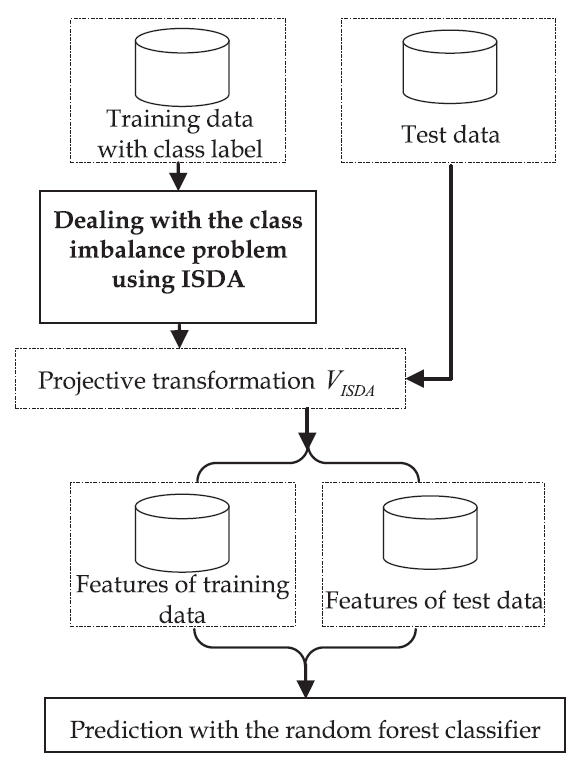
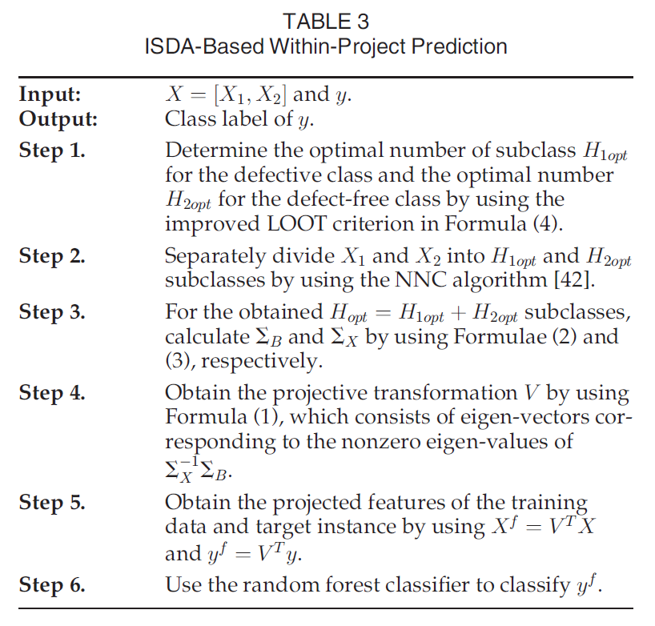
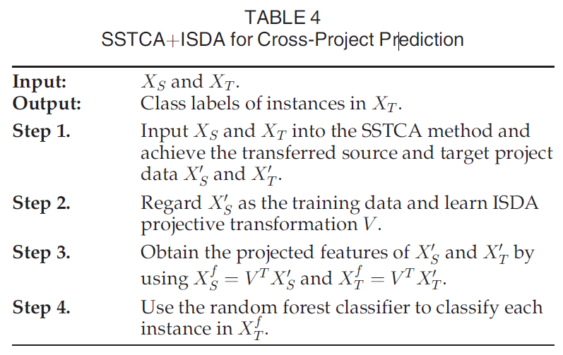
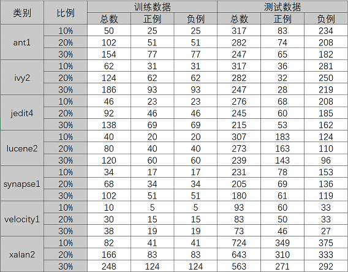
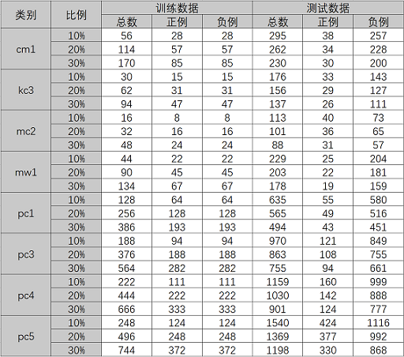
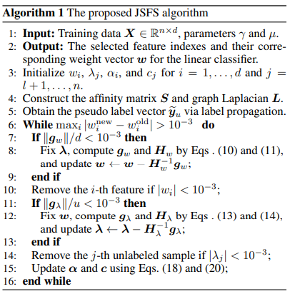

# 数据驱动测试报告

**姓名：蔡挺，周泽龙**
**学号：2020214022，2020213990**
**课程：软件测试技术**
**日期：2020年12月5日**

------

[TOC]

## 1 实验内容

### 1.1 要求

* 设计机器学习算法，利用NASA数据集和CK数据集进行软件缺陷预测；
* 利用10%，20%及30%的随机样本数据进行训练，使用剩余数据进行测试；
* 统计在两个数据集上的测试结果。

### 1.2 完成内容

* 调用库，评估现有分类器的效果
  * 如 `MLPClassifier`、`DecisionTreeClassifier`、`RandomForestClassifier` 等等
  * 包含无监督、半监督、监督算法
* 复现相关论文算法
  * `ISDA` [1]
  * `BaggingClassifierPU` [2]
  * `JSFS` [3]

## 2 现有分类器评估

部分子数据集实验结果较差，在报告中忽略，具体结果可查看 `.\MultipleMethods\result` 目录。

### 2.1 `AdaBoostClassifier`

<table align="center" style="width:100%; border:#000 solid; border-width:1px 0"> 
    <caption>AdaBoostClassifier (CK/ant1)</caption> 
    <thead style="border-bottom:#000 1px solid;"> 
        <tr> 
            <th style="border:0"></th> 
            <th style="border:0">10%</th> 
            <th style="border:0">20%</th> 
            <th style="border:0">30%</th> 
        </tr> 
    </thead> 
    <tr> 
        <th style="border:0">train samples</th> 
        <td style="border:0">34</td> 
        <td style="border:0">69</td> 
        <td style="border:0">104</td> 
    </tr> 
    <tr> 
        <th style="border:0">defective train samples</th> 
        <td style="border:0">9</td> 
        <td style="border:0">18</td> 
        <td style="border:0">27</td> 
    </tr> 
    <tr> 
        <th style="border:0">precision</th> 
        <td style="border:0">0.4838709677419355</td> 
        <td style="border:0">0.5483870967741935</td> 
        <td style="border:0">0.559322033898305</td> 
    </tr> 
    <tr> 
        <th style="border:0">recall</th> 
        <td style="border:0">0.3614457831325301</td> 
        <td style="border:0">0.4594594594594595</td> 
        <td style="border:0">0.5076923076923077</td> 
    </tr> 
    <tr> 
        <th style="border:0">pf</th> 
        <td style="border:0">0.13675213675213677</td> 
        <td style="border:0">0.1346153846153846</td> 
        <td style="border:0">0.14285714285714285</td> 
    </tr> 
    <tr> 
        <th style="border:0">F-measure</th> 
        <td style="border:0">0.41379310344827586</td> 
        <td style="border:0">0.5</td> 
        <td style="border:0">0.532258064516129</td> 
    </tr> 
    <tr> 
        <th style="border:0">accuracy</th> 
        <td style="border:0">0.7318611987381703</td> 
        <td style="border:0">0.7588652482269503</td> 
        <td style="border:0">0.7651821862348178</td> 
    </tr> 
    <tr> 
        <th style="border:0">AUC</th> 
        <td style="border:0">0.6123468231901967</td> 
        <td style="border:0">0.6624220374220374</td> 
        <td style="border:0">0.6824175824175824</td> 
    </tr> 
</table>

<table align="center" style="width:100%; border:#000 solid; border-width:1px 0"> 
    <caption>AdaBoostClassifier (CK/jedit4)</caption> 
    <thead style="border-bottom:#000 1px solid;"> 
        <tr> 
            <th style="border:0"></th> 
            <th style="border:0">10%</th> 
            <th style="border:0">20%</th> 
            <th style="border:0">30%</th> 
        </tr> 
    </thead> 
    <tr> 
        <th style="border:0">train samples</th> 
        <td style="border:0">30</td> 
        <td style="border:0">61</td> 
        <td style="border:0">91</td> 
    </tr> 
    <tr> 
        <th style="border:0">defective train samples</th> 
        <td style="border:0">7</td> 
        <td style="border:0">15</td> 
        <td style="border:0">22</td> 
    </tr> 
    <tr> 
        <th style="border:0">precision</th> 
        <td style="border:0">0.4536082474226804</td> 
        <td style="border:0">0.515625</td> 
        <td style="border:0">0.4791666666666667</td> 
    </tr> 
    <tr> 
        <th style="border:0">recall</th> 
        <td style="border:0">0.6470588235294118</td> 
        <td style="border:0">0.55</td> 
        <td style="border:0">0.4339622641509434</td> 
    </tr> 
    <tr> 
        <th style="border:0">pf</th> 
        <td style="border:0">0.2548076923076923</td> 
        <td style="border:0">0.16756756756756758</td> 
        <td style="border:0">0.15432098765432098</td> 
    </tr> 
    <tr> 
        <th style="border:0">F-measure</th> 
        <td style="border:0">0.5333333333333333</td> 
        <td style="border:0">0.5322580645161291</td> 
        <td style="border:0">0.4554455445544555</td> 
    </tr> 
    <tr> 
        <th style="border:0">accuracy</th> 
        <td style="border:0">0.7210144927536232</td> 
        <td style="border:0">0.763265306122449</td> 
        <td style="border:0">0.7441860465116279</td> 
    </tr> 
    <tr> 
        <th style="border:0">AUC</th> 
        <td style="border:0">0.6961255656108598</td> 
        <td style="border:0">0.6912162162162162</td> 
        <td style="border:0">0.6398206382483113</td> 
    </tr> 
</table>

<table align="center" style="width:100%; border:#000 solid; border-width:1px 0"> 
    <caption>AdaBoostClassifier (CK/lucene2)</caption> 
    <thead style="border-bottom:#000 1px solid;"> 
        <tr> 
            <th style="border:0"></th> 
            <th style="border:0">10%</th> 
            <th style="border:0">20%</th> 
            <th style="border:0">30%</th> 
        </tr> 
    </thead> 
    <tr> 
        <th style="border:0">train samples</th> 
        <td style="border:0">33</td> 
        <td style="border:0">67</td> 
        <td style="border:0">101</td> 
    </tr> 
    <tr> 
        <th style="border:0">defective train samples</th> 
        <td style="border:0">20</td> 
        <td style="border:0">40</td> 
        <td style="border:0">60</td> 
    </tr> 
    <tr> 
        <th style="border:0">precision</th> 
        <td style="border:0">0.6451612903225806</td> 
        <td style="border:0">0.6927710843373494</td> 
        <td style="border:0">0.76</td> 
    </tr> 
    <tr> 
        <th style="border:0">recall</th> 
        <td style="border:0">0.546448087431694</td> 
        <td style="border:0">0.7055214723926381</td> 
        <td style="border:0">0.6643356643356644</td> 
    </tr> 
    <tr> 
        <th style="border:0">pf</th> 
        <td style="border:0">0.4435483870967742</td> 
        <td style="border:0">0.4636363636363636</td> 
        <td style="border:0">0.3125</td> 
    </tr> 
    <tr> 
        <th style="border:0">F-measure</th> 
        <td style="border:0">0.591715976331361</td> 
        <td style="border:0">0.6990881458966565</td> 
        <td style="border:0">0.7089552238805971</td> 
    </tr> 
    <tr> 
        <th style="border:0">accuracy</th> 
        <td style="border:0">0.5504885993485342</td> 
        <td style="border:0">0.6373626373626373</td> 
        <td style="border:0">0.6736401673640168</td> 
    </tr> 
    <tr> 
        <th style="border:0">AUC</th> 
        <td style="border:0">0.55144985016746</td> 
        <td style="border:0">0.6209425543781372</td> 
        <td style="border:0">0.6759178321678321</td> 
    </tr> 
</table>

<table align="center" style="width:100%; border:#000 solid; border-width:1px 0"> 
    <caption>AdaBoostClassifier (CK/synapse1)</caption> 
    <thead style="border-bottom:#000 1px solid;"> 
        <tr> 
            <th style="border:0"></th> 
            <th style="border:0">10%</th> 
            <th style="border:0">20%</th> 
            <th style="border:0">30%</th> 
        </tr> 
    </thead> 
    <tr> 
        <th style="border:0">train samples</th> 
        <td style="border:0">25</td> 
        <td style="border:0">51</td> 
        <td style="border:0">76</td> 
    </tr> 
    <tr> 
        <th style="border:0">defective train samples</th> 
        <td style="border:0">8</td> 
        <td style="border:0">17</td> 
        <td style="border:0">25</td> 
    </tr> 
    <tr> 
        <th style="border:0">precision</th> 
        <td style="border:0">0.5476190476190477</td> 
        <td style="border:0">0.5492957746478874</td> 
        <td style="border:0">0.5223880597014925</td> 
    </tr> 
    <tr> 
        <th style="border:0">recall</th> 
        <td style="border:0">0.2948717948717949</td> 
        <td style="border:0">0.5652173913043478</td> 
        <td style="border:0">0.5737704918032787</td> 
    </tr> 
    <tr> 
        <th style="border:0">pf</th> 
        <td style="border:0">0.12418300653594772</td> 
        <td style="border:0">0.23529411764705882</td> 
        <td style="border:0">0.2689075630252101</td> 
    </tr> 
    <tr> 
        <th style="border:0">F-measure</th> 
        <td style="border:0">0.3833333333333333</td> 
        <td style="border:0">0.5571428571428572</td> 
        <td style="border:0">0.5468749999999999</td> 
    </tr> 
    <tr> 
        <th style="border:0">accuracy</th> 
        <td style="border:0">0.6796536796536796</td> 
        <td style="border:0">0.697560975609756</td> 
        <td style="border:0">0.6777777777777778</td> 
    </tr> 
    <tr> 
        <th style="border:0">AUC</th> 
        <td style="border:0">0.5853443941679236</td> 
        <td style="border:0">0.6649616368286444</td> 
        <td style="border:0">0.6524314643890343</td> 
    </tr> 
</table>

<table align="center" style="width:100%; border:#000 solid; border-width:1px 0"> 
    <caption>AdaBoostClassifier (CK/xalan2)</caption> 
    <thead style="border-bottom:#000 1px solid;"> 
        <tr> 
            <th style="border:0"></th> 
            <th style="border:0">10%</th> 
            <th style="border:0">20%</th> 
            <th style="border:0">30%</th> 
        </tr> 
    </thead> 
    <tr> 
        <th style="border:0">train samples</th> 
        <td style="border:0">79</td> 
        <td style="border:0">160</td> 
        <td style="border:0">240</td> 
    </tr> 
    <tr> 
        <th style="border:0">defective train samples</th> 
        <td style="border:0">38</td> 
        <td style="border:0">77</td> 
        <td style="border:0">116</td> 
    </tr> 
    <tr> 
        <th style="border:0">precision</th> 
        <td style="border:0">0.5778894472361809</td> 
        <td style="border:0">0.5813953488372093</td> 
        <td style="border:0">0.6188925081433225</td> 
    </tr> 
    <tr> 
        <th style="border:0">recall</th> 
        <td style="border:0">0.6590257879656161</td> 
        <td style="border:0">0.5645161290322581</td> 
        <td style="border:0">0.7011070110701108</td> 
    </tr> 
    <tr> 
        <th style="border:0">pf</th> 
        <td style="border:0">0.448</td> 
        <td style="border:0">0.3783783783783784</td> 
        <td style="border:0">0.4006849315068493</td> 
    </tr> 
    <tr> 
        <th style="border:0">F-measure</th> 
        <td style="border:0">0.6157965194109772</td> 
        <td style="border:0">0.5728314238952538</td> 
        <td style="border:0">0.6574394463667821</td> 
    </tr> 
    <tr> 
        <th style="border:0">accuracy</th> 
        <td style="border:0">0.6035911602209945</td> 
        <td style="border:0">0.5940902021772939</td> 
        <td style="border:0">0.6483126110124334</td> 
    </tr> 
    <tr> 
        <th style="border:0">AUC</th> 
        <td style="border:0">0.605512893982808</td> 
        <td style="border:0">0.5930688753269399</td> 
        <td style="border:0">0.6502110397816308</td> 
    </tr> 
</table>

<table align="center" style="width:100%; border:#000 solid; border-width:1px 0"> 
    <caption>AdaBoostClassifier (NASA/pc4)</caption> 
    <thead style="border-bottom:#000 1px solid;"> 
        <tr> 
            <th style="border:0"></th> 
            <th style="border:0">10%</th> 
            <th style="border:0">20%</th> 
            <th style="border:0">30%</th> 
        </tr> 
    </thead> 
    <tr> 
        <th style="border:0">train samples</th> 
        <td style="border:0">128</td> 
        <td style="border:0">257</td> 
        <td style="border:0">386</td> 
    </tr> 
    <tr> 
        <th style="border:0">defective train samples</th> 
        <td style="border:0">17</td> 
        <td style="border:0">35</td> 
        <td style="border:0">53</td> 
    </tr> 
    <tr> 
        <th style="border:0">precision</th> 
        <td style="border:0">0.4125874125874126</td> 
        <td style="border:0">0.475</td> 
        <td style="border:0">0.59</td> 
    </tr> 
    <tr> 
        <th style="border:0">recall</th> 
        <td style="border:0">0.36875</td> 
        <td style="border:0">0.4014084507042254</td> 
        <td style="border:0">0.47580645161290325</td> 
    </tr> 
    <tr> 
        <th style="border:0">pf</th> 
        <td style="border:0">0.08408408408408409</td> 
        <td style="border:0">0.07094594594594594</td> 
        <td style="border:0">0.05276705276705277</td> 
    </tr> 
    <tr> 
        <th style="border:0">F-measure</th> 
        <td style="border:0">0.38943894389438943</td> 
        <td style="border:0">0.4351145038167939</td> 
        <td style="border:0">0.5267857142857142</td> 
    </tr> 
    <tr> 
        <th style="border:0">accuracy</th> 
        <td style="border:0">0.8403796376186368</td> 
        <td style="border:0">0.8563106796116505</td> 
        <td style="border:0">0.8823529411764706</td> 
    </tr> 
    <tr> 
        <th style="border:0">AUC</th> 
        <td style="border:0">0.642332957957958</td> 
        <td style="border:0">0.6652312523791397</td> 
        <td style="border:0">0.7115196994229253</td> 
    </tr> 
</table>

<table align="center" style="width:100%; border:#000 solid; border-width:1px 0"> 
    <caption>AdaBoostClassifier (NASA/pc5)</caption> 
    <thead style="border-bottom:#000 1px solid;"> 
        <tr> 
            <th style="border:0"></th> 
            <th style="border:0">10%</th> 
            <th style="border:0">20%</th> 
            <th style="border:0">30%</th> 
        </tr> 
    </thead> 
    <tr> 
        <th style="border:0">train samples</th> 
        <td style="border:0">171</td> 
        <td style="border:0">342</td> 
        <td style="border:0">513</td> 
    </tr> 
    <tr> 
        <th style="border:0">defective train samples</th> 
        <td style="border:0">47</td> 
        <td style="border:0">94</td> 
        <td style="border:0">141</td> 
    </tr> 
    <tr> 
        <th style="border:0">precision</th> 
        <td style="border:0">0.4470588235294118</td> 
        <td style="border:0">0.5186567164179104</td> 
        <td style="border:0">0.5358851674641149</td> 
    </tr> 
    <tr> 
        <th style="border:0">recall</th> 
        <td style="border:0">0.3584905660377358</td> 
        <td style="border:0">0.3687002652519894</td> 
        <td style="border:0">0.3393939393939394</td> 
    </tr> 
    <tr> 
        <th style="border:0">pf</th> 
        <td style="border:0">0.16845878136200718</td> 
        <td style="border:0">0.13004032258064516</td> 
        <td style="border:0">0.11175115207373272</td> 
    </tr> 
    <tr> 
        <th style="border:0">F-measure</th> 
        <td style="border:0">0.3979057591623037</td> 
        <td style="border:0">0.43100775193798446</td> 
        <td style="border:0">0.4155844155844156</td> 
    </tr> 
    <tr> 
        <th style="border:0">accuracy</th> 
        <td style="border:0">0.7012987012987013</td> 
        <td style="border:0">0.7319211102994887</td> 
        <td style="border:0">0.7370617696160268</td> 
    </tr> 
    <tr> 
        <th style="border:0">AUC</th> 
        <td style="border:0">0.5950158923378642</td> 
        <td style="border:0">0.619329971335672</td> 
        <td style="border:0">0.6138213936601032</td> 
    </tr> 
</table>
### 2.2 `CBLOF` （无监督）

<table align="center" style="width:100%; border:#000 solid; border-width:1px 0"> 
    <caption>CBLOF (CK/ant1)</caption> 
    <thead style="border-bottom:#000 1px solid;"> 
        <tr> 
            <th style="border:0"></th> 
            <th style="border:0">10%</th> 
            <th style="border:0">20%</th> 
            <th style="border:0">30%</th> 
        </tr> 
    </thead> 
    <tr> 
        <th style="border:0">train samples</th> 
        <td style="border:0">34</td> 
        <td style="border:0">69</td> 
        <td style="border:0">104</td> 
    </tr> 
    <tr> 
        <th style="border:0">defective train samples</th> 
        <td style="border:0">9</td> 
        <td style="border:0">18</td> 
        <td style="border:0">27</td> 
    </tr> 
    <tr> 
        <th style="border:0">precision</th> 
        <td style="border:0">0.5882352941176471</td> 
        <td style="border:0">0.7021276595744681</td> 
        <td style="border:0">0.5769230769230769</td> 
    </tr> 
    <tr> 
        <th style="border:0">recall</th> 
        <td style="border:0">0.3614457831325301</td> 
        <td style="border:0">0.44594594594594594</td> 
        <td style="border:0">0.23076923076923078</td> 
    </tr> 
    <tr> 
        <th style="border:0">pf</th> 
        <td style="border:0">0.08974358974358974</td> 
        <td style="border:0">0.0673076923076923</td> 
        <td style="border:0">0.06043956043956044</td> 
    </tr> 
    <tr> 
        <th style="border:0">F-measure</th> 
        <td style="border:0">0.4477611940298508</td> 
        <td style="border:0">0.5454545454545454</td> 
        <td style="border:0">0.3296703296703296</td> 
    </tr> 
    <tr> 
        <th style="border:0">accuracy</th> 
        <td style="border:0">0.7665615141955836</td> 
        <td style="border:0">0.8049645390070922</td> 
        <td style="border:0">0.7530364372469636</td> 
    </tr> 
    <tr> 
        <th style="border:0">AUC</th> 
        <td style="border:0">0.6358510966944703</td> 
        <td style="border:0">0.6893191268191269</td> 
        <td style="border:0">0.5851648351648352</td> 
    </tr> 
</table>

<table align="center" style="width:100%; border:#000 solid; border-width:1px 0"> 
    <caption>CBLOF (CK/ivy2)</caption> 
    <thead style="border-bottom:#000 1px solid;"> 
        <tr> 
            <th style="border:0"></th> 
            <th style="border:0">10%</th> 
            <th style="border:0">20%</th> 
            <th style="border:0">30%</th> 
        </tr> 
    </thead> 
    <tr> 
        <th style="border:0">train samples</th> 
        <td style="border:0">35</td> 
        <td style="border:0">70</td> 
        <td style="border:0">105</td> 
    </tr> 
    <tr> 
        <th style="border:0">defective train samples</th> 
        <td style="border:0">4</td> 
        <td style="border:0">8</td> 
        <td style="border:0">12</td> 
    </tr> 
    <tr> 
        <th style="border:0">precision</th> 
        <td style="border:0">0.33962264150943394</td> 
        <td style="border:0">0.2926829268292683</td> 
        <td style="border:0">0.3684210526315789</td> 
    </tr> 
    <tr> 
        <th style="border:0">recall</th> 
        <td style="border:0">0.5</td> 
        <td style="border:0">0.375</td> 
        <td style="border:0">0.5</td> 
    </tr> 
    <tr> 
        <th style="border:0">pf</th> 
        <td style="border:0">0.12455516014234876</td> 
        <td style="border:0">0.116</td> 
        <td style="border:0">0.1095890410958904</td> 
    </tr> 
    <tr> 
        <th style="border:0">F-measure</th> 
        <td style="border:0">0.4044943820224719</td> 
        <td style="border:0">0.32876712328767116</td> 
        <td style="border:0">0.4242424242424242</td> 
    </tr> 
    <tr> 
        <th style="border:0">accuracy</th> 
        <td style="border:0">0.832807570977918</td> 
        <td style="border:0">0.8262411347517731</td> 
        <td style="border:0">0.8461538461538461</td> 
    </tr> 
    <tr> 
        <th style="border:0">AUC</th> 
        <td style="border:0">0.6877224199288255</td> 
        <td style="border:0">0.6295000000000001</td> 
        <td style="border:0">0.6952054794520548</td> 
    </tr> 
</table>

<table align="center" style="width:100%; border:#000 solid; border-width:1px 0"> 
    <caption>CBLOF (CK/jedit4)</caption> 
    <thead style="border-bottom:#000 1px solid;"> 
        <tr> 
            <th style="border:0"></th> 
            <th style="border:0">10%</th> 
            <th style="border:0">20%</th> 
            <th style="border:0">30%</th> 
        </tr> 
    </thead> 
    <tr> 
        <th style="border:0">train samples</th> 
        <td style="border:0">30</td> 
        <td style="border:0">61</td> 
        <td style="border:0">91</td> 
    </tr> 
    <tr> 
        <th style="border:0">defective train samples</th> 
        <td style="border:0">7</td> 
        <td style="border:0">15</td> 
        <td style="border:0">22</td> 
    </tr> 
    <tr> 
        <th style="border:0">precision</th> 
        <td style="border:0">0.6296296296296297</td> 
        <td style="border:0">0.6086956521739131</td> 
        <td style="border:0">0.5263157894736842</td> 
    </tr> 
    <tr> 
        <th style="border:0">recall</th> 
        <td style="border:0">0.5</td> 
        <td style="border:0">0.4666666666666667</td> 
        <td style="border:0">0.18867924528301888</td> 
    </tr> 
    <tr> 
        <th style="border:0">pf</th> 
        <td style="border:0">0.09615384615384616</td> 
        <td style="border:0">0.0972972972972973</td> 
        <td style="border:0">0.05555555555555555</td> 
    </tr> 
    <tr> 
        <th style="border:0">F-measure</th> 
        <td style="border:0">0.5573770491803278</td> 
        <td style="border:0">0.5283018867924527</td> 
        <td style="border:0">0.27777777777777773</td> 
    </tr> 
    <tr> 
        <th style="border:0">accuracy</th> 
        <td style="border:0">0.8043478260869565</td> 
        <td style="border:0">0.7959183673469388</td> 
        <td style="border:0">0.7581395348837209</td> 
    </tr> 
    <tr> 
        <th style="border:0">AUC</th> 
        <td style="border:0">0.701923076923077</td> 
        <td style="border:0">0.6846846846846847</td> 
        <td style="border:0">0.5665618448637316</td> 
    </tr> 
</table>

<table align="center" style="width:100%; border:#000 solid; border-width:1px 0"> 
    <caption>CBLOF (CK/lucene2)</caption> 
    <thead style="border-bottom:#000 1px solid;"> 
        <tr> 
            <th style="border:0"></th> 
            <th style="border:0">10%</th> 
            <th style="border:0">20%</th> 
            <th style="border:0">30%</th> 
        </tr> 
    </thead> 
    <tr> 
        <th style="border:0">train samples</th> 
        <td style="border:0">33</td> 
        <td style="border:0">67</td> 
        <td style="border:0">101</td> 
    </tr> 
    <tr> 
        <th style="border:0">defective train samples</th> 
        <td style="border:0">20</td> 
        <td style="border:0">40</td> 
        <td style="border:0">60</td> 
    </tr> 
    <tr> 
        <th style="border:0">precision</th> 
        <td style="border:0">0.8243243243243243</td> 
        <td style="border:0">0.84</td> 
        <td style="border:0">0.8260869565217391</td> 
    </tr> 
    <tr> 
        <th style="border:0">recall</th> 
        <td style="border:0">0.3333333333333333</td> 
        <td style="border:0">0.25766871165644173</td> 
        <td style="border:0">0.13286713286713286</td> 
    </tr> 
    <tr> 
        <th style="border:0">pf</th> 
        <td style="border:0">0.10483870967741936</td> 
        <td style="border:0">0.07272727272727272</td> 
        <td style="border:0">0.041666666666666664</td> 
    </tr> 
    <tr> 
        <th style="border:0">F-measure</th> 
        <td style="border:0">0.47470817120622566</td> 
        <td style="border:0">0.3943661971830986</td> 
        <td style="border:0">0.22891566265060243</td> 
    </tr> 
    <tr> 
        <th style="border:0">accuracy</th> 
        <td style="border:0">0.5602605863192183</td> 
        <td style="border:0">0.5274725274725275</td> 
        <td style="border:0">0.46443514644351463</td> 
    </tr> 
    <tr> 
        <th style="border:0">AUC</th> 
        <td style="border:0">0.6142473118279569</td> 
        <td style="border:0">0.5924707194645844</td> 
        <td style="border:0">0.5456002331002332</td> 
    </tr> 
</table>

<table align="center" style="width:100%; border:#000 solid; border-width:1px 0"> 
    <caption>CBLOF (CK/synapse1)</caption> 
    <thead style="border-bottom:#000 1px solid;"> 
        <tr> 
            <th style="border:0"></th> 
            <th style="border:0">10%</th> 
            <th style="border:0">20%</th> 
            <th style="border:0">30%</th> 
        </tr> 
    </thead> 
    <tr> 
        <th style="border:0">train samples</th> 
        <td style="border:0">25</td> 
        <td style="border:0">51</td> 
        <td style="border:0">76</td> 
    </tr> 
    <tr> 
        <th style="border:0">defective train samples</th> 
        <td style="border:0">8</td> 
        <td style="border:0">17</td> 
        <td style="border:0">25</td> 
    </tr> 
    <tr> 
        <th style="border:0">precision</th> 
        <td style="border:0">0.5454545454545454</td> 
        <td style="border:0">0.5789473684210527</td> 
        <td style="border:0">0.6071428571428571</td> 
    </tr> 
    <tr> 
        <th style="border:0">recall</th> 
        <td style="border:0">0.6153846153846154</td> 
        <td style="border:0">0.3188405797101449</td> 
        <td style="border:0">0.2786885245901639</td> 
    </tr> 
    <tr> 
        <th style="border:0">pf</th> 
        <td style="border:0">0.26143790849673204</td> 
        <td style="border:0">0.11764705882352941</td> 
        <td style="border:0">0.09243697478991597</td> 
    </tr> 
    <tr> 
        <th style="border:0">F-measure</th> 
        <td style="border:0">0.5783132530120482</td> 
        <td style="border:0">0.411214953271028</td> 
        <td style="border:0">0.3820224719101123</td> 
    </tr> 
    <tr> 
        <th style="border:0">accuracy</th> 
        <td style="border:0">0.696969696969697</td> 
        <td style="border:0">0.6926829268292682</td> 
        <td style="border:0">0.6944444444444444</td> 
    </tr> 
    <tr> 
        <th style="border:0">AUC</th> 
        <td style="border:0">0.6769733534439417</td> 
        <td style="border:0">0.6005967604433077</td> 
        <td style="border:0">0.5931257749001241</td> 
    </tr> 
</table>

<table align="center" style="width:100%; border:#000 solid; border-width:1px 0"> 
    <caption>CBLOF (NASA/mc2)</caption> 
    <thead style="border-bottom:#000 1px solid;"> 
        <tr> 
            <th style="border:0"></th> 
            <th style="border:0">10%</th> 
            <th style="border:0">20%</th> 
            <th style="border:0">30%</th> 
        </tr> 
    </thead> 
    <tr> 
        <th style="border:0">train samples</th> 
        <td style="border:0">12</td> 
        <td style="border:0">24</td> 
        <td style="border:0">37</td> 
    </tr> 
    <tr> 
        <th style="border:0">defective train samples</th> 
        <td style="border:0">4</td> 
        <td style="border:0">8</td> 
        <td style="border:0">13</td> 
    </tr> 
    <tr> 
        <th style="border:0">precision</th> 
        <td style="border:0">0.4473684210526316</td> 
        <td style="border:0">0.5769230769230769</td> 
        <td style="border:0">0.5625</td> 
    </tr> 
    <tr> 
        <th style="border:0">recall</th> 
        <td style="border:0">0.85</td> 
        <td style="border:0">0.4166666666666667</td> 
        <td style="border:0">0.2903225806451613</td> 
    </tr> 
    <tr> 
        <th style="border:0">pf</th> 
        <td style="border:0">0.5753424657534246</td> 
        <td style="border:0">0.16923076923076924</td> 
        <td style="border:0">0.12280701754385964</td> 
    </tr> 
    <tr> 
        <th style="border:0">F-measure</th> 
        <td style="border:0">0.5862068965517242</td> 
        <td style="border:0">0.48387096774193544</td> 
        <td style="border:0">0.3829787234042554</td> 
    </tr> 
    <tr> 
        <th style="border:0">accuracy</th> 
        <td style="border:0">0.5752212389380531</td> 
        <td style="border:0">0.6831683168316832</td> 
        <td style="border:0">0.6704545454545454</td> 
    </tr> 
    <tr> 
        <th style="border:0">AUC</th> 
        <td style="border:0">0.6373287671232877</td> 
        <td style="border:0">0.6237179487179487</td> 
        <td style="border:0">0.5837577815506508</td> 
    </tr> 
</table>

### 2.3 `DecisionTreeClassifier`

<table align="center" style="width:100%; border:#000 solid; border-width:1px 0"> 
    <caption>DecisionTreeClassifier (CK/ant1)</caption> 
    <thead style="border-bottom:#000 1px solid;"> 
        <tr> 
            <th style="border:0"></th> 
            <th style="border:0">10%</th> 
            <th style="border:0">20%</th> 
            <th style="border:0">30%</th> 
        </tr> 
    </thead> 
    <tr> 
        <th style="border:0">train samples</th> 
        <td style="border:0">34</td> 
        <td style="border:0">69</td> 
        <td style="border:0">104</td> 
    </tr> 
    <tr> 
        <th style="border:0">defective train samples</th> 
        <td style="border:0">9</td> 
        <td style="border:0">18</td> 
        <td style="border:0">27</td> 
    </tr> 
    <tr> 
        <th style="border:0">precision</th> 
        <td style="border:0">0.5</td> 
        <td style="border:0">0.4657534246575342</td> 
        <td style="border:0">0.4915254237288136</td> 
    </tr> 
    <tr> 
        <th style="border:0">recall</th> 
        <td style="border:0">0.3373493975903614</td> 
        <td style="border:0">0.4594594594594595</td> 
        <td style="border:0">0.4461538461538462</td> 
    </tr> 
    <tr> 
        <th style="border:0">pf</th> 
        <td style="border:0">0.11965811965811966</td> 
        <td style="border:0">0.1875</td> 
        <td style="border:0">0.16483516483516483</td> 
    </tr> 
    <tr> 
        <th style="border:0">F-measure</th> 
        <td style="border:0">0.4028776978417266</td> 
        <td style="border:0">0.4625850340136054</td> 
        <td style="border:0">0.46774193548387105</td> 
    </tr> 
    <tr> 
        <th style="border:0">accuracy</th> 
        <td style="border:0">0.7381703470031545</td> 
        <td style="border:0">0.7198581560283688</td> 
        <td style="border:0">0.7327935222672065</td> 
    </tr> 
    <tr> 
        <th style="border:0">AUC</th> 
        <td style="border:0">0.6088456389661209</td> 
        <td style="border:0">0.6359797297297297</td> 
        <td style="border:0">0.6406593406593407</td> 
    </tr> 
</table>

<table align="center" style="width:100%; border:#000 solid; border-width:1px 0"> 
    <caption>DecisionTreeClassifier (CK/jedit4)</caption> 
    <thead style="border-bottom:#000 1px solid;"> 
        <tr> 
            <th style="border:0"></th> 
            <th style="border:0">10%</th> 
            <th style="border:0">20%</th> 
            <th style="border:0">30%</th> 
        </tr> 
    </thead> 
    <tr> 
        <th style="border:0">train samples</th> 
        <td style="border:0">30</td> 
        <td style="border:0">61</td> 
        <td style="border:0">91</td> 
    </tr> 
    <tr> 
        <th style="border:0">defective train samples</th> 
        <td style="border:0">7</td> 
        <td style="border:0">15</td> 
        <td style="border:0">22</td> 
    </tr> 
    <tr> 
        <th style="border:0">precision</th> 
        <td style="border:0">0.39344262295081966</td> 
        <td style="border:0">0.4186046511627907</td> 
        <td style="border:0">0.5357142857142857</td> 
    </tr> 
    <tr> 
        <th style="border:0">recall</th> 
        <td style="border:0">0.7058823529411765</td> 
        <td style="border:0">0.6</td> 
        <td style="border:0">0.5660377358490566</td> 
    </tr> 
    <tr> 
        <th style="border:0">pf</th> 
        <td style="border:0">0.3557692307692308</td> 
        <td style="border:0">0.2702702702702703</td> 
        <td style="border:0">0.16049382716049382</td> 
    </tr> 
    <tr> 
        <th style="border:0">F-measure</th> 
        <td style="border:0">0.5052631578947367</td> 
        <td style="border:0">0.49315068493150693</td> 
        <td style="border:0">0.5504587155963302</td> 
    </tr> 
    <tr> 
        <th style="border:0">accuracy</th> 
        <td style="border:0">0.6594202898550725</td> 
        <td style="border:0">0.6979591836734694</td> 
        <td style="border:0">0.772093023255814</td> 
    </tr> 
    <tr> 
        <th style="border:0">AUC</th> 
        <td style="border:0">0.6750565610859729</td> 
        <td style="border:0">0.664864864864865</td> 
        <td style="border:0">0.7027719543442813</td> 
    </tr> 
</table>

<table align="center" style="width:100%; border:#000 solid; border-width:1px 0"> 
    <caption>DecisionTreeClassifier (CK/lucene2)</caption> 
    <thead style="border-bottom:#000 1px solid;"> 
        <tr> 
            <th style="border:0"></th> 
            <th style="border:0">10%</th> 
            <th style="border:0">20%</th> 
            <th style="border:0">30%</th> 
        </tr> 
    </thead> 
    <tr> 
        <th style="border:0">train samples</th> 
        <td style="border:0">33</td> 
        <td style="border:0">67</td> 
        <td style="border:0">101</td> 
    </tr> 
    <tr> 
        <th style="border:0">defective train samples</th> 
        <td style="border:0">20</td> 
        <td style="border:0">40</td> 
        <td style="border:0">60</td> 
    </tr> 
    <tr> 
        <th style="border:0">precision</th> 
        <td style="border:0">0.624390243902439</td> 
        <td style="border:0">0.7006369426751592</td> 
        <td style="border:0">0.676056338028169</td> 
    </tr> 
    <tr> 
        <th style="border:0">recall</th> 
        <td style="border:0">0.6994535519125683</td> 
        <td style="border:0">0.6748466257668712</td> 
        <td style="border:0">0.6713286713286714</td> 
    </tr> 
    <tr> 
        <th style="border:0">pf</th> 
        <td style="border:0">0.6209677419354839</td> 
        <td style="border:0">0.42727272727272725</td> 
        <td style="border:0">0.4791666666666667</td> 
    </tr> 
    <tr> 
        <th style="border:0">F-measure</th> 
        <td style="border:0">0.6597938144329897</td> 
        <td style="border:0">0.6875</td> 
        <td style="border:0">0.6736842105263159</td> 
    </tr> 
    <tr> 
        <th style="border:0">accuracy</th> 
        <td style="border:0">0.5700325732899023</td> 
        <td style="border:0">0.6336996336996337</td> 
        <td style="border:0">0.6108786610878661</td> 
    </tr> 
    <tr> 
        <th style="border:0">AUC</th> 
        <td style="border:0">0.5392429049885422</td> 
        <td style="border:0">0.623786949247072</td> 
        <td style="border:0">0.5960810023310023</td> 
    </tr> 
</table>

<table align="center" style="width:100%; border:#000 solid; border-width:1px 0"> 
    <caption>DecisionTreeClassifier (CK/synapse1)</caption> 
    <thead style="border-bottom:#000 1px solid;"> 
        <tr> 
            <th style="border:0"></th> 
            <th style="border:0">10%</th> 
            <th style="border:0">20%</th> 
            <th style="border:0">30%</th> 
        </tr> 
    </thead> 
    <tr> 
        <th style="border:0">train samples</th> 
        <td style="border:0">25</td> 
        <td style="border:0">51</td> 
        <td style="border:0">76</td> 
    </tr> 
    <tr> 
        <th style="border:0">defective train samples</th> 
        <td style="border:0">8</td> 
        <td style="border:0">17</td> 
        <td style="border:0">25</td> 
    </tr> 
    <tr> 
        <th style="border:0">precision</th> 
        <td style="border:0">0.5263157894736842</td> 
        <td style="border:0">0.4605263157894737</td> 
        <td style="border:0">0.4418604651162791</td> 
    </tr> 
    <tr> 
        <th style="border:0">recall</th> 
        <td style="border:0">0.2564102564102564</td> 
        <td style="border:0">0.5072463768115942</td> 
        <td style="border:0">0.6229508196721312</td> 
    </tr> 
    <tr> 
        <th style="border:0">pf</th> 
        <td style="border:0">0.11764705882352941</td> 
        <td style="border:0">0.3014705882352941</td> 
        <td style="border:0">0.40336134453781514</td> 
    </tr> 
    <tr> 
        <th style="border:0">F-measure</th> 
        <td style="border:0">0.3448275862068965</td> 
        <td style="border:0">0.48275862068965514</td> 
        <td style="border:0">0.5170068027210885</td> 
    </tr> 
    <tr> 
        <th style="border:0">accuracy</th> 
        <td style="border:0">0.670995670995671</td> 
        <td style="border:0">0.6341463414634146</td> 
        <td style="border:0">0.6055555555555555</td> 
    </tr> 
    <tr> 
        <th style="border:0">AUC</th> 
        <td style="border:0">0.5693815987933634</td> 
        <td style="border:0">0.60288789428815</td> 
        <td style="border:0">0.609794737567158</td> 
    </tr> 
</table>

<table align="center" style="width:100%; border:#000 solid; border-width:1px 0"> 
    <caption>DecisionTreeClassifier (CK/xalan2)</caption> 
    <thead style="border-bottom:#000 1px solid;"> 
        <tr> 
            <th style="border:0"></th> 
            <th style="border:0">10%</th> 
            <th style="border:0">20%</th> 
            <th style="border:0">30%</th> 
        </tr> 
    </thead> 
    <tr> 
        <th style="border:0">train samples</th> 
        <td style="border:0">79</td> 
        <td style="border:0">160</td> 
        <td style="border:0">240</td> 
    </tr> 
    <tr> 
        <th style="border:0">defective train samples</th> 
        <td style="border:0">38</td> 
        <td style="border:0">77</td> 
        <td style="border:0">116</td> 
    </tr> 
    <tr> 
        <th style="border:0">precision</th> 
        <td style="border:0">0.56575682382134</td> 
        <td style="border:0">0.5876923076923077</td> 
        <td style="border:0">0.6212624584717608</td> 
    </tr> 
    <tr> 
        <th style="border:0">recall</th> 
        <td style="border:0">0.6532951289398281</td> 
        <td style="border:0">0.6161290322580645</td> 
        <td style="border:0">0.6900369003690037</td> 
    </tr> 
    <tr> 
        <th style="border:0">pf</th> 
        <td style="border:0">0.4666666666666667</td> 
        <td style="border:0">0.4024024024024024</td> 
        <td style="border:0">0.3904109589041096</td> 
    </tr> 
    <tr> 
        <th style="border:0">F-measure</th> 
        <td style="border:0">0.6063829787234042</td> 
        <td style="border:0">0.6015748031496062</td> 
        <td style="border:0">0.6538461538461537</td> 
    </tr> 
    <tr> 
        <th style="border:0">accuracy</th> 
        <td style="border:0">0.5911602209944752</td> 
        <td style="border:0">0.6065318818040435</td> 
        <td style="border:0">0.6483126110124334</td> 
    </tr> 
    <tr> 
        <th style="border:0">AUC</th> 
        <td style="border:0">0.5933142311365807</td> 
        <td style="border:0">0.6068633149278311</td> 
        <td style="border:0">0.649812970732447</td> 
    </tr> 
</table>

<table align="center" style="width:100%; border:#000 solid; border-width:1px 0"> 
    <caption>DecisionTreeClassifier (NASA/mc2)</caption> 
    <thead style="border-bottom:#000 1px solid;"> 
        <tr> 
            <th style="border:0"></th> 
            <th style="border:0">10%</th> 
            <th style="border:0">20%</th> 
            <th style="border:0">30%</th> 
        </tr> 
    </thead> 
    <tr> 
        <th style="border:0">train samples</th> 
        <td style="border:0">12</td> 
        <td style="border:0">24</td> 
        <td style="border:0">37</td> 
    </tr> 
    <tr> 
        <th style="border:0">defective train samples</th> 
        <td style="border:0">4</td> 
        <td style="border:0">8</td> 
        <td style="border:0">13</td> 
    </tr> 
    <tr> 
        <th style="border:0">precision</th> 
        <td style="border:0">0.5</td> 
        <td style="border:0">0.32</td> 
        <td style="border:0">0.45454545454545453</td> 
    </tr> 
    <tr> 
        <th style="border:0">recall</th> 
        <td style="border:0">0.475</td> 
        <td style="border:0">0.2222222222222222</td> 
        <td style="border:0">0.3225806451612903</td> 
    </tr> 
    <tr> 
        <th style="border:0">pf</th> 
        <td style="border:0">0.2602739726027397</td> 
        <td style="border:0">0.26153846153846155</td> 
        <td style="border:0">0.21052631578947367</td> 
    </tr> 
    <tr> 
        <th style="border:0">F-measure</th> 
        <td style="border:0">0.48717948717948717</td> 
        <td style="border:0">0.26229508196721313</td> 
        <td style="border:0">0.3773584905660377</td> 
    </tr> 
    <tr> 
        <th style="border:0">accuracy</th> 
        <td style="border:0">0.6460176991150443</td> 
        <td style="border:0">0.5544554455445545</td> 
        <td style="border:0">0.625</td> 
    </tr> 
    <tr> 
        <th style="border:0">AUC</th> 
        <td style="border:0">0.6073630136986302</td> 
        <td style="border:0">0.4803418803418804</td> 
        <td style="border:0">0.5560271646859083</td> 
    </tr> 
</table>

<table align="center" style="width:100%; border:#000 solid; border-width:1px 0"> 
    <caption>DecisionTreeClassifier (NASA/pc4)</caption> 
    <thead style="border-bottom:#000 1px solid;"> 
        <tr> 
            <th style="border:0"></th> 
            <th style="border:0">10%</th> 
            <th style="border:0">20%</th> 
            <th style="border:0">30%</th> 
        </tr> 
    </thead> 
    <tr> 
        <th style="border:0">train samples</th> 
        <td style="border:0">128</td> 
        <td style="border:0">257</td> 
        <td style="border:0">386</td> 
    </tr> 
    <tr> 
        <th style="border:0">defective train samples</th> 
        <td style="border:0">17</td> 
        <td style="border:0">35</td> 
        <td style="border:0">53</td> 
    </tr> 
    <tr> 
        <th style="border:0">precision</th> 
        <td style="border:0">0.452</td> 
        <td style="border:0">0.41818181818181815</td> 
        <td style="border:0">0.4921875</td> 
    </tr> 
    <tr> 
        <th style="border:0">recall</th> 
        <td style="border:0">0.70625</td> 
        <td style="border:0">0.4859154929577465</td> 
        <td style="border:0">0.5080645161290323</td> 
    </tr> 
    <tr> 
        <th style="border:0">pf</th> 
        <td style="border:0">0.13713713713713713</td> 
        <td style="border:0">0.10810810810810811</td> 
        <td style="border:0">0.08365508365508366</td> 
    </tr> 
    <tr> 
        <th style="border:0">F-measure</th> 
        <td style="border:0">0.551219512195122</td> 
        <td style="border:0">0.4495114006514658</td> 
        <td style="border:0">0.5</td> 
    </tr> 
    <tr> 
        <th style="border:0">accuracy</th> 
        <td style="border:0">0.8412424503882657</td> 
        <td style="border:0">0.8359223300970874</td> 
        <td style="border:0">0.8601553829078802</td> 
    </tr> 
    <tr> 
        <th style="border:0">AUC</th> 
        <td style="border:0">0.7845564314314314</td> 
        <td style="border:0">0.6889036924248192</td> 
        <td style="border:0">0.7122047162369742</td> 
    </tr> 
</table>

<table align="center" style="width:100%; border:#000 solid; border-width:1px 0"> 
    <caption>DecisionTreeClassifier (NASA/pc5)</caption> 
    <thead style="border-bottom:#000 1px solid;"> 
        <tr> 
            <th style="border:0"></th> 
            <th style="border:0">10%</th> 
            <th style="border:0">20%</th> 
            <th style="border:0">30%</th> 
        </tr> 
    </thead> 
    <tr> 
        <th style="border:0">train samples</th> 
        <td style="border:0">171</td> 
        <td style="border:0">342</td> 
        <td style="border:0">513</td> 
    </tr> 
    <tr> 
        <th style="border:0">defective train samples</th> 
        <td style="border:0">47</td> 
        <td style="border:0">94</td> 
        <td style="border:0">141</td> 
    </tr> 
    <tr> 
        <th style="border:0">precision</th> 
        <td style="border:0">0.3974025974025974</td> 
        <td style="border:0">0.4447058823529412</td> 
        <td style="border:0">0.42771084337349397</td> 
    </tr> 
    <tr> 
        <th style="border:0">recall</th> 
        <td style="border:0">0.3608490566037736</td> 
        <td style="border:0">0.5013262599469496</td> 
        <td style="border:0">0.4303030303030303</td> 
    </tr> 
    <tr> 
        <th style="border:0">pf</th> 
        <td style="border:0">0.2078853046594982</td> 
        <td style="border:0">0.23790322580645162</td> 
        <td style="border:0">0.21889400921658986</td> 
    </tr> 
    <tr> 
        <th style="border:0">F-measure</th> 
        <td style="border:0">0.3782447466007416</td> 
        <td style="border:0">0.4713216957605985</td> 
        <td style="border:0">0.42900302114803623</td> 
    </tr> 
    <tr> 
        <th style="border:0">accuracy</th> 
        <td style="border:0">0.6733766233766234</td> 
        <td style="border:0">0.6902848794740687</td> 
        <td style="border:0">0.6844741235392321</td> 
    </tr> 
    <tr> 
        <th style="border:0">AUC</th> 
        <td style="border:0">0.5764818759721377</td> 
        <td style="border:0">0.631711517070249</td> 
        <td style="border:0">0.6057045105432202</td> 
    </tr> 
</table>

### 2.4 `GaussianNB`

<table align="center" style="width:100%; border:#000 solid; border-width:1px 0"> 
    <caption>GaussianNB (CK/ant1)</caption> 
    <thead style="border-bottom:#000 1px solid;"> 
        <tr> 
            <th style="border:0"></th> 
            <th style="border:0">10%</th> 
            <th style="border:0">20%</th> 
            <th style="border:0">30%</th> 
        </tr> 
    </thead> 
    <tr> 
        <th style="border:0">train samples</th> 
        <td style="border:0">34</td> 
        <td style="border:0">69</td> 
        <td style="border:0">104</td> 
    </tr> 
    <tr> 
        <th style="border:0">defective train samples</th> 
        <td style="border:0">9</td> 
        <td style="border:0">18</td> 
        <td style="border:0">27</td> 
    </tr> 
    <tr> 
        <th style="border:0">precision</th> 
        <td style="border:0">0.5128205128205128</td> 
        <td style="border:0">0.5540540540540541</td> 
        <td style="border:0">0.5909090909090909</td> 
    </tr> 
    <tr> 
        <th style="border:0">recall</th> 
        <td style="border:0">0.4819277108433735</td> 
        <td style="border:0">0.5540540540540541</td> 
        <td style="border:0">0.6</td> 
    </tr> 
    <tr> 
        <th style="border:0">pf</th> 
        <td style="border:0">0.1623931623931624</td> 
        <td style="border:0">0.15865384615384615</td> 
        <td style="border:0">0.14835164835164835</td> 
    </tr> 
    <tr> 
        <th style="border:0">F-measure</th> 
        <td style="border:0">0.4968944099378882</td> 
        <td style="border:0">0.5540540540540541</td> 
        <td style="border:0">0.5954198473282443</td> 
    </tr> 
    <tr> 
        <th style="border:0">accuracy</th> 
        <td style="border:0">0.7444794952681388</td> 
        <td style="border:0">0.7659574468085106</td> 
        <td style="border:0">0.7854251012145749</td> 
    </tr> 
    <tr> 
        <th style="border:0">AUC</th> 
        <td style="border:0">0.6597672742251055</td> 
        <td style="border:0">0.697700103950104</td> 
        <td style="border:0">0.7258241758241758</td> 
    </tr> 
</table>

<table align="center" style="width:100%; border:#000 solid; border-width:1px 0"> 
    <caption>GaussianNB (CK/jedit4)</caption> 
    <thead style="border-bottom:#000 1px solid;"> 
        <tr> 
            <th style="border:0"></th> 
            <th style="border:0">10%</th> 
            <th style="border:0">20%</th> 
            <th style="border:0">30%</th> 
        </tr> 
    </thead> 
    <tr> 
        <th style="border:0">train samples</th> 
        <td style="border:0">30</td> 
        <td style="border:0">61</td> 
        <td style="border:0">91</td> 
    </tr> 
    <tr> 
        <th style="border:0">defective train samples</th> 
        <td style="border:0">7</td> 
        <td style="border:0">15</td> 
        <td style="border:0">22</td> 
    </tr> 
    <tr> 
        <th style="border:0">precision</th> 
        <td style="border:0">0.22797927461139897</td> 
        <td style="border:0">0.5423728813559322</td> 
        <td style="border:0">0.4925373134328358</td> 
    </tr> 
    <tr> 
        <th style="border:0">recall</th> 
        <td style="border:0">0.6470588235294118</td> 
        <td style="border:0">0.5333333333333333</td> 
        <td style="border:0">0.6226415094339622</td> 
    </tr> 
    <tr> 
        <th style="border:0">pf</th> 
        <td style="border:0">0.7163461538461539</td> 
        <td style="border:0">0.14594594594594595</td> 
        <td style="border:0">0.20987654320987653</td> 
    </tr> 
    <tr> 
        <th style="border:0">F-measure</th> 
        <td style="border:0">0.3371647509578544</td> 
        <td style="border:0">0.5378151260504201</td> 
        <td style="border:0">0.55</td> 
    </tr> 
    <tr> 
        <th style="border:0">accuracy</th> 
        <td style="border:0">0.37318840579710144</td> 
        <td style="border:0">0.7755102040816326</td> 
        <td style="border:0">0.7488372093023256</td> 
    </tr> 
    <tr> 
        <th style="border:0">AUC</th> 
        <td style="border:0">0.46535633484162897</td> 
        <td style="border:0">0.6936936936936936</td> 
        <td style="border:0">0.7063824831120429</td> 
    </tr> 
</table>

<table align="center" style="width:100%; border:#000 solid; border-width:1px 0"> 
    <caption>GaussianNB (CK/lucene2)</caption> 
    <thead style="border-bottom:#000 1px solid;"> 
        <tr> 
            <th style="border:0"></th> 
            <th style="border:0">10%</th> 
            <th style="border:0">20%</th> 
            <th style="border:0">30%</th> 
        </tr> 
    </thead> 
    <tr> 
        <th style="border:0">train samples</th> 
        <td style="border:0">33</td> 
        <td style="border:0">67</td> 
        <td style="border:0">101</td> 
    </tr> 
    <tr> 
        <th style="border:0">defective train samples</th> 
        <td style="border:0">20</td> 
        <td style="border:0">40</td> 
        <td style="border:0">60</td> 
    </tr> 
    <tr> 
        <th style="border:0">precision</th> 
        <td style="border:0">0.6632124352331606</td> 
        <td style="border:0">0.8</td> 
        <td style="border:0">0.7674418604651163</td> 
    </tr> 
    <tr> 
        <th style="border:0">recall</th> 
        <td style="border:0">0.6994535519125683</td> 
        <td style="border:0">0.4171779141104294</td> 
        <td style="border:0">0.46153846153846156</td> 
    </tr> 
    <tr> 
        <th style="border:0">pf</th> 
        <td style="border:0">0.5241935483870968</td> 
        <td style="border:0">0.15454545454545454</td> 
        <td style="border:0">0.20833333333333334</td> 
    </tr> 
    <tr> 
        <th style="border:0">F-measure</th> 
        <td style="border:0">0.6808510638297872</td> 
        <td style="border:0">0.5483870967741935</td> 
        <td style="border:0">0.5764192139737991</td> 
    </tr> 
    <tr> 
        <th style="border:0">accuracy</th> 
        <td style="border:0">0.6091205211726385</td> 
        <td style="border:0">0.5897435897435898</td> 
        <td style="border:0">0.5941422594142259</td> 
    </tr> 
    <tr> 
        <th style="border:0">AUC</th> 
        <td style="border:0">0.5876300017627357</td> 
        <td style="border:0">0.6313162297824875</td> 
        <td style="border:0">0.6266025641025642</td> 
    </tr> 
</table>

<table align="center" style="width:100%; border:#000 solid; border-width:1px 0"> 
    <caption>GaussianNB (CK/synapse1)</caption> 
    <thead style="border-bottom:#000 1px solid;"> 
        <tr> 
            <th style="border:0"></th> 
            <th style="border:0">10%</th> 
            <th style="border:0">20%</th> 
            <th style="border:0">30%</th> 
        </tr> 
    </thead> 
    <tr> 
        <th style="border:0">train samples</th> 
        <td style="border:0">25</td> 
        <td style="border:0">51</td> 
        <td style="border:0">76</td> 
    </tr> 
    <tr> 
        <th style="border:0">defective train samples</th> 
        <td style="border:0">8</td> 
        <td style="border:0">17</td> 
        <td style="border:0">25</td> 
    </tr> 
    <tr> 
        <th style="border:0">precision</th> 
        <td style="border:0">0.43902439024390244</td> 
        <td style="border:0">0.5340909090909091</td> 
        <td style="border:0">0.625</td> 
    </tr> 
    <tr> 
        <th style="border:0">recall</th> 
        <td style="border:0">0.23076923076923078</td> 
        <td style="border:0">0.6811594202898551</td> 
        <td style="border:0">0.6557377049180327</td> 
    </tr> 
    <tr> 
        <th style="border:0">pf</th> 
        <td style="border:0">0.1503267973856209</td> 
        <td style="border:0">0.3014705882352941</td> 
        <td style="border:0">0.20168067226890757</td> 
    </tr> 
    <tr> 
        <th style="border:0">F-measure</th> 
        <td style="border:0">0.3025210084033614</td> 
        <td style="border:0">0.5987261146496815</td> 
        <td style="border:0">0.64</td> 
    </tr> 
    <tr> 
        <th style="border:0">accuracy</th> 
        <td style="border:0">0.6406926406926406</td> 
        <td style="border:0">0.6926829268292682</td> 
        <td style="border:0">0.75</td> 
    </tr> 
    <tr> 
        <th style="border:0">AUC</th> 
        <td style="border:0">0.540221216691805</td> 
        <td style="border:0">0.6898444160272804</td> 
        <td style="border:0">0.7270285163245626</td> 
    </tr> 
</table>

<table align="center" style="width:100%; border:#000 solid; border-width:1px 0"> 
    <caption>GaussianNB (NASA/mc2)</caption> 
    <thead style="border-bottom:#000 1px solid;"> 
        <tr> 
            <th style="border:0"></th> 
            <th style="border:0">10%</th> 
            <th style="border:0">20%</th> 
            <th style="border:0">30%</th> 
        </tr> 
    </thead> 
    <tr> 
        <th style="border:0">train samples</th> 
        <td style="border:0">12</td> 
        <td style="border:0">24</td> 
        <td style="border:0">37</td> 
    </tr> 
    <tr> 
        <th style="border:0">defective train samples</th> 
        <td style="border:0">4</td> 
        <td style="border:0">8</td> 
        <td style="border:0">13</td> 
    </tr> 
    <tr> 
        <th style="border:0">precision</th> 
        <td style="border:0">0.5925925925925926</td> 
        <td style="border:0">0.8</td> 
        <td style="border:0">0.5652173913043478</td> 
    </tr> 
    <tr> 
        <th style="border:0">recall</th> 
        <td style="border:0">0.4</td> 
        <td style="border:0">0.2222222222222222</td> 
        <td style="border:0">0.41935483870967744</td> 
    </tr> 
    <tr> 
        <th style="border:0">pf</th> 
        <td style="border:0">0.1506849315068493</td> 
        <td style="border:0">0.03076923076923077</td> 
        <td style="border:0">0.17543859649122806</td> 
    </tr> 
    <tr> 
        <th style="border:0">F-measure</th> 
        <td style="border:0">0.4776119402985075</td> 
        <td style="border:0">0.3478260869565218</td> 
        <td style="border:0">0.4814814814814815</td> 
    </tr> 
    <tr> 
        <th style="border:0">accuracy</th> 
        <td style="border:0">0.6902654867256637</td> 
        <td style="border:0">0.7029702970297029</td> 
        <td style="border:0">0.6818181818181818</td> 
    </tr> 
    <tr> 
        <th style="border:0">AUC</th> 
        <td style="border:0">0.6246575342465753</td> 
        <td style="border:0">0.5957264957264957</td> 
        <td style="border:0">0.6219581211092248</td> 
    </tr> 
</table>

<table align="center" style="width:100%; border:#000 solid; border-width:1px 0"> 
    <caption>GaussianNB (NASA/pc4)</caption> 
    <thead style="border-bottom:#000 1px solid;"> 
        <tr> 
            <th style="border:0"></th> 
            <th style="border:0">10%</th> 
            <th style="border:0">20%</th> 
            <th style="border:0">30%</th> 
        </tr> 
    </thead> 
    <tr> 
        <th style="border:0">train samples</th> 
        <td style="border:0">128</td> 
        <td style="border:0">257</td> 
        <td style="border:0">386</td> 
    </tr> 
    <tr> 
        <th style="border:0">defective train samples</th> 
        <td style="border:0">17</td> 
        <td style="border:0">35</td> 
        <td style="border:0">53</td> 
    </tr> 
    <tr> 
        <th style="border:0">precision</th> 
        <td style="border:0">0.38926174496644295</td> 
        <td style="border:0">0.5546218487394958</td> 
        <td style="border:0">0.5777777777777777</td> 
    </tr> 
    <tr> 
        <th style="border:0">recall</th> 
        <td style="border:0">0.3625</td> 
        <td style="border:0">0.4647887323943662</td> 
        <td style="border:0">0.20967741935483872</td> 
    </tr> 
    <tr> 
        <th style="border:0">pf</th> 
        <td style="border:0">0.09109109109109109</td> 
        <td style="border:0">0.059684684684684686</td> 
        <td style="border:0">0.02445302445302445</td> 
    </tr> 
    <tr> 
        <th style="border:0">F-measure</th> 
        <td style="border:0">0.37540453074433655</td> 
        <td style="border:0">0.5057471264367815</td> 
        <td style="border:0">0.30769230769230765</td> 
    </tr> 
    <tr> 
        <th style="border:0">accuracy</th> 
        <td style="border:0">0.8334771354616048</td> 
        <td style="border:0">0.874757281553398</td> 
        <td style="border:0">0.8701442841287459</td> 
    </tr> 
    <tr> 
        <th style="border:0">AUC</th> 
        <td style="border:0">0.6357044544544544</td> 
        <td style="border:0">0.7025520238548408</td> 
        <td style="border:0">0.5926121974509072</td> 
    </tr> 
</table>

### 2.5 `GaussianProcessClassifier`

<table align="center" style="width:100%; border:#000 solid; border-width:1px 0"> 
    <caption>GaussianProcessClassifier (CK/ant1)</caption> 
    <thead style="border-bottom:#000 1px solid;"> 
        <tr> 
            <th style="border:0"></th> 
            <th style="border:0">10%</th> 
            <th style="border:0">20%</th> 
            <th style="border:0">30%</th> 
        </tr> 
    </thead> 
    <tr> 
        <th style="border:0">train samples</th> 
        <td style="border:0">34</td> 
        <td style="border:0">69</td> 
        <td style="border:0">104</td> 
    </tr> 
    <tr> 
        <th style="border:0">defective train samples</th> 
        <td style="border:0">9</td> 
        <td style="border:0">18</td> 
        <td style="border:0">27</td> 
    </tr> 
    <tr> 
        <th style="border:0">precision</th> 
        <td style="border:0">0.5909090909090909</td> 
        <td style="border:0">0.6461538461538462</td> 
        <td style="border:0">0.6833333333333333</td> 
    </tr> 
    <tr> 
        <th style="border:0">recall</th> 
        <td style="border:0">0.3132530120481928</td> 
        <td style="border:0">0.5675675675675675</td> 
        <td style="border:0">0.6307692307692307</td> 
    </tr> 
    <tr> 
        <th style="border:0">pf</th> 
        <td style="border:0">0.07692307692307693</td> 
        <td style="border:0">0.11057692307692307</td> 
        <td style="border:0">0.1043956043956044</td> 
    </tr> 
    <tr> 
        <th style="border:0">F-measure</th> 
        <td style="border:0">0.40944881889763785</td> 
        <td style="border:0">0.6043165467625901</td> 
        <td style="border:0">0.6559999999999999</td> 
    </tr> 
    <tr> 
        <th style="border:0">accuracy</th> 
        <td style="border:0">0.7634069400630915</td> 
        <td style="border:0">0.8049645390070922</td> 
        <td style="border:0">0.8259109311740891</td> 
    </tr> 
    <tr> 
        <th style="border:0">AUC</th> 
        <td style="border:0">0.6181649675625579</td> 
        <td style="border:0">0.7284953222453222</td> 
        <td style="border:0">0.7631868131868133</td> 
    </tr> 
</table>

<table align="center" style="width:100%; border:#000 solid; border-width:1px 0"> 
    <caption>GaussianProcessClassifier (CK/jedit4)</caption> 
    <thead style="border-bottom:#000 1px solid;"> 
        <tr> 
            <th style="border:0"></th> 
            <th style="border:0">10%</th> 
            <th style="border:0">20%</th> 
            <th style="border:0">30%</th> 
        </tr> 
    </thead> 
    <tr> 
        <th style="border:0">train samples</th> 
        <td style="border:0">30</td> 
        <td style="border:0">61</td> 
        <td style="border:0">91</td> 
    </tr> 
    <tr> 
        <th style="border:0">defective train samples</th> 
        <td style="border:0">7</td> 
        <td style="border:0">15</td> 
        <td style="border:0">22</td> 
    </tr> 
    <tr> 
        <th style="border:0">precision</th> 
        <td style="border:0">0.5909090909090909</td> 
        <td style="border:0">0.5142857142857142</td> 
        <td style="border:0">0.5757575757575758</td> 
    </tr> 
    <tr> 
        <th style="border:0">recall</th> 
        <td style="border:0">0.38235294117647056</td> 
        <td style="border:0">0.3</td> 
        <td style="border:0">0.3584905660377358</td> 
    </tr> 
    <tr> 
        <th style="border:0">pf</th> 
        <td style="border:0">0.08653846153846154</td> 
        <td style="border:0">0.0918918918918919</td> 
        <td style="border:0">0.08641975308641975</td> 
    </tr> 
    <tr> 
        <th style="border:0">F-measure</th> 
        <td style="border:0">0.46428571428571425</td> 
        <td style="border:0">0.3789473684210526</td> 
        <td style="border:0">0.441860465116279</td> 
    </tr> 
    <tr> 
        <th style="border:0">accuracy</th> 
        <td style="border:0">0.782608695652174</td> 
        <td style="border:0">0.7591836734693878</td> 
        <td style="border:0">0.7767441860465116</td> 
    </tr> 
    <tr> 
        <th style="border:0">AUC</th> 
        <td style="border:0">0.6479072398190044</td> 
        <td style="border:0">0.6040540540540541</td> 
        <td style="border:0">0.6360354064756581</td> 
    </tr> 
</table>

<table align="center" style="width:100%; border:#000 solid; border-width:1px 0"> 
    <caption>GaussianProcessClassifier (CK/lucene2)</caption> 
    <thead style="border-bottom:#000 1px solid;"> 
        <tr> 
            <th style="border:0"></th> 
            <th style="border:0">10%</th> 
            <th style="border:0">20%</th> 
            <th style="border:0">30%</th> 
        </tr> 
    </thead> 
    <tr> 
        <th style="border:0">train samples</th> 
        <td style="border:0">33</td> 
        <td style="border:0">67</td> 
        <td style="border:0">101</td> 
    </tr> 
    <tr> 
        <th style="border:0">defective train samples</th> 
        <td style="border:0">20</td> 
        <td style="border:0">40</td> 
        <td style="border:0">60</td> 
    </tr> 
    <tr> 
        <th style="border:0">precision</th> 
        <td style="border:0">0.5277777777777778</td> 
        <td style="border:0">0.5585585585585585</td> 
        <td style="border:0">0.7068965517241379</td> 
    </tr> 
    <tr> 
        <th style="border:0">recall</th> 
        <td style="border:0">0.3114754098360656</td> 
        <td style="border:0">0.3803680981595092</td> 
        <td style="border:0">0.5734265734265734</td> 
    </tr> 
    <tr> 
        <th style="border:0">pf</th> 
        <td style="border:0">0.4112903225806452</td> 
        <td style="border:0">0.44545454545454544</td> 
        <td style="border:0">0.3541666666666667</td> 
    </tr> 
    <tr> 
        <th style="border:0">F-measure</th> 
        <td style="border:0">0.3917525773195876</td> 
        <td style="border:0">0.45255474452554745</td> 
        <td style="border:0">0.6332046332046333</td> 
    </tr> 
    <tr> 
        <th style="border:0">accuracy</th> 
        <td style="border:0">0.4234527687296417</td> 
        <td style="border:0">0.45054945054945056</td> 
        <td style="border:0">0.602510460251046</td> 
    </tr> 
    <tr> 
        <th style="border:0">AUC</th> 
        <td style="border:0">0.4500925436277102</td> 
        <td style="border:0">0.4674567763524819</td> 
        <td style="border:0">0.6096299533799533</td> 
    </tr> 
</table>

<table align="center" style="width:100%; border:#000 solid; border-width:1px 0"> 
    <caption>GaussianProcessClassifier (CK/synapse1)</caption> 
    <thead style="border-bottom:#000 1px solid;"> 
        <tr> 
            <th style="border:0"></th> 
            <th style="border:0">10%</th> 
            <th style="border:0">20%</th> 
            <th style="border:0">30%</th> 
        </tr> 
    </thead> 
    <tr> 
        <th style="border:0">train samples</th> 
        <td style="border:0">25</td> 
        <td style="border:0">51</td> 
        <td style="border:0">76</td> 
    </tr> 
    <tr> 
        <th style="border:0">defective train samples</th> 
        <td style="border:0">8</td> 
        <td style="border:0">17</td> 
        <td style="border:0">25</td> 
    </tr> 
    <tr> 
        <th style="border:0">precision</th> 
        <td style="border:0">0.4857142857142857</td> 
        <td style="border:0">0.5245901639344263</td> 
        <td style="border:0">0.6086956521739131</td> 
    </tr> 
    <tr> 
        <th style="border:0">recall</th> 
        <td style="border:0">0.4358974358974359</td> 
        <td style="border:0">0.463768115942029</td> 
        <td style="border:0">0.45901639344262296</td> 
    </tr> 
    <tr> 
        <th style="border:0">pf</th> 
        <td style="border:0">0.23529411764705882</td> 
        <td style="border:0">0.21323529411764705</td> 
        <td style="border:0">0.15126050420168066</td> 
    </tr> 
    <tr> 
        <th style="border:0">F-measure</th> 
        <td style="border:0">0.45945945945945943</td> 
        <td style="border:0">0.49230769230769234</td> 
        <td style="border:0">0.5233644859813085</td> 
    </tr> 
    <tr> 
        <th style="border:0">accuracy</th> 
        <td style="border:0">0.6536796536796536</td> 
        <td style="border:0">0.6780487804878049</td> 
        <td style="border:0">0.7166666666666667</td> 
    </tr> 
    <tr> 
        <th style="border:0">AUC</th> 
        <td style="border:0">0.6003016591251885</td> 
        <td style="border:0">0.625266410912191</td> 
        <td style="border:0">0.6538779446204711</td> 
    </tr> 
</table>

<table align="center" style="width:100%; border:#000 solid; border-width:1px 0"> 
    <caption>GaussianProcessClassifier (CK/xalan2)</caption> 
    <thead style="border-bottom:#000 1px solid;"> 
        <tr> 
            <th style="border:0"></th> 
            <th style="border:0">10%</th> 
            <th style="border:0">20%</th> 
            <th style="border:0">30%</th> 
        </tr> 
    </thead> 
    <tr> 
        <th style="border:0">train samples</th> 
        <td style="border:0">79</td> 
        <td style="border:0">160</td> 
        <td style="border:0">240</td> 
    </tr> 
    <tr> 
        <th style="border:0">defective train samples</th> 
        <td style="border:0">38</td> 
        <td style="border:0">77</td> 
        <td style="border:0">116</td> 
    </tr> 
    <tr> 
        <th style="border:0">precision</th> 
        <td style="border:0">0.5833333333333334</td> 
        <td style="border:0">0.5376344086021505</td> 
        <td style="border:0">0.5833333333333334</td> 
    </tr> 
    <tr> 
        <th style="border:0">recall</th> 
        <td style="border:0">0.12034383954154727</td> 
        <td style="border:0">0.16129032258064516</td> 
        <td style="border:0">0.5166051660516605</td> 
    </tr> 
    <tr> 
        <th style="border:0">pf</th> 
        <td style="border:0">0.08</td> 
        <td style="border:0">0.12912912912912913</td> 
        <td style="border:0">0.3424657534246575</td> 
    </tr> 
    <tr> 
        <th style="border:0">F-measure</th> 
        <td style="border:0">0.1995249406175772</td> 
        <td style="border:0">0.24813895781637718</td> 
        <td style="border:0">0.5479452054794521</td> 
    </tr> 
    <tr> 
        <th style="border:0">accuracy</th> 
        <td style="border:0">0.5345303867403315</td> 
        <td style="border:0">0.5287713841368584</td> 
        <td style="border:0">0.5896980461811723</td> 
    </tr> 
    <tr> 
        <th style="border:0">AUC</th> 
        <td style="border:0">0.5201719197707737</td> 
        <td style="border:0">0.516080596725758</td> 
        <td style="border:0">0.5870697063135015</td> 
    </tr> 
</table>

### 2.6 `KNeighborsClassifier`

<table align="center" style="width:100%; border:#000 solid; border-width:1px 0"> 
    <caption>KNeighborsClassifier (CK/ant1)</caption> 
    <thead style="border-bottom:#000 1px solid;"> 
        <tr> 
            <th style="border:0"></th> 
            <th style="border:0">10%</th> 
            <th style="border:0">20%</th> 
            <th style="border:0">30%</th> 
        </tr> 
    </thead> 
    <tr> 
        <th style="border:0">train samples</th> 
        <td style="border:0">34</td> 
        <td style="border:0">69</td> 
        <td style="border:0">104</td> 
    </tr> 
    <tr> 
        <th style="border:0">defective train samples</th> 
        <td style="border:0">9</td> 
        <td style="border:0">18</td> 
        <td style="border:0">27</td> 
    </tr> 
    <tr> 
        <th style="border:0">precision</th> 
        <td style="border:0">0.5263157894736842</td> 
        <td style="border:0">0.6610169491525424</td> 
        <td style="border:0">0.5769230769230769</td> 
    </tr> 
    <tr> 
        <th style="border:0">recall</th> 
        <td style="border:0">0.3614457831325301</td> 
        <td style="border:0">0.527027027027027</td> 
        <td style="border:0">0.46153846153846156</td> 
    </tr> 
    <tr> 
        <th style="border:0">pf</th> 
        <td style="border:0">0.11538461538461539</td> 
        <td style="border:0">0.09615384615384616</td> 
        <td style="border:0">0.12087912087912088</td> 
    </tr> 
    <tr> 
        <th style="border:0">F-measure</th> 
        <td style="border:0">0.42857142857142855</td> 
        <td style="border:0">0.5864661654135338</td> 
        <td style="border:0">0.5128205128205129</td> 
    </tr> 
    <tr> 
        <th style="border:0">accuracy</th> 
        <td style="border:0">0.7476340694006309</td> 
        <td style="border:0">0.8049645390070922</td> 
        <td style="border:0">0.7692307692307693</td> 
    </tr> 
    <tr> 
        <th style="border:0">AUC</th> 
        <td style="border:0">0.6230305838739574</td> 
        <td style="border:0">0.7154365904365904</td> 
        <td style="border:0">0.6703296703296703</td> 
    </tr> 
</table>

<table align="center" style="width:100%; border:#000 solid; border-width:1px 0"> 
    <caption>KNeighborsClassifier (CK/jedit4)</caption> 
    <thead style="border-bottom:#000 1px solid;"> 
        <tr> 
            <th style="border:0"></th> 
            <th style="border:0">10%</th> 
            <th style="border:0">20%</th> 
            <th style="border:0">30%</th> 
        </tr> 
    </thead> 
    <tr> 
        <th style="border:0">train samples</th> 
        <td style="border:0">30</td> 
        <td style="border:0">61</td> 
        <td style="border:0">91</td> 
    </tr> 
    <tr> 
        <th style="border:0">defective train samples</th> 
        <td style="border:0">7</td> 
        <td style="border:0">15</td> 
        <td style="border:0">22</td> 
    </tr> 
    <tr> 
        <th style="border:0">precision</th> 
        <td style="border:0">0.546875</td> 
        <td style="border:0">0.4166666666666667</td> 
        <td style="border:0">0.5757575757575758</td> 
    </tr> 
    <tr> 
        <th style="border:0">recall</th> 
        <td style="border:0">0.5147058823529411</td> 
        <td style="border:0">0.3333333333333333</td> 
        <td style="border:0">0.3584905660377358</td> 
    </tr> 
    <tr> 
        <th style="border:0">pf</th> 
        <td style="border:0">0.13942307692307693</td> 
        <td style="border:0">0.15135135135135136</td> 
        <td style="border:0">0.08641975308641975</td> 
    </tr> 
    <tr> 
        <th style="border:0">F-measure</th> 
        <td style="border:0">0.5303030303030303</td> 
        <td style="border:0">0.3703703703703704</td> 
        <td style="border:0">0.441860465116279</td> 
    </tr> 
    <tr> 
        <th style="border:0">accuracy</th> 
        <td style="border:0">0.7753623188405797</td> 
        <td style="border:0">0.7224489795918367</td> 
        <td style="border:0">0.7767441860465116</td> 
    </tr> 
    <tr> 
        <th style="border:0">AUC</th> 
        <td style="border:0">0.6876414027149321</td> 
        <td style="border:0">0.590990990990991</td> 
        <td style="border:0">0.6360354064756581</td> 
    </tr> 
</table>

<table align="center" style="width:100%; border:#000 solid; border-width:1px 0"> 
    <caption>KNeighborsClassifier (CK/lucene2)</caption> 
    <thead style="border-bottom:#000 1px solid;"> 
        <tr> 
            <th style="border:0"></th> 
            <th style="border:0">10%</th> 
            <th style="border:0">20%</th> 
            <th style="border:0">30%</th> 
        </tr> 
    </thead> 
    <tr> 
        <th style="border:0">train samples</th> 
        <td style="border:0">33</td> 
        <td style="border:0">67</td> 
        <td style="border:0">101</td> 
    </tr> 
    <tr> 
        <th style="border:0">defective train samples</th> 
        <td style="border:0">20</td> 
        <td style="border:0">40</td> 
        <td style="border:0">60</td> 
    </tr> 
    <tr> 
        <th style="border:0">precision</th> 
        <td style="border:0">0.6108108108108108</td> 
        <td style="border:0">0.6613756613756614</td> 
        <td style="border:0">0.6811594202898551</td> 
    </tr> 
    <tr> 
        <th style="border:0">recall</th> 
        <td style="border:0">0.6174863387978142</td> 
        <td style="border:0">0.7668711656441718</td> 
        <td style="border:0">0.6573426573426573</td> 
    </tr> 
    <tr> 
        <th style="border:0">pf</th> 
        <td style="border:0">0.5806451612903226</td> 
        <td style="border:0">0.5818181818181818</td> 
        <td style="border:0">0.4583333333333333</td> 
    </tr> 
    <tr> 
        <th style="border:0">F-measure</th> 
        <td style="border:0">0.6141304347826086</td> 
        <td style="border:0">0.7102272727272727</td> 
        <td style="border:0">0.6690391459074733</td> 
    </tr> 
    <tr> 
        <th style="border:0">accuracy</th> 
        <td style="border:0">0.5374592833876222</td> 
        <td style="border:0">0.6263736263736264</td> 
        <td style="border:0">0.6108786610878661</td> 
    </tr> 
    <tr> 
        <th style="border:0">AUC</th> 
        <td style="border:0">0.5184205887537459</td> 
        <td style="border:0">0.592526491912995</td> 
        <td style="border:0">0.599504662004662</td> 
    </tr> 
</table>

<table align="center" style="width:100%; border:#000 solid; border-width:1px 0"> 
    <caption>KNeighborsClassifier (CK/synapse1)</caption> 
    <thead style="border-bottom:#000 1px solid;"> 
        <tr> 
            <th style="border:0"></th> 
            <th style="border:0">10%</th> 
            <th style="border:0">20%</th> 
            <th style="border:0">30%</th> 
        </tr> 
    </thead> 
    <tr> 
        <th style="border:0">train samples</th> 
        <td style="border:0">25</td> 
        <td style="border:0">51</td> 
        <td style="border:0">76</td> 
    </tr> 
    <tr> 
        <th style="border:0">defective train samples</th> 
        <td style="border:0">8</td> 
        <td style="border:0">17</td> 
        <td style="border:0">25</td> 
    </tr> 
    <tr> 
        <th style="border:0">precision</th> 
        <td style="border:0">0.4626865671641791</td> 
        <td style="border:0">0.5263157894736842</td> 
        <td style="border:0">0.6166666666666667</td> 
    </tr> 
    <tr> 
        <th style="border:0">recall</th> 
        <td style="border:0">0.3974358974358974</td> 
        <td style="border:0">0.5797101449275363</td> 
        <td style="border:0">0.6065573770491803</td> 
    </tr> 
    <tr> 
        <th style="border:0">pf</th> 
        <td style="border:0">0.23529411764705882</td> 
        <td style="border:0">0.2647058823529412</td> 
        <td style="border:0">0.19327731092436976</td> 
    </tr> 
    <tr> 
        <th style="border:0">F-measure</th> 
        <td style="border:0">0.42758620689655175</td> 
        <td style="border:0">0.5517241379310345</td> 
        <td style="border:0">0.6115702479338844</td> 
    </tr> 
    <tr> 
        <th style="border:0">accuracy</th> 
        <td style="border:0">0.6406926406926406</td> 
        <td style="border:0">0.6829268292682927</td> 
        <td style="border:0">0.7388888888888889</td> 
    </tr> 
    <tr> 
        <th style="border:0">AUC</th> 
        <td style="border:0">0.5810708898944191</td> 
        <td style="border:0">0.6575021312872975</td> 
        <td style="border:0">0.7066400330624054</td> 
    </tr> 
</table>

<table align="center" style="width:100%; border:#000 solid; border-width:1px 0"> 
    <caption>KNeighborsClassifier (CK/xalan2)</caption> 
    <thead style="border-bottom:#000 1px solid;"> 
        <tr> 
            <th style="border:0"></th> 
            <th style="border:0">10%</th> 
            <th style="border:0">20%</th> 
            <th style="border:0">30%</th> 
        </tr> 
    </thead> 
    <tr> 
        <th style="border:0">train samples</th> 
        <td style="border:0">79</td> 
        <td style="border:0">160</td> 
        <td style="border:0">240</td> 
    </tr> 
    <tr> 
        <th style="border:0">defective train samples</th> 
        <td style="border:0">38</td> 
        <td style="border:0">77</td> 
        <td style="border:0">116</td> 
    </tr> 
    <tr> 
        <th style="border:0">precision</th> 
        <td style="border:0">0.6209150326797386</td> 
        <td style="border:0">0.5955414012738853</td> 
        <td style="border:0">0.59</td> 
    </tr> 
    <tr> 
        <th style="border:0">recall</th> 
        <td style="border:0">0.5444126074498568</td> 
        <td style="border:0">0.603225806451613</td> 
        <td style="border:0">0.6531365313653137</td> 
    </tr> 
    <tr> 
        <th style="border:0">pf</th> 
        <td style="border:0">0.30933333333333335</td> 
        <td style="border:0">0.3813813813813814</td> 
        <td style="border:0">0.4212328767123288</td> 
    </tr> 
    <tr> 
        <th style="border:0">F-measure</th> 
        <td style="border:0">0.5801526717557252</td> 
        <td style="border:0">0.5993589743589743</td> 
        <td style="border:0">0.6199649737302977</td> 
    </tr> 
    <tr> 
        <th style="border:0">accuracy</th> 
        <td style="border:0">0.6201657458563536</td> 
        <td style="border:0">0.6111975116640747</td> 
        <td style="border:0">0.6145648312611013</td> 
    </tr> 
    <tr> 
        <th style="border:0">AUC</th> 
        <td style="border:0">0.6175396370582618</td> 
        <td style="border:0">0.6109222125351158</td> 
        <td style="border:0">0.6159518273264925</td> 
    </tr> 
</table>

<table align="center" style="width:100%; border:#000 solid; border-width:1px 0"> 
    <caption>KNeighborsClassifier (NASA/mc2)</caption> 
    <thead style="border-bottom:#000 1px solid;"> 
        <tr> 
            <th style="border:0"></th> 
            <th style="border:0">10%</th> 
            <th style="border:0">20%</th> 
            <th style="border:0">30%</th> 
        </tr> 
    </thead> 
    <tr> 
        <th style="border:0">train samples</th> 
        <td style="border:0">12</td> 
        <td style="border:0">24</td> 
        <td style="border:0">37</td> 
    </tr> 
    <tr> 
        <th style="border:0">defective train samples</th> 
        <td style="border:0">4</td> 
        <td style="border:0">8</td> 
        <td style="border:0">13</td> 
    </tr> 
    <tr> 
        <th style="border:0">precision</th> 
        <td style="border:0">0.65</td> 
        <td style="border:0">0.47058823529411764</td> 
        <td style="border:0">0.6</td> 
    </tr> 
    <tr> 
        <th style="border:0">recall</th> 
        <td style="border:0">0.325</td> 
        <td style="border:0">0.2222222222222222</td> 
        <td style="border:0">0.3870967741935484</td> 
    </tr> 
    <tr> 
        <th style="border:0">pf</th> 
        <td style="border:0">0.0958904109589041</td> 
        <td style="border:0">0.13846153846153847</td> 
        <td style="border:0">0.14035087719298245</td> 
    </tr> 
    <tr> 
        <th style="border:0">F-measure</th> 
        <td style="border:0">0.43333333333333335</td> 
        <td style="border:0">0.3018867924528302</td> 
        <td style="border:0">0.47058823529411764</td> 
    </tr> 
    <tr> 
        <th style="border:0">accuracy</th> 
        <td style="border:0">0.6991150442477876</td> 
        <td style="border:0">0.6336633663366337</td> 
        <td style="border:0">0.6931818181818182</td> 
    </tr> 
    <tr> 
        <th style="border:0">AUC</th> 
        <td style="border:0">0.614554794520548</td> 
        <td style="border:0">0.541880341880342</td> 
        <td style="border:0">0.623372948500283</td> 
    </tr> 
</table>

### 2.7 `MLPClassifier`

<table align="center" style="width:100%; border:#000 solid; border-width:1px 0"> 
    <caption>MLPClassifier (CK/ant1)</caption> 
    <thead style="border-bottom:#000 1px solid;"> 
        <tr> 
            <th style="border:0"></th> 
            <th style="border:0">10%</th> 
            <th style="border:0">20%</th> 
            <th style="border:0">30%</th> 
        </tr> 
    </thead> 
    <tr> 
        <th style="border:0">train samples</th> 
        <td style="border:0">34</td> 
        <td style="border:0">69</td> 
        <td style="border:0">104</td> 
    </tr> 
    <tr> 
        <th style="border:0">defective train samples</th> 
        <td style="border:0">9</td> 
        <td style="border:0">18</td> 
        <td style="border:0">27</td> 
    </tr> 
    <tr> 
        <th style="border:0">precision</th> 
        <td style="border:0">0.5423728813559322</td> 
        <td style="border:0">0.546875</td> 
        <td style="border:0">0.6410256410256411</td> 
    </tr> 
    <tr> 
        <th style="border:0">recall</th> 
        <td style="border:0">0.3855421686746988</td> 
        <td style="border:0">0.47297297297297297</td> 
        <td style="border:0">0.38461538461538464</td> 
    </tr> 
    <tr> 
        <th style="border:0">pf</th> 
        <td style="border:0">0.11538461538461539</td> 
        <td style="border:0">0.13942307692307693</td> 
        <td style="border:0">0.07692307692307693</td> 
    </tr> 
    <tr> 
        <th style="border:0">F-measure</th> 
        <td style="border:0">0.4507042253521127</td> 
        <td style="border:0">0.5072463768115941</td> 
        <td style="border:0">0.4807692307692308</td> 
    </tr> 
    <tr> 
        <th style="border:0">accuracy</th> 
        <td style="border:0">0.7539432176656151</td> 
        <td style="border:0">0.7588652482269503</td> 
        <td style="border:0">0.7813765182186235</td> 
    </tr> 
    <tr> 
        <th style="border:0">AUC</th> 
        <td style="border:0">0.6350787766450416</td> 
        <td style="border:0">0.6667749480249481</td> 
        <td style="border:0">0.6538461538461539</td> 
    </tr> 
</table>

<table align="center" style="width:100%; border:#000 solid; border-width:1px 0"> 
    <caption>MLPClassifier (CK/jedit4)</caption> 
    <thead style="border-bottom:#000 1px solid;"> 
        <tr> 
            <th style="border:0"></th> 
            <th style="border:0">10%</th> 
            <th style="border:0">20%</th> 
            <th style="border:0">30%</th> 
        </tr> 
    </thead> 
    <tr> 
        <th style="border:0">train samples</th> 
        <td style="border:0">30</td> 
        <td style="border:0">61</td> 
        <td style="border:0">91</td> 
    </tr> 
    <tr> 
        <th style="border:0">defective train samples</th> 
        <td style="border:0">7</td> 
        <td style="border:0">15</td> 
        <td style="border:0">22</td> 
    </tr> 
    <tr> 
        <th style="border:0">precision</th> 
        <td style="border:0">0.30120481927710846</td> 
        <td style="border:0">0.5161290322580645</td> 
        <td style="border:0">0.48717948717948717</td> 
    </tr> 
    <tr> 
        <th style="border:0">recall</th> 
        <td style="border:0">0.36764705882352944</td> 
        <td style="border:0">0.5333333333333333</td> 
        <td style="border:0">0.3584905660377358</td> 
    </tr> 
    <tr> 
        <th style="border:0">pf</th> 
        <td style="border:0">0.27884615384615385</td> 
        <td style="border:0">0.16216216216216217</td> 
        <td style="border:0">0.12345679012345678</td> 
    </tr> 
    <tr> 
        <th style="border:0">F-measure</th> 
        <td style="border:0">0.3311258278145696</td> 
        <td style="border:0">0.5245901639344263</td> 
        <td style="border:0">0.41304347826086957</td> 
    </tr> 
    <tr> 
        <th style="border:0">accuracy</th> 
        <td style="border:0">0.6340579710144928</td> 
        <td style="border:0">0.763265306122449</td> 
        <td style="border:0">0.7488372093023256</td> 
    </tr> 
    <tr> 
        <th style="border:0">AUC</th> 
        <td style="border:0">0.5444004524886878</td> 
        <td style="border:0">0.6855855855855856</td> 
        <td style="border:0">0.6175168879571394</td> 
    </tr> 
</table>

<table align="center" style="width:100%; border:#000 solid; border-width:1px 0"> 
    <caption>MLPClassifier (CK/lucene2)</caption> 
    <thead style="border-bottom:#000 1px solid;"> 
        <tr> 
            <th style="border:0"></th> 
            <th style="border:0">10%</th> 
            <th style="border:0">20%</th> 
            <th style="border:0">30%</th> 
        </tr> 
    </thead> 
    <tr> 
        <th style="border:0">train samples</th> 
        <td style="border:0">33</td> 
        <td style="border:0">67</td> 
        <td style="border:0">101</td> 
    </tr> 
    <tr> 
        <th style="border:0">defective train samples</th> 
        <td style="border:0">20</td> 
        <td style="border:0">40</td> 
        <td style="border:0">60</td> 
    </tr> 
    <tr> 
        <th style="border:0">precision</th> 
        <td style="border:0">0.6048780487804878</td> 
        <td style="border:0">0.6848484848484848</td> 
        <td style="border:0">0.673469387755102</td> 
    </tr> 
    <tr> 
        <th style="border:0">recall</th> 
        <td style="border:0">0.6775956284153005</td> 
        <td style="border:0">0.6932515337423313</td> 
        <td style="border:0">0.6923076923076923</td> 
    </tr> 
    <tr> 
        <th style="border:0">pf</th> 
        <td style="border:0">0.6532258064516129</td> 
        <td style="border:0">0.4727272727272727</td> 
        <td style="border:0">0.5</td> 
    </tr> 
    <tr> 
        <th style="border:0">F-measure</th> 
        <td style="border:0">0.6391752577319587</td> 
        <td style="border:0">0.6890243902439025</td> 
        <td style="border:0">0.6827586206896552</td> 
    </tr> 
    <tr> 
        <th style="border:0">accuracy</th> 
        <td style="border:0">0.5439739413680782</td> 
        <td style="border:0">0.6263736263736264</td> 
        <td style="border:0">0.6150627615062761</td> 
    </tr> 
    <tr> 
        <th style="border:0">AUC</th> 
        <td style="border:0">0.5121849109818438</td> 
        <td style="border:0">0.6102621305075293</td> 
        <td style="border:0">0.5961538461538461</td> 
    </tr> 
</table>

<table align="center" style="width:100%; border:#000 solid; border-width:1px 0"> 
    <caption>MLPClassifier (CK/synapse1)</caption> 
    <thead style="border-bottom:#000 1px solid;"> 
        <tr> 
            <th style="border:0"></th> 
            <th style="border:0">10%</th> 
            <th style="border:0">20%</th> 
            <th style="border:0">30%</th> 
        </tr> 
    </thead> 
    <tr> 
        <th style="border:0">train samples</th> 
        <td style="border:0">25</td> 
        <td style="border:0">51</td> 
        <td style="border:0">76</td> 
    </tr> 
    <tr> 
        <th style="border:0">defective train samples</th> 
        <td style="border:0">8</td> 
        <td style="border:0">17</td> 
        <td style="border:0">25</td> 
    </tr> 
    <tr> 
        <th style="border:0">precision</th> 
        <td style="border:0">0.6530612244897959</td> 
        <td style="border:0">0.5303030303030303</td> 
        <td style="border:0">0.55</td> 
    </tr> 
    <tr> 
        <th style="border:0">recall</th> 
        <td style="border:0">0.41025641025641024</td> 
        <td style="border:0">0.5072463768115942</td> 
        <td style="border:0">0.5409836065573771</td> 
    </tr> 
    <tr> 
        <th style="border:0">pf</th> 
        <td style="border:0">0.1111111111111111</td> 
        <td style="border:0">0.22794117647058823</td> 
        <td style="border:0">0.226890756302521</td> 
    </tr> 
    <tr> 
        <th style="border:0">F-measure</th> 
        <td style="border:0">0.5039370078740157</td> 
        <td style="border:0">0.5185185185185185</td> 
        <td style="border:0">0.5454545454545455</td> 
    </tr> 
    <tr> 
        <th style="border:0">accuracy</th> 
        <td style="border:0">0.7272727272727273</td> 
        <td style="border:0">0.6829268292682927</td> 
        <td style="border:0">0.6944444444444444</td> 
    </tr> 
    <tr> 
        <th style="border:0">AUC</th> 
        <td style="border:0">0.6495726495726495</td> 
        <td style="border:0">0.6396526001705031</td> 
        <td style="border:0">0.657046425127428</td> 
    </tr> 
</table>

<table align="center" style="width:100%; border:#000 solid; border-width:1px 0"> 
    <caption>MLPClassifier (CK/xalan2)</caption> 
    <thead style="border-bottom:#000 1px solid;"> 
        <tr> 
            <th style="border:0"></th> 
            <th style="border:0">10%</th> 
            <th style="border:0">20%</th> 
            <th style="border:0">30%</th> 
        </tr> 
    </thead> 
    <tr> 
        <th style="border:0">train samples</th> 
        <td style="border:0">79</td> 
        <td style="border:0">160</td> 
        <td style="border:0">240</td> 
    </tr> 
    <tr> 
        <th style="border:0">defective train samples</th> 
        <td style="border:0">38</td> 
        <td style="border:0">77</td> 
        <td style="border:0">116</td> 
    </tr> 
    <tr> 
        <th style="border:0">precision</th> 
        <td style="border:0">0.5935828877005348</td> 
        <td style="border:0">0.5975232198142415</td> 
        <td style="border:0">0.6186046511627907</td> 
    </tr> 
    <tr> 
        <th style="border:0">recall</th> 
        <td style="border:0">0.6361031518624641</td> 
        <td style="border:0">0.6225806451612903</td> 
        <td style="border:0">0.4907749077490775</td> 
    </tr> 
    <tr> 
        <th style="border:0">pf</th> 
        <td style="border:0">0.4053333333333333</td> 
        <td style="border:0">0.39039039039039036</td> 
        <td style="border:0">0.2808219178082192</td> 
    </tr> 
    <tr> 
        <th style="border:0">F-measure</th> 
        <td style="border:0">0.6141078838174274</td> 
        <td style="border:0">0.6097946287519748</td> 
        <td style="border:0">0.5473251028806585</td> 
    </tr> 
    <tr> 
        <th style="border:0">accuracy</th> 
        <td style="border:0">0.6146408839779005</td> 
        <td style="border:0">0.6158631415241057</td> 
        <td style="border:0">0.6092362344582594</td> 
    </tr> 
    <tr> 
        <th style="border:0">AUC</th> 
        <td style="border:0">0.6153849092645655</td> 
        <td style="border:0">0.6160951273854499</td> 
        <td style="border:0">0.6049764949704292</td> 
    </tr> 
</table>

<table align="center" style="width:100%; border:#000 solid; border-width:1px 0"> 
    <caption>MLPClassifier (NASA/mc2)</caption> 
    <thead style="border-bottom:#000 1px solid;"> 
        <tr> 
            <th style="border:0"></th> 
            <th style="border:0">10%</th> 
            <th style="border:0">20%</th> 
            <th style="border:0">30%</th> 
        </tr> 
    </thead> 
    <tr> 
        <th style="border:0">train samples</th> 
        <td style="border:0">12</td> 
        <td style="border:0">24</td> 
        <td style="border:0">37</td> 
    </tr> 
    <tr> 
        <th style="border:0">defective train samples</th> 
        <td style="border:0">4</td> 
        <td style="border:0">8</td> 
        <td style="border:0">13</td> 
    </tr> 
    <tr> 
        <th style="border:0">precision</th> 
        <td style="border:0">0.35398230088495575</td> 
        <td style="border:0">0.3564356435643564</td> 
        <td style="border:0">0.3522727272727273</td> 
    </tr> 
    <tr> 
        <th style="border:0">recall</th> 
        <td style="border:0">1.0</td> 
        <td style="border:0">1.0</td> 
        <td style="border:0">1.0</td> 
    </tr> 
    <tr> 
        <th style="border:0">pf</th> 
        <td style="border:0">1.0</td> 
        <td style="border:0">1.0</td> 
        <td style="border:0">1.0</td> 
    </tr> 
    <tr> 
        <th style="border:0">F-measure</th> 
        <td style="border:0">0.522875816993464</td> 
        <td style="border:0">0.5255474452554745</td> 
        <td style="border:0">0.5210084033613446</td> 
    </tr> 
    <tr> 
        <th style="border:0">accuracy</th> 
        <td style="border:0">0.35398230088495575</td> 
        <td style="border:0">0.3564356435643564</td> 
        <td style="border:0">0.3522727272727273</td> 
    </tr> 
    <tr> 
        <th style="border:0">AUC</th> 
        <td style="border:0">0.5</td> 
        <td style="border:0">0.5</td> 
        <td style="border:0">0.5</td> 
    </tr> 
</table>

<table align="center" style="width:100%; border:#000 solid; border-width:1px 0"> 
    <caption>MLPClassifier (NASA/pc5)</caption> 
    <thead style="border-bottom:#000 1px solid;"> 
        <tr> 
            <th style="border:0"></th> 
            <th style="border:0">10%</th> 
            <th style="border:0">20%</th> 
            <th style="border:0">30%</th> 
        </tr> 
    </thead> 
    <tr> 
        <th style="border:0">train samples</th> 
        <td style="border:0">171</td> 
        <td style="border:0">342</td> 
        <td style="border:0">513</td> 
    </tr> 
    <tr> 
        <th style="border:0">defective train samples</th> 
        <td style="border:0">47</td> 
        <td style="border:0">94</td> 
        <td style="border:0">141</td> 
    </tr> 
    <tr> 
        <th style="border:0">precision</th> 
        <td style="border:0">0.14695945945945946</td> 
        <td style="border:0">0.2788104089219331</td> 
        <td style="border:0">0.28761061946902655</td> 
    </tr> 
    <tr> 
        <th style="border:0">recall</th> 
        <td style="border:0">0.20518867924528303</td> 
        <td style="border:0">0.9946949602122016</td> 
        <td style="border:0">0.9848484848484849</td> 
    </tr> 
    <tr> 
        <th style="border:0">pf</th> 
        <td style="border:0">0.4525089605734767</td> 
        <td style="border:0">0.9778225806451613</td> 
        <td style="border:0">0.9274193548387096</td> 
    </tr> 
    <tr> 
        <th style="border:0">F-measure</th> 
        <td style="border:0">0.17125984251968504</td> 
        <td style="border:0">0.4355400696864112</td> 
        <td style="border:0">0.4452054794520548</td> 
    </tr> 
    <tr> 
        <th style="border:0">accuracy</th> 
        <td style="border:0">0.45324675324675323</td> 
        <td style="border:0">0.2899926953981008</td> 
        <td style="border:0">0.32387312186978295</td> 
    </tr> 
    <tr> 
        <th style="border:0">AUC</th> 
        <td style="border:0">0.3763398593359032</td> 
        <td style="border:0">0.5084361897835202</td> 
        <td style="border:0">0.5287145650048877</td> 
    </tr> 
</table>

### 2.8 `QuadraticDiscriminantAnalysis`

<table align="center" style="width:100%; border:#000 solid; border-width:1px 0"> 
    <caption>QuadraticDiscriminantAnalysis (CK/lucene2)</caption> 
    <thead style="border-bottom:#000 1px solid;"> 
        <tr> 
            <th style="border:0"></th> 
            <th style="border:0">10%</th> 
            <th style="border:0">20%</th> 
            <th style="border:0">30%</th> 
        </tr> 
    </thead> 
    <tr> 
        <th style="border:0">train samples</th> 
        <td style="border:0">33</td> 
        <td style="border:0">67</td> 
        <td style="border:0">101</td> 
    </tr> 
    <tr> 
        <th style="border:0">defective train samples</th> 
        <td style="border:0">20</td> 
        <td style="border:0">40</td> 
        <td style="border:0">60</td> 
    </tr> 
    <tr> 
        <th style="border:0">precision</th> 
        <td style="border:0">0.5609756097560976</td> 
        <td style="border:0">0.6698113207547169</td> 
        <td style="border:0">0.6739130434782609</td> 
    </tr> 
    <tr> 
        <th style="border:0">recall</th> 
        <td style="border:0">0.12568306010928962</td> 
        <td style="border:0">0.8711656441717791</td> 
        <td style="border:0">0.6503496503496503</td> 
    </tr> 
    <tr> 
        <th style="border:0">pf</th> 
        <td style="border:0">0.14516129032258066</td> 
        <td style="border:0">0.6363636363636364</td> 
        <td style="border:0">0.46875</td> 
    </tr> 
    <tr> 
        <th style="border:0">F-measure</th> 
        <td style="border:0">0.20535714285714288</td> 
        <td style="border:0">0.7573333333333332</td> 
        <td style="border:0">0.6619217081850534</td> 
    </tr> 
    <tr> 
        <th style="border:0">accuracy</th> 
        <td style="border:0">0.4201954397394137</td> 
        <td style="border:0">0.6666666666666666</td> 
        <td style="border:0">0.602510460251046</td> 
    </tr> 
    <tr> 
        <th style="border:0">AUC</th> 
        <td style="border:0">0.49026088489335445</td> 
        <td style="border:0">0.6174010039040714</td> 
        <td style="border:0">0.5907998251748252</td> 
    </tr> 
</table>

<table align="center" style="width:100%; border:#000 solid; border-width:1px 0"> 
    <caption>QuadraticDiscriminantAnalysis (CK/xalan2)</caption> 
    <thead style="border-bottom:#000 1px solid;"> 
        <tr> 
            <th style="border:0"></th> 
            <th style="border:0">10%</th> 
            <th style="border:0">20%</th> 
            <th style="border:0">30%</th> 
        </tr> 
    </thead> 
    <tr> 
        <th style="border:0">train samples</th> 
        <td style="border:0">79</td> 
        <td style="border:0">160</td> 
        <td style="border:0">240</td> 
    </tr> 
    <tr> 
        <th style="border:0">defective train samples</th> 
        <td style="border:0">38</td> 
        <td style="border:0">77</td> 
        <td style="border:0">116</td> 
    </tr> 
    <tr> 
        <th style="border:0">precision</th> 
        <td style="border:0">0.56047197640118</td> 
        <td style="border:0">0.601593625498008</td> 
        <td style="border:0">0.5977653631284916</td> 
    </tr> 
    <tr> 
        <th style="border:0">recall</th> 
        <td style="border:0">0.5444126074498568</td> 
        <td style="border:0">0.4870967741935484</td> 
        <td style="border:0">0.3948339483394834</td> 
    </tr> 
    <tr> 
        <th style="border:0">pf</th> 
        <td style="border:0">0.3973333333333333</td> 
        <td style="border:0">0.3003003003003003</td> 
        <td style="border:0">0.2465753424657534</td> 
    </tr> 
    <tr> 
        <th style="border:0">F-measure</th> 
        <td style="border:0">0.5523255813953489</td> 
        <td style="border:0">0.5383244206773619</td> 
        <td style="border:0">0.47555555555555556</td> 
    </tr> 
    <tr> 
        <th style="border:0">accuracy</th> 
        <td style="border:0">0.574585635359116</td> 
        <td style="border:0">0.5972006220839814</td> 
        <td style="border:0">0.5808170515097691</td> 
    </tr> 
    <tr> 
        <th style="border:0">AUC</th> 
        <td style="border:0">0.5735396370582617</td> 
        <td style="border:0">0.5933982369466241</td> 
        <td style="border:0">0.5741293029368649</td> 
    </tr> 
</table>

<table align="center" style="width:100%; border:#000 solid; border-width:1px 0"> 
    <caption>QuadraticDiscriminantAnalysis (NASA/pc5)</caption> 
    <thead style="border-bottom:#000 1px solid;"> 
        <tr> 
            <th style="border:0"></th> 
            <th style="border:0">10%</th> 
            <th style="border:0">20%</th> 
            <th style="border:0">30%</th> 
        </tr> 
    </thead> 
    <tr> 
        <th style="border:0">train samples</th> 
        <td style="border:0">171</td> 
        <td style="border:0">342</td> 
        <td style="border:0">513</td> 
    </tr> 
    <tr> 
        <th style="border:0">defective train samples</th> 
        <td style="border:0">47</td> 
        <td style="border:0">94</td> 
        <td style="border:0">141</td> 
    </tr> 
    <tr> 
        <th style="border:0">precision</th> 
        <td style="border:0">0.3341584158415842</td> 
        <td style="border:0">0.5095057034220533</td> 
        <td style="border:0">0.6159420289855072</td> 
    </tr> 
    <tr> 
        <th style="border:0">recall</th> 
        <td style="border:0">0.6367924528301887</td> 
        <td style="border:0">0.35543766578249336</td> 
        <td style="border:0">0.25757575757575757</td> 
    </tr> 
    <tr> 
        <th style="border:0">pf</th> 
        <td style="border:0">0.482078853046595</td> 
        <td style="border:0">0.13004032258064516</td> 
        <td style="border:0">0.06105990783410138</td> 
    </tr> 
    <tr> 
        <th style="border:0">F-measure</th> 
        <td style="border:0">0.4383116883116883</td> 
        <td style="border:0">0.41874999999999996</td> 
        <td style="border:0">0.36324786324786323</td> 
    </tr> 
    <tr> 
        <th style="border:0">accuracy</th> 
        <td style="border:0">0.5506493506493506</td> 
        <td style="border:0">0.7282688093498905</td> 
        <td style="border:0">0.7512520868113522</td> 
    </tr> 
    <tr> 
        <th style="border:0">AUC</th> 
        <td style="border:0">0.5773567998917969</td> 
        <td style="border:0">0.6126986716009241</td> 
        <td style="border:0">0.5982579248708281</td> 
    </tr> 
</table>

### 2.9 `RandomForestClassifier`

<table align="center" style="width:100%; border:#000 solid; border-width:1px 0"> 
    <caption>RandomForestClassifier (CK/ant1)</caption> 
    <thead style="border-bottom:#000 1px solid;"> 
        <tr> 
            <th style="border:0"></th> 
            <th style="border:0">10%</th> 
            <th style="border:0">20%</th> 
            <th style="border:0">30%</th> 
        </tr> 
    </thead> 
    <tr> 
        <th style="border:0">train samples</th> 
        <td style="border:0">34</td> 
        <td style="border:0">69</td> 
        <td style="border:0">104</td> 
    </tr> 
    <tr> 
        <th style="border:0">defective train samples</th> 
        <td style="border:0">9</td> 
        <td style="border:0">18</td> 
        <td style="border:0">27</td> 
    </tr> 
    <tr> 
        <th style="border:0">precision</th> 
        <td style="border:0">0.5510204081632653</td> 
        <td style="border:0">0.6557377049180327</td> 
        <td style="border:0">0.6862745098039216</td> 
    </tr> 
    <tr> 
        <th style="border:0">recall</th> 
        <td style="border:0">0.3253012048192771</td> 
        <td style="border:0">0.5405405405405406</td> 
        <td style="border:0">0.5384615384615384</td> 
    </tr> 
    <tr> 
        <th style="border:0">pf</th> 
        <td style="border:0">0.09401709401709402</td> 
        <td style="border:0">0.10096153846153846</td> 
        <td style="border:0">0.08791208791208792</td> 
    </tr> 
    <tr> 
        <th style="border:0">F-measure</th> 
        <td style="border:0">0.409090909090909</td> 
        <td style="border:0">0.5925925925925926</td> 
        <td style="border:0">0.6034482758620688</td> 
    </tr> 
    <tr> 
        <th style="border:0">accuracy</th> 
        <td style="border:0">0.7539432176656151</td> 
        <td style="border:0">0.8049645390070922</td> 
        <td style="border:0">0.8137651821862348</td> 
    </tr> 
    <tr> 
        <th style="border:0">AUC</th> 
        <td style="border:0">0.6156420554010915</td> 
        <td style="border:0">0.7197895010395011</td> 
        <td style="border:0">0.7252747252747253</td> 
    </tr> 
</table>

<table align="center" style="width:100%; border:#000 solid; border-width:1px 0"> 
    <caption>RandomForestClassifier (CK/jedit4)</caption> 
    <thead style="border-bottom:#000 1px solid;"> 
        <tr> 
            <th style="border:0"></th> 
            <th style="border:0">10%</th> 
            <th style="border:0">20%</th> 
            <th style="border:0">30%</th> 
        </tr> 
    </thead> 
    <tr> 
        <th style="border:0">train samples</th> 
        <td style="border:0">30</td> 
        <td style="border:0">61</td> 
        <td style="border:0">91</td> 
    </tr> 
    <tr> 
        <th style="border:0">defective train samples</th> 
        <td style="border:0">7</td> 
        <td style="border:0">15</td> 
        <td style="border:0">22</td> 
    </tr> 
    <tr> 
        <th style="border:0">precision</th> 
        <td style="border:0">0.5348837209302325</td> 
        <td style="border:0">0.5873015873015873</td> 
        <td style="border:0">0.6923076923076923</td> 
    </tr> 
    <tr> 
        <th style="border:0">recall</th> 
        <td style="border:0">0.6764705882352942</td> 
        <td style="border:0">0.6166666666666667</td> 
        <td style="border:0">0.5094339622641509</td> 
    </tr> 
    <tr> 
        <th style="border:0">pf</th> 
        <td style="border:0">0.19230769230769232</td> 
        <td style="border:0">0.14054054054054055</td> 
        <td style="border:0">0.07407407407407407</td> 
    </tr> 
    <tr> 
        <th style="border:0">F-measure</th> 
        <td style="border:0">0.5974025974025974</td> 
        <td style="border:0">0.6016260162601625</td> 
        <td style="border:0">0.5869565217391305</td> 
    </tr> 
    <tr> 
        <th style="border:0">accuracy</th> 
        <td style="border:0">0.7753623188405797</td> 
        <td style="border:0">0.8</td> 
        <td style="border:0">0.8232558139534883</td> 
    </tr> 
    <tr> 
        <th style="border:0">AUC</th> 
        <td style="border:0">0.7420814479638009</td> 
        <td style="border:0">0.738063063063063</td> 
        <td style="border:0">0.7176799440950384</td> 
    </tr> 
</table>

<table align="center" style="width:100%; border:#000 solid; border-width:1px 0"> 
    <caption>RandomForestClassifier (CK/lucene2)</caption> 
    <thead style="border-bottom:#000 1px solid;"> 
        <tr> 
            <th style="border:0"></th> 
            <th style="border:0">10%</th> 
            <th style="border:0">20%</th> 
            <th style="border:0">30%</th> 
        </tr> 
    </thead> 
    <tr> 
        <th style="border:0">train samples</th> 
        <td style="border:0">33</td> 
        <td style="border:0">67</td> 
        <td style="border:0">101</td> 
    </tr> 
    <tr> 
        <th style="border:0">defective train samples</th> 
        <td style="border:0">20</td> 
        <td style="border:0">40</td> 
        <td style="border:0">60</td> 
    </tr> 
    <tr> 
        <th style="border:0">precision</th> 
        <td style="border:0">0.6697674418604651</td> 
        <td style="border:0">0.6813186813186813</td> 
        <td style="border:0">0.7446808510638298</td> 
    </tr> 
    <tr> 
        <th style="border:0">recall</th> 
        <td style="border:0">0.7868852459016393</td> 
        <td style="border:0">0.7607361963190185</td> 
        <td style="border:0">0.7342657342657343</td> 
    </tr> 
    <tr> 
        <th style="border:0">pf</th> 
        <td style="border:0">0.5725806451612904</td> 
        <td style="border:0">0.5272727272727272</td> 
        <td style="border:0">0.375</td> 
    </tr> 
    <tr> 
        <th style="border:0">F-measure</th> 
        <td style="border:0">0.7236180904522613</td> 
        <td style="border:0">0.7188405797101449</td> 
        <td style="border:0">0.7394366197183099</td> 
    </tr> 
    <tr> 
        <th style="border:0">accuracy</th> 
        <td style="border:0">0.6416938110749185</td> 
        <td style="border:0">0.6446886446886447</td> 
        <td style="border:0">0.6903765690376569</td> 
    </tr> 
    <tr> 
        <th style="border:0">AUC</th> 
        <td style="border:0">0.6071523003701744</td> 
        <td style="border:0">0.6167317345231456</td> 
        <td style="border:0">0.6796328671328671</td> 
    </tr> 
</table>

<table align="center" style="width:100%; border:#000 solid; border-width:1px 0"> 
    <caption>RandomForestClassifier (CK/synapse1)</caption> 
    <thead style="border-bottom:#000 1px solid;"> 
        <tr> 
            <th style="border:0"></th> 
            <th style="border:0">10%</th> 
            <th style="border:0">20%</th> 
            <th style="border:0">30%</th> 
        </tr> 
    </thead> 
    <tr> 
        <th style="border:0">train samples</th> 
        <td style="border:0">25</td> 
        <td style="border:0">51</td> 
        <td style="border:0">76</td> 
    </tr> 
    <tr> 
        <th style="border:0">defective train samples</th> 
        <td style="border:0">8</td> 
        <td style="border:0">17</td> 
        <td style="border:0">25</td> 
    </tr> 
    <tr> 
        <th style="border:0">precision</th> 
        <td style="border:0">0.5818181818181818</td> 
        <td style="border:0">0.6567164179104478</td> 
        <td style="border:0">0.6086956521739131</td> 
    </tr> 
    <tr> 
        <th style="border:0">recall</th> 
        <td style="border:0">0.41025641025641024</td> 
        <td style="border:0">0.6376811594202898</td> 
        <td style="border:0">0.6885245901639344</td> 
    </tr> 
    <tr> 
        <th style="border:0">pf</th> 
        <td style="border:0">0.1503267973856209</td> 
        <td style="border:0">0.16911764705882354</td> 
        <td style="border:0">0.226890756302521</td> 
    </tr> 
    <tr> 
        <th style="border:0">F-measure</th> 
        <td style="border:0">0.48120300751879697</td> 
        <td style="border:0">0.6470588235294118</td> 
        <td style="border:0">0.6461538461538463</td> 
    </tr> 
    <tr> 
        <th style="border:0">accuracy</th> 
        <td style="border:0">0.7012987012987013</td> 
        <td style="border:0">0.7658536585365854</td> 
        <td style="border:0">0.7444444444444445</td> 
    </tr> 
    <tr> 
        <th style="border:0">AUC</th> 
        <td style="border:0">0.6299648064353947</td> 
        <td style="border:0">0.7342817561807331</td> 
        <td style="border:0">0.7308169169307067</td> 
    </tr> 
</table>

<table align="center" style="width:100%; border:#000 solid; border-width:1px 0"> 
    <caption>RandomForestClassifier (CK/xalan2)</caption> 
    <thead style="border-bottom:#000 1px solid;"> 
        <tr> 
            <th style="border:0"></th> 
            <th style="border:0">10%</th> 
            <th style="border:0">20%</th> 
            <th style="border:0">30%</th> 
        </tr> 
    </thead> 
    <tr> 
        <th style="border:0">train samples</th> 
        <td style="border:0">79</td> 
        <td style="border:0">160</td> 
        <td style="border:0">240</td> 
    </tr> 
    <tr> 
        <th style="border:0">defective train samples</th> 
        <td style="border:0">38</td> 
        <td style="border:0">77</td> 
        <td style="border:0">116</td> 
    </tr> 
    <tr> 
        <th style="border:0">precision</th> 
        <td style="border:0">0.5931758530183727</td> 
        <td style="border:0">0.654275092936803</td> 
        <td style="border:0">0.6486486486486487</td> 
    </tr> 
    <tr> 
        <th style="border:0">recall</th> 
        <td style="border:0">0.6475644699140402</td> 
        <td style="border:0">0.567741935483871</td> 
        <td style="border:0">0.7084870848708487</td> 
    </tr> 
    <tr> 
        <th style="border:0">pf</th> 
        <td style="border:0">0.41333333333333333</td> 
        <td style="border:0">0.27927927927927926</td> 
        <td style="border:0">0.3561643835616438</td> 
    </tr> 
    <tr> 
        <th style="border:0">F-measure</th> 
        <td style="border:0">0.6191780821917807</td> 
        <td style="border:0">0.6079447322970639</td> 
        <td style="border:0">0.6772486772486772</td> 
    </tr> 
    <tr> 
        <th style="border:0">accuracy</th> 
        <td style="border:0">0.6160220994475138</td> 
        <td style="border:0">0.6469673405909798</td> 
        <td style="border:0">0.6749555950266429</td> 
    </tr> 
    <tr> 
        <th style="border:0">AUC</th> 
        <td style="border:0">0.6171155682903534</td> 
        <td style="border:0">0.6442313281022958</td> 
        <td style="border:0">0.6761613506546024</td> 
    </tr> 
</table>

<table align="center" style="width:100%; border:#000 solid; border-width:1px 0"> 
    <caption>RandomForestClassifier (NASA/mc2)</caption> 
    <thead style="border-bottom:#000 1px solid;"> 
        <tr> 
            <th style="border:0"></th> 
            <th style="border:0">10%</th> 
            <th style="border:0">20%</th> 
            <th style="border:0">30%</th> 
        </tr> 
    </thead> 
    <tr> 
        <th style="border:0">train samples</th> 
        <td style="border:0">12</td> 
        <td style="border:0">24</td> 
        <td style="border:0">37</td> 
    </tr> 
    <tr> 
        <th style="border:0">defective train samples</th> 
        <td style="border:0">4</td> 
        <td style="border:0">8</td> 
        <td style="border:0">13</td> 
    </tr> 
    <tr> 
        <th style="border:0">precision</th> 
        <td style="border:0">0.6190476190476191</td> 
        <td style="border:0">0.375</td> 
        <td style="border:0">0.5555555555555556</td> 
    </tr> 
    <tr> 
        <th style="border:0">recall</th> 
        <td style="border:0">0.325</td> 
        <td style="border:0">0.25</td> 
        <td style="border:0">0.3225806451612903</td> 
    </tr> 
    <tr> 
        <th style="border:0">pf</th> 
        <td style="border:0">0.1095890410958904</td> 
        <td style="border:0">0.23076923076923078</td> 
        <td style="border:0">0.14035087719298245</td> 
    </tr> 
    <tr> 
        <th style="border:0">F-measure</th> 
        <td style="border:0">0.42622950819672134</td> 
        <td style="border:0">0.3</td> 
        <td style="border:0">0.40816326530612246</td> 
    </tr> 
    <tr> 
        <th style="border:0">accuracy</th> 
        <td style="border:0">0.6902654867256637</td> 
        <td style="border:0">0.5841584158415841</td> 
        <td style="border:0">0.6704545454545454</td> 
    </tr> 
    <tr> 
        <th style="border:0">AUC</th> 
        <td style="border:0">0.6077054794520548</td> 
        <td style="border:0">0.5096153846153846</td> 
        <td style="border:0">0.5911148839841539</td> 
    </tr> 
</table>

<table align="center" style="width:100%; border:#000 solid; border-width:1px 0"> 
    <caption>RandomForestClassifier (NASA/pc5)</caption> 
    <thead style="border-bottom:#000 1px solid;"> 
        <tr> 
            <th style="border:0"></th> 
            <th style="border:0">10%</th> 
            <th style="border:0">20%</th> 
            <th style="border:0">30%</th> 
        </tr> 
    </thead> 
    <tr> 
        <th style="border:0">train samples</th> 
        <td style="border:0">171</td> 
        <td style="border:0">342</td> 
        <td style="border:0">513</td> 
    </tr> 
    <tr> 
        <th style="border:0">defective train samples</th> 
        <td style="border:0">47</td> 
        <td style="border:0">94</td> 
        <td style="border:0">141</td> 
    </tr> 
    <tr> 
        <th style="border:0">precision</th> 
        <td style="border:0">0.4611872146118721</td> 
        <td style="border:0">0.5955555555555555</td> 
        <td style="border:0">0.5977011494252874</td> 
    </tr> 
    <tr> 
        <th style="border:0">recall</th> 
        <td style="border:0">0.23820754716981132</td> 
        <td style="border:0">0.35543766578249336</td> 
        <td style="border:0">0.3151515151515151</td> 
    </tr> 
    <tr> 
        <th style="border:0">pf</th> 
        <td style="border:0">0.1057347670250896</td> 
        <td style="border:0">0.09173387096774194</td> 
        <td style="border:0">0.08064516129032258</td> 
    </tr> 
    <tr> 
        <th style="border:0">F-measure</th> 
        <td style="border:0">0.31415241057542764</td> 
        <td style="border:0">0.44518272425249167</td> 
        <td style="border:0">0.41269841269841273</td> 
    </tr> 
    <tr> 
        <th style="border:0">accuracy</th> 
        <td style="border:0">0.7136363636363636</td> 
        <td style="border:0">0.7560262965668371</td> 
        <td style="border:0">0.7529215358931552</td> 
    </tr> 
    <tr> 
        <th style="border:0">AUC</th> 
        <td style="border:0">0.5662363900723608</td> 
        <td style="border:0">0.6318518974073757</td> 
        <td style="border:0">0.6172531769305962</td> 
    </tr> 
</table>

### 2.10 `SVC`

<table align="center" style="width:100%; border:#000 solid; border-width:1px 0"> 
    <caption>SVC (CK/ant1)</caption> 
    <thead style="border-bottom:#000 1px solid;"> 
        <tr> 
            <th style="border:0"></th> 
            <th style="border:0">10%</th> 
            <th style="border:0">20%</th> 
            <th style="border:0">30%</th> 
        </tr> 
    </thead> 
    <tr> 
        <th style="border:0">train samples</th> 
        <td style="border:0">34</td> 
        <td style="border:0">69</td> 
        <td style="border:0">104</td> 
    </tr> 
    <tr> 
        <th style="border:0">defective train samples</th> 
        <td style="border:0">9</td> 
        <td style="border:0">18</td> 
        <td style="border:0">27</td> 
    </tr> 
    <tr> 
        <th style="border:0">precision</th> 
        <td style="border:0">0.6046511627906976</td> 
        <td style="border:0">0.6530612244897959</td> 
        <td style="border:0">0.6724137931034483</td> 
    </tr> 
    <tr> 
        <th style="border:0">recall</th> 
        <td style="border:0">0.3132530120481928</td> 
        <td style="border:0">0.43243243243243246</td> 
        <td style="border:0">0.6</td> 
    </tr> 
    <tr> 
        <th style="border:0">pf</th> 
        <td style="border:0">0.07264957264957266</td> 
        <td style="border:0">0.08173076923076923</td> 
        <td style="border:0">0.1043956043956044</td> 
    </tr> 
    <tr> 
        <th style="border:0">F-measure</th> 
        <td style="border:0">0.41269841269841273</td> 
        <td style="border:0">0.5203252032520326</td> 
        <td style="border:0">0.6341463414634146</td> 
    </tr> 
    <tr> 
        <th style="border:0">accuracy</th> 
        <td style="border:0">0.7665615141955836</td> 
        <td style="border:0">0.7907801418439716</td> 
        <td style="border:0">0.8178137651821862</td> 
    </tr> 
    <tr> 
        <th style="border:0">AUC</th> 
        <td style="border:0">0.62030171969931</td> 
        <td style="border:0">0.6753508316008315</td> 
        <td style="border:0">0.7478021978021979</td> 
    </tr> 
</table>

<table align="center" style="width:100%; border:#000 solid; border-width:1px 0"> 
    <caption>SVC (CK/synapse1)</caption> 
    <thead style="border-bottom:#000 1px solid;"> 
        <tr> 
            <th style="border:0"></th> 
            <th style="border:0">10%</th> 
            <th style="border:0">20%</th> 
            <th style="border:0">30%</th> 
        </tr> 
    </thead> 
    <tr> 
        <th style="border:0">train samples</th> 
        <td style="border:0">25</td> 
        <td style="border:0">51</td> 
        <td style="border:0">76</td> 
    </tr> 
    <tr> 
        <th style="border:0">defective train samples</th> 
        <td style="border:0">8</td> 
        <td style="border:0">17</td> 
        <td style="border:0">25</td> 
    </tr> 
    <tr> 
        <th style="border:0">precision</th> 
        <td style="border:0">0.574468085106383</td> 
        <td style="border:0">0.6037735849056604</td> 
        <td style="border:0">0.6341463414634146</td> 
    </tr> 
    <tr> 
        <th style="border:0">recall</th> 
        <td style="border:0">0.34615384615384615</td> 
        <td style="border:0">0.463768115942029</td> 
        <td style="border:0">0.4262295081967213</td> 
    </tr> 
    <tr> 
        <th style="border:0">pf</th> 
        <td style="border:0">0.13071895424836602</td> 
        <td style="border:0">0.15441176470588236</td> 
        <td style="border:0">0.12605042016806722</td> 
    </tr> 
    <tr> 
        <th style="border:0">F-measure</th> 
        <td style="border:0">0.43200000000000005</td> 
        <td style="border:0">0.5245901639344263</td> 
        <td style="border:0">0.5098039215686274</td> 
    </tr> 
    <tr> 
        <th style="border:0">accuracy</th> 
        <td style="border:0">0.6926406926406926</td> 
        <td style="border:0">0.7170731707317073</td> 
        <td style="border:0">0.7222222222222222</td> 
    </tr> 
    <tr> 
        <th style="border:0">AUC</th> 
        <td style="border:0">0.6077174459527401</td> 
        <td style="border:0">0.6546781756180733</td> 
        <td style="border:0">0.6500895440143271</td> 
    </tr> 
</table>

<table align="center" style="width:100%; border:#000 solid; border-width:1px 0"> 
    <caption>SVC (CK/xalan2)</caption> 
    <thead style="border-bottom:#000 1px solid;"> 
        <tr> 
            <th style="border:0"></th> 
            <th style="border:0">10%</th> 
            <th style="border:0">20%</th> 
            <th style="border:0">30%</th> 
        </tr> 
    </thead> 
    <tr> 
        <th style="border:0">train samples</th> 
        <td style="border:0">79</td> 
        <td style="border:0">160</td> 
        <td style="border:0">240</td> 
    </tr> 
    <tr> 
        <th style="border:0">defective train samples</th> 
        <td style="border:0">38</td> 
        <td style="border:0">77</td> 
        <td style="border:0">116</td> 
    </tr> 
    <tr> 
        <th style="border:0">precision</th> 
        <td style="border:0">0.6703910614525139</td> 
        <td style="border:0">0.6282722513089005</td> 
        <td style="border:0">0.7121212121212122</td> 
    </tr> 
    <tr> 
        <th style="border:0">recall</th> 
        <td style="border:0">0.3438395415472779</td> 
        <td style="border:0">0.3870967741935484</td> 
        <td style="border:0">0.17343173431734318</td> 
    </tr> 
    <tr> 
        <th style="border:0">pf</th> 
        <td style="border:0">0.15733333333333333</td> 
        <td style="border:0">0.2132132132132132</td> 
        <td style="border:0">0.06506849315068493</td> 
    </tr> 
    <tr> 
        <th style="border:0">F-measure</th> 
        <td style="border:0">0.4545454545454545</td> 
        <td style="border:0">0.4790419161676647</td> 
        <td style="border:0">0.2789317507418398</td> 
    </tr> 
    <tr> 
        <th style="border:0">accuracy</th> 
        <td style="border:0">0.6022099447513812</td> 
        <td style="border:0">0.5940902021772939</td> 
        <td style="border:0">0.5683836589698046</td> 
    </tr> 
    <tr> 
        <th style="border:0">AUC</th> 
        <td style="border:0">0.5932531041069723</td> 
        <td style="border:0">0.5869417804901677</td> 
        <td style="border:0">0.5541816205833292</td> 
    </tr> 
</table>

<table align="center" style="width:100%; border:#000 solid; border-width:1px 0"> 
    <caption>SVC (NASA/mc2)</caption> 
    <thead style="border-bottom:#000 1px solid;"> 
        <tr> 
            <th style="border:0"></th> 
            <th style="border:0">10%</th> 
            <th style="border:0">20%</th> 
            <th style="border:0">30%</th> 
        </tr> 
    </thead> 
    <tr> 
        <th style="border:0">train samples</th> 
        <td style="border:0">12</td> 
        <td style="border:0">24</td> 
        <td style="border:0">37</td> 
    </tr> 
    <tr> 
        <th style="border:0">defective train samples</th> 
        <td style="border:0">4</td> 
        <td style="border:0">8</td> 
        <td style="border:0">13</td> 
    </tr> 
    <tr> 
        <th style="border:0">precision</th> 
        <td style="border:0">0.8571428571428571</td> 
        <td style="border:0">1.0</td> 
        <td style="border:0">0.7333333333333333</td> 
    </tr> 
    <tr> 
        <th style="border:0">recall</th> 
        <td style="border:0">0.15</td> 
        <td style="border:0">0.027777777777777776</td> 
        <td style="border:0">0.3548387096774194</td> 
    </tr> 
    <tr> 
        <th style="border:0">pf</th> 
        <td style="border:0">0.0136986301369863</td> 
        <td style="border:0">0.0</td> 
        <td style="border:0">0.07017543859649122</td> 
    </tr> 
    <tr> 
        <th style="border:0">F-measure</th> 
        <td style="border:0">0.2553191489361702</td> 
        <td style="border:0">0.05405405405405406</td> 
        <td style="border:0">0.47826086956521735</td> 
    </tr> 
    <tr> 
        <th style="border:0">accuracy</th> 
        <td style="border:0">0.6902654867256637</td> 
        <td style="border:0">0.6534653465346535</td> 
        <td style="border:0">0.7272727272727273</td> 
    </tr> 
    <tr> 
        <th style="border:0">AUC</th> 
        <td style="border:0">0.5681506849315068</td> 
        <td style="border:0">0.5138888888888888</td> 
        <td style="border:0">0.6423316355404641</td> 
    </tr> 
</table>

### 2.11 `XGBOD`

<table align="center" style="width:100%; border:#000 solid; border-width:1px 0"> 
    <caption>XGBOD (CK/ant1)</caption> 
    <thead style="border-bottom:#000 1px solid;"> 
        <tr> 
            <th style="border:0"></th> 
            <th style="border:0">10%</th> 
            <th style="border:0">20%</th> 
            <th style="border:0">30%</th> 
        </tr> 
    </thead> 
    <tr> 
        <th style="border:0">train samples</th> 
        <td style="border:0">34</td> 
        <td style="border:0">69</td> 
        <td style="border:0">104</td> 
    </tr> 
    <tr> 
        <th style="border:0">defective train samples</th> 
        <td style="border:0">9</td> 
        <td style="border:0">18</td> 
        <td style="border:0">27</td> 
    </tr> 
    <tr> 
        <th style="border:0">precision</th> 
        <td style="border:0">0.547945205479452</td> 
        <td style="border:0">0.5686274509803921</td> 
        <td style="border:0">0.5555555555555556</td> 
    </tr> 
    <tr> 
        <th style="border:0">recall</th> 
        <td style="border:0">0.4819277108433735</td> 
        <td style="border:0">0.3918918918918919</td> 
        <td style="border:0">0.5384615384615384</td> 
    </tr> 
    <tr> 
        <th style="border:0">pf</th> 
        <td style="border:0">0.14102564102564102</td> 
        <td style="border:0">0.10576923076923077</td> 
        <td style="border:0">0.15384615384615385</td> 
    </tr> 
    <tr> 
        <th style="border:0">F-measure</th> 
        <td style="border:0">0.5128205128205129</td> 
        <td style="border:0">0.464</td> 
        <td style="border:0">0.5468749999999999</td> 
    </tr> 
    <tr> 
        <th style="border:0">accuracy</th> 
        <td style="border:0">0.7602523659305994</td> 
        <td style="border:0">0.7624113475177305</td> 
        <td style="border:0">0.7651821862348178</td> 
    </tr> 
    <tr> 
        <th style="border:0">AUC</th> 
        <td style="border:0">0.6704510349088663</td> 
        <td style="border:0">0.6430613305613305</td> 
        <td style="border:0">0.6923076923076922</td> 
    </tr> 
</table>

<table align="center" style="width:100%; border:#000 solid; border-width:1px 0"> 
    <caption>XGBOD (CK/jedit4)</caption> 
    <thead style="border-bottom:#000 1px solid;"> 
        <tr> 
            <th style="border:0"></th> 
            <th style="border:0">10%</th> 
            <th style="border:0">20%</th> 
            <th style="border:0">30%</th> 
        </tr> 
    </thead> 
    <tr> 
        <th style="border:0">train samples</th> 
        <td style="border:0">30</td> 
        <td style="border:0">61</td> 
        <td style="border:0">91</td> 
    </tr> 
    <tr> 
        <th style="border:0">defective train samples</th> 
        <td style="border:0">7</td> 
        <td style="border:0">15</td> 
        <td style="border:0">22</td> 
    </tr> 
    <tr> 
        <th style="border:0">precision</th> 
        <td style="border:0">0.37037037037037035</td> 
        <td style="border:0">0.44285714285714284</td> 
        <td style="border:0">0.6341463414634146</td> 
    </tr> 
    <tr> 
        <th style="border:0">recall</th> 
        <td style="border:0">0.14705882352941177</td> 
        <td style="border:0">0.5166666666666667</td> 
        <td style="border:0">0.49056603773584906</td> 
    </tr> 
    <tr> 
        <th style="border:0">pf</th> 
        <td style="border:0">0.08173076923076923</td> 
        <td style="border:0">0.21081081081081082</td> 
        <td style="border:0">0.09259259259259259</td> 
    </tr> 
    <tr> 
        <th style="border:0">F-measure</th> 
        <td style="border:0">0.21052631578947367</td> 
        <td style="border:0">0.47692307692307695</td> 
        <td style="border:0">0.5531914893617021</td> 
    </tr> 
    <tr> 
        <th style="border:0">accuracy</th> 
        <td style="border:0">0.7282608695652174</td> 
        <td style="border:0">0.7224489795918367</td> 
        <td style="border:0">0.8046511627906977</td> 
    </tr> 
    <tr> 
        <th style="border:0">AUC</th> 
        <td style="border:0">0.5326640271493213</td> 
        <td style="border:0">0.6529279279279279</td> 
        <td style="border:0">0.6989867225716283</td> 
    </tr> 
</table>

<table align="center" style="width:100%; border:#000 solid; border-width:1px 0"> 
    <caption>XGBOD (CK/lucene2)</caption> 
    <thead style="border-bottom:#000 1px solid;"> 
        <tr> 
            <th style="border:0"></th> 
            <th style="border:0">10%</th> 
            <th style="border:0">20%</th> 
            <th style="border:0">30%</th> 
        </tr> 
    </thead> 
    <tr> 
        <th style="border:0">train samples</th> 
        <td style="border:0">33</td> 
        <td style="border:0">67</td> 
        <td style="border:0">101</td> 
    </tr> 
    <tr> 
        <th style="border:0">defective train samples</th> 
        <td style="border:0">20</td> 
        <td style="border:0">40</td> 
        <td style="border:0">60</td> 
    </tr> 
    <tr> 
        <th style="border:0">precision</th> 
        <td style="border:0">0.6363636363636364</td> 
        <td style="border:0">0.7094972067039106</td> 
        <td style="border:0">0.695364238410596</td> 
    </tr> 
    <tr> 
        <th style="border:0">recall</th> 
        <td style="border:0">0.6502732240437158</td> 
        <td style="border:0">0.7791411042944786</td> 
        <td style="border:0">0.7342657342657343</td> 
    </tr> 
    <tr> 
        <th style="border:0">pf</th> 
        <td style="border:0">0.5483870967741935</td> 
        <td style="border:0">0.4727272727272727</td> 
        <td style="border:0">0.4791666666666667</td> 
    </tr> 
    <tr> 
        <th style="border:0">F-measure</th> 
        <td style="border:0">0.6432432432432432</td> 
        <td style="border:0">0.7426900584795323</td> 
        <td style="border:0">0.7142857142857142</td> 
    </tr> 
    <tr> 
        <th style="border:0">accuracy</th> 
        <td style="border:0">0.5700325732899023</td> 
        <td style="border:0">0.6776556776556777</td> 
        <td style="border:0">0.6485355648535565</td> 
    </tr> 
    <tr> 
        <th style="border:0">AUC</th> 
        <td style="border:0">0.5509430636347612</td> 
        <td style="border:0">0.653206915783603</td> 
        <td style="border:0">0.6275495337995337</td> 
    </tr> 
</table>

<table align="center" style="width:100%; border:#000 solid; border-width:1px 0"> 
    <caption>XGBOD (CK/synapse1)</caption> 
    <thead style="border-bottom:#000 1px solid;"> 
        <tr> 
            <th style="border:0"></th> 
            <th style="border:0">10%</th> 
            <th style="border:0">20%</th> 
            <th style="border:0">30%</th> 
        </tr> 
    </thead> 
    <tr> 
        <th style="border:0">train samples</th> 
        <td style="border:0">25</td> 
        <td style="border:0">51</td> 
        <td style="border:0">76</td> 
    </tr> 
    <tr> 
        <th style="border:0">defective train samples</th> 
        <td style="border:0">8</td> 
        <td style="border:0">17</td> 
        <td style="border:0">25</td> 
    </tr> 
    <tr> 
        <th style="border:0">precision</th> 
        <td style="border:0">0.4766355140186916</td> 
        <td style="border:0">0.55</td> 
        <td style="border:0">0.5757575757575758</td> 
    </tr> 
    <tr> 
        <th style="border:0">recall</th> 
        <td style="border:0">0.6538461538461539</td> 
        <td style="border:0">0.4782608695652174</td> 
        <td style="border:0">0.6229508196721312</td> 
    </tr> 
    <tr> 
        <th style="border:0">pf</th> 
        <td style="border:0">0.3660130718954248</td> 
        <td style="border:0">0.19852941176470587</td> 
        <td style="border:0">0.23529411764705882</td> 
    </tr> 
    <tr> 
        <th style="border:0">F-measure</th> 
        <td style="border:0">0.5513513513513513</td> 
        <td style="border:0">0.5116279069767442</td> 
        <td style="border:0">0.5984251968503937</td> 
    </tr> 
    <tr> 
        <th style="border:0">accuracy</th> 
        <td style="border:0">0.6406926406926406</td> 
        <td style="border:0">0.6926829268292682</td> 
        <td style="border:0">0.7166666666666667</td> 
    </tr> 
    <tr> 
        <th style="border:0">AUC</th> 
        <td style="border:0">0.6439165409753644</td> 
        <td style="border:0">0.6398657289002557</td> 
        <td style="border:0">0.693828351012536</td> 
    </tr> 
</table>

<table align="center" style="width:100%; border:#000 solid; border-width:1px 0"> 
    <caption>XGBOD (CK/xalan2)</caption> 
    <thead style="border-bottom:#000 1px solid;"> 
        <tr> 
            <th style="border:0"></th> 
            <th style="border:0">10%</th> 
            <th style="border:0">20%</th> 
            <th style="border:0">30%</th> 
        </tr> 
    </thead> 
    <tr> 
        <th style="border:0">train samples</th> 
        <td style="border:0">79</td> 
        <td style="border:0">160</td> 
        <td style="border:0">240</td> 
    </tr> 
    <tr> 
        <th style="border:0">defective train samples</th> 
        <td style="border:0">38</td> 
        <td style="border:0">77</td> 
        <td style="border:0">116</td> 
    </tr> 
    <tr> 
        <th style="border:0">precision</th> 
        <td style="border:0">0.6184615384615385</td> 
        <td style="border:0">0.597972972972973</td> 
        <td style="border:0">0.6085626911314985</td> 
    </tr> 
    <tr> 
        <th style="border:0">recall</th> 
        <td style="border:0">0.5759312320916905</td> 
        <td style="border:0">0.5709677419354838</td> 
        <td style="border:0">0.7343173431734318</td> 
    </tr> 
    <tr> 
        <th style="border:0">pf</th> 
        <td style="border:0">0.33066666666666666</td> 
        <td style="border:0">0.35735735735735735</td> 
        <td style="border:0">0.4383561643835616</td> 
    </tr> 
    <tr> 
        <th style="border:0">F-measure</th> 
        <td style="border:0">0.5964391691394659</td> 
        <td style="border:0">0.5841584158415841</td> 
        <td style="border:0">0.6655518394648829</td> 
    </tr> 
    <tr> 
        <th style="border:0">accuracy</th> 
        <td style="border:0">0.6243093922651933</td> 
        <td style="border:0">0.6080870917573873</td> 
        <td style="border:0">0.6447602131438721</td> 
    </tr> 
    <tr> 
        <th style="border:0">AUC</th> 
        <td style="border:0">0.6226322827125119</td> 
        <td style="border:0">0.6068051922890632</td> 
        <td style="border:0">0.6479805893949351</td> 
    </tr> 
</table>

<table align="center" style="width:100%; border:#000 solid; border-width:1px 0"> 
    <caption>XGBOD (NASA/mc2)</caption> 
    <thead style="border-bottom:#000 1px solid;"> 
        <tr> 
            <th style="border:0"></th> 
            <th style="border:0">10%</th> 
            <th style="border:0">20%</th> 
            <th style="border:0">30%</th> 
        </tr> 
    </thead> 
    <tr> 
        <th style="border:0">train samples</th> 
        <td style="border:0">12</td> 
        <td style="border:0">24</td> 
        <td style="border:0">37</td> 
    </tr> 
    <tr> 
        <th style="border:0">defective train samples</th> 
        <td style="border:0">4</td> 
        <td style="border:0">8</td> 
        <td style="border:0">13</td> 
    </tr> 
    <tr> 
        <th style="border:0">precision</th> 
        <td style="border:0">0.4166666666666667</td> 
        <td style="border:0">0.5789473684210527</td> 
        <td style="border:0">0.4666666666666667</td> 
    </tr> 
    <tr> 
        <th style="border:0">recall</th> 
        <td style="border:0">0.25</td> 
        <td style="border:0">0.3055555555555556</td> 
        <td style="border:0">0.6774193548387096</td> 
    </tr> 
    <tr> 
        <th style="border:0">pf</th> 
        <td style="border:0">0.1917808219178082</td> 
        <td style="border:0">0.12307692307692308</td> 
        <td style="border:0">0.42105263157894735</td> 
    </tr> 
    <tr> 
        <th style="border:0">F-measure</th> 
        <td style="border:0">0.3125</td> 
        <td style="border:0">0.4000000000000001</td> 
        <td style="border:0">0.5526315789473684</td> 
    </tr> 
    <tr> 
        <th style="border:0">accuracy</th> 
        <td style="border:0">0.6106194690265486</td> 
        <td style="border:0">0.6732673267326733</td> 
        <td style="border:0">0.6136363636363636</td> 
    </tr> 
    <tr> 
        <th style="border:0">AUC</th> 
        <td style="border:0">0.5291095890410958</td> 
        <td style="border:0">0.5912393162393162</td> 
        <td style="border:0">0.6281833616298811</td> 
    </tr> 
</table>

<table align="center" style="width:100%; border:#000 solid; border-width:1px 0"> 
    <caption>XGBOD (NASA/pc4)</caption> 
    <thead style="border-bottom:#000 1px solid;"> 
        <tr> 
            <th style="border:0"></th> 
            <th style="border:0">10%</th> 
            <th style="border:0">20%</th> 
            <th style="border:0">30%</th> 
        </tr> 
    </thead> 
    <tr> 
        <th style="border:0">train samples</th> 
        <td style="border:0">128</td> 
        <td style="border:0">257</td> 
        <td style="border:0">386</td> 
    </tr> 
    <tr> 
        <th style="border:0">defective train samples</th> 
        <td style="border:0">17</td> 
        <td style="border:0">35</td> 
        <td style="border:0">53</td> 
    </tr> 
    <tr> 
        <th style="border:0">precision</th> 
        <td style="border:0">0.5740740740740741</td> 
        <td style="border:0">0.44285714285714284</td> 
        <td style="border:0">0.6753246753246753</td> 
    </tr> 
    <tr> 
        <th style="border:0">recall</th> 
        <td style="border:0">0.3875</td> 
        <td style="border:0">0.21830985915492956</td> 
        <td style="border:0">0.41935483870967744</td> 
    </tr> 
    <tr> 
        <th style="border:0">pf</th> 
        <td style="border:0">0.04604604604604605</td> 
        <td style="border:0">0.04391891891891892</td> 
        <td style="border:0">0.032175032175032175</td> 
    </tr> 
    <tr> 
        <th style="border:0">F-measure</th> 
        <td style="border:0">0.4626865671641791</td> 
        <td style="border:0">0.29245283018867924</td> 
        <td style="border:0">0.5174129353233831</td> 
    </tr> 
    <tr> 
        <th style="border:0">accuracy</th> 
        <td style="border:0">0.8757549611734253</td> 
        <td style="border:0">0.8543689320388349</td> 
        <td style="border:0">0.8923418423973363</td> 
    </tr> 
    <tr> 
        <th style="border:0">AUC</th> 
        <td style="border:0">0.6707269769769769</td> 
        <td style="border:0">0.5871954701180052</td> 
        <td style="border:0">0.6935899032673227</td> 
    </tr> 
</table>

<table align="center" style="width:100%; border:#000 solid; border-width:1px 0"> 
    <caption>XGBOD (NASA/pc5)</caption> 
    <thead style="border-bottom:#000 1px solid;"> 
        <tr> 
            <th style="border:0"></th> 
            <th style="border:0">10%</th> 
            <th style="border:0">20%</th> 
            <th style="border:0">30%</th> 
        </tr> 
    </thead> 
    <tr> 
        <th style="border:0">train samples</th> 
        <td style="border:0">171</td> 
        <td style="border:0">342</td> 
        <td style="border:0">513</td> 
    </tr> 
    <tr> 
        <th style="border:0">defective train samples</th> 
        <td style="border:0">47</td> 
        <td style="border:0">94</td> 
        <td style="border:0">141</td> 
    </tr> 
    <tr> 
        <th style="border:0">precision</th> 
        <td style="border:0">0.4878048780487805</td> 
        <td style="border:0">0.5741444866920152</td> 
        <td style="border:0">0.59</td> 
    </tr> 
    <tr> 
        <th style="border:0">recall</th> 
        <td style="border:0">0.2830188679245283</td> 
        <td style="border:0">0.4005305039787798</td> 
        <td style="border:0">0.3575757575757576</td> 
    </tr> 
    <tr> 
        <th style="border:0">pf</th> 
        <td style="border:0">0.11290322580645161</td> 
        <td style="border:0">0.11290322580645161</td> 
        <td style="border:0">0.0944700460829493</td> 
    </tr> 
    <tr> 
        <th style="border:0">F-measure</th> 
        <td style="border:0">0.3582089552238806</td> 
        <td style="border:0">0.47187500000000004</td> 
        <td style="border:0">0.44528301886792454</td> 
    </tr> 
    <tr> 
        <th style="border:0">accuracy</th> 
        <td style="border:0">0.7207792207792207</td> 
        <td style="border:0">0.7531044558071585</td> 
        <td style="border:0">0.7545909849749582</td> 
    </tr> 
    <tr> 
        <th style="border:0">AUC</th> 
        <td style="border:0">0.5850578210590383</td> 
        <td style="border:0">0.6438136390861641</td> 
        <td style="border:0">0.6315528557464042</td> 
    </tr> 
</table>

## 3 论文算法复现

### 3.1 `ISDA`

​		一种改进的子类判别分析算法（Improved Subclass Discriminant Analysis），主要用于处理类不平衡问题。同时，通过 `SSTCA` 进行特征迁移，可实现跨项目缺陷预测。 [1]

<table align="center" style="width:100%; border:#000 solid; border-width:1px 0"> 
    <caption>ISDA (CK/ant1)</caption> 
    <thead style="border-bottom:#000 1px solid;"> 
        <tr> 
            <th style="border:0"></th> 
            <th style="border:0">10%</th> 
            <th style="border:0">20%</th> 
            <th style="border:0">30%</th> 
        </tr> 
    </thead> 
    <tr> 
        <th style="border:0">train samples</th> 
        <td style="border:0">34</td> 
        <td style="border:0">69</td> 
        <td style="border:0">104</td> 
    </tr> 
    <tr> 
        <th style="border:0">defective train samples</th> 
        <td style="border:0">9</td> 
        <td style="border:0">18</td> 
        <td style="border:0">27</td> 
    </tr> 
    <tr> 
        <th style="border:0">precision</th> 
        <td style="border:0">0.4666666666666667</td> 
        <td style="border:0">0.47368421052631576</td> 
        <td style="border:0">0.543859649122807</td> 
    </tr> 
    <tr> 
        <th style="border:0">recall</th> 
        <td style="border:0">0.42168674698795183</td> 
        <td style="border:0">0.4864864864864865</td> 
        <td style="border:0">0.47692307692307695</td> 
    </tr> 
    <tr> 
        <th style="border:0">pf</th> 
        <td style="border:0">0.17094017094017094</td> 
        <td style="border:0">0.19230769230769232</td> 
        <td style="border:0">0.14285714285714285</td> 
    </tr> 
    <tr> 
        <th style="border:0">F-measure</th> 
        <td style="border:0">0.4430379746835443</td> 
        <td style="border:0">0.4799999999999999</td> 
        <td style="border:0">0.5081967213114754</td> 
    </tr> 
    <tr> 
        <th style="border:0">accuracy</th> 
        <td style="border:0">0.722397476340694</td> 
        <td style="border:0">0.723404255319149</td> 
        <td style="border:0">0.757085020242915</td> 
    </tr> 
    <tr> 
        <th style="border:0">AUC</th> 
        <td style="border:0">0.6253732880238904</td> 
        <td style="border:0">0.6470893970893971</td> 
        <td style="border:0">0.6670329670329671</td> 
    </tr> 
</table>

<table align="center" style="width:100%; border:#000 solid; border-width:1px 0"> 
    <caption>ISDA (CK/lucene2)</caption> 
    <thead style="border-bottom:#000 1px solid;"> 
        <tr> 
            <th style="border:0"></th> 
            <th style="border:0">10%</th> 
            <th style="border:0">20%</th> 
            <th style="border:0">30%</th> 
        </tr> 
    </thead> 
    <tr> 
        <th style="border:0">train samples</th> 
        <td style="border:0">33</td> 
        <td style="border:0">67</td> 
        <td style="border:0">101</td> 
    </tr> 
    <tr> 
        <th style="border:0">defective train samples</th> 
        <td style="border:0">20</td> 
        <td style="border:0">40</td> 
        <td style="border:0">60</td> 
    </tr> 
    <tr> 
        <th style="border:0">precision</th> 
        <td style="border:0">0.56</td> 
        <td style="border:0">0.6162162162162163</td> 
        <td style="border:0">0.6506849315068494</td> 
    </tr> 
    <tr> 
        <th style="border:0">recall</th> 
        <td style="border:0">0.5355191256830601</td> 
        <td style="border:0">0.6993865030674846</td> 
        <td style="border:0">0.6643356643356644</td> 
    </tr> 
    <tr> 
        <th style="border:0">pf</th> 
        <td style="border:0">0.6209677419354839</td> 
        <td style="border:0">0.6454545454545455</td> 
        <td style="border:0">0.53125</td> 
    </tr> 
    <tr> 
        <th style="border:0">F-measure</th> 
        <td style="border:0">0.547486033519553</td> 
        <td style="border:0">0.6551724137931035</td> 
        <td style="border:0">0.6574394463667821</td> 
    </tr> 
    <tr> 
        <th style="border:0">accuracy</th> 
        <td style="border:0">0.4723127035830619</td> 
        <td style="border:0">0.5604395604395604</td> 
        <td style="border:0">0.5857740585774058</td> 
    </tr> 
    <tr> 
        <th style="border:0">AUC</th> 
        <td style="border:0">0.4572756918737882</td> 
        <td style="border:0">0.5269659788064696</td> 
        <td style="border:0">0.5665428321678322</td> 
    </tr> 
</table>

<table align="center" style="width:100%; border:#000 solid; border-width:1px 0"> 
    <caption>ISDA (CK/synapse1)</caption> 
    <thead style="border-bottom:#000 1px solid;"> 
        <tr> 
            <th style="border:0"></th> 
            <th style="border:0">10%</th> 
            <th style="border:0">20%</th> 
            <th style="border:0">30%</th> 
        </tr> 
    </thead> 
    <tr> 
        <th style="border:0">train samples</th> 
        <td style="border:0">25</td> 
        <td style="border:0">51</td> 
        <td style="border:0">76</td> 
    </tr> 
    <tr> 
        <th style="border:0">defective train samples</th> 
        <td style="border:0">8</td> 
        <td style="border:0">17</td> 
        <td style="border:0">25</td> 
    </tr> 
    <tr> 
        <th style="border:0">precision</th> 
        <td style="border:0">0.5164835164835165</td> 
        <td style="border:0">0.46153846153846156</td> 
        <td style="border:0">0.5</td> 
    </tr> 
    <tr> 
        <th style="border:0">recall</th> 
        <td style="border:0">0.6025641025641025</td> 
        <td style="border:0">0.5217391304347826</td> 
        <td style="border:0">0.5901639344262295</td> 
    </tr> 
    <tr> 
        <th style="border:0">pf</th> 
        <td style="border:0">0.2875816993464052</td> 
        <td style="border:0">0.3088235294117647</td> 
        <td style="border:0">0.3025210084033613</td> 
    </tr> 
    <tr> 
        <th style="border:0">F-measure</th> 
        <td style="border:0">0.5562130177514794</td> 
        <td style="border:0">0.4897959183673469</td> 
        <td style="border:0">0.5413533834586466</td> 
    </tr> 
    <tr> 
        <th style="border:0">accuracy</th> 
        <td style="border:0">0.6753246753246753</td> 
        <td style="border:0">0.6341463414634146</td> 
        <td style="border:0">0.6611111111111111</td> 
    </tr> 
    <tr> 
        <th style="border:0">AUC</th> 
        <td style="border:0">0.6574912016088487</td> 
        <td style="border:0">0.606457800511509</td> 
        <td style="border:0">0.6438214630114341</td> 
    </tr> 
</table>

<table align="center" style="width:100%; border:#000 solid; border-width:1px 0"> 
    <caption>ISDA (CK/xalan2)</caption> 
    <thead style="border-bottom:#000 1px solid;"> 
        <tr> 
            <th style="border:0"></th> 
            <th style="border:0">10%</th> 
            <th style="border:0">20%</th> 
            <th style="border:0">30%</th> 
        </tr> 
    </thead> 
    <tr> 
        <th style="border:0">train samples</th> 
        <td style="border:0">79</td> 
        <td style="border:0">160</td> 
        <td style="border:0">240</td> 
    </tr> 
    <tr> 
        <th style="border:0">defective train samples</th> 
        <td style="border:0">38</td> 
        <td style="border:0">77</td> 
        <td style="border:0">116</td> 
    </tr> 
    <tr> 
        <th style="border:0">precision</th> 
        <td style="border:0">0.5866666666666667</td> 
        <td style="border:0">0.5539568345323741</td> 
        <td style="border:0">0.5475285171102662</td> 
    </tr> 
    <tr> 
        <th style="border:0">recall</th> 
        <td style="border:0">0.6303724928366762</td> 
        <td style="border:0">0.4967741935483871</td> 
        <td style="border:0">0.5313653136531366</td> 
    </tr> 
    <tr> 
        <th style="border:0">pf</th> 
        <td style="border:0">0.41333333333333333</td> 
        <td style="border:0">0.37237237237237236</td> 
        <td style="border:0">0.4075342465753425</td> 
    </tr> 
    <tr> 
        <th style="border:0">F-measure</th> 
        <td style="border:0">0.6077348066298343</td> 
        <td style="border:0">0.5238095238095238</td> 
        <td style="border:0">0.5393258426966292</td> 
    </tr> 
    <tr> 
        <th style="border:0">accuracy</th> 
        <td style="border:0">0.6077348066298343</td> 
        <td style="border:0">0.5645412130637636</td> 
        <td style="border:0">0.5630550621669627</td> 
    </tr> 
    <tr> 
        <th style="border:0">AUC</th> 
        <td style="border:0">0.6085195797516715</td> 
        <td style="border:0">0.5622009105880074</td> 
        <td style="border:0">0.561915533538897</td> 
    </tr> 
</table>

<table align="center" style="width:100%; border:#000 solid; border-width:1px 0"> 
    <caption>ISDA (NASA/mc2)</caption> 
    <thead style="border-bottom:#000 1px solid;"> 
        <tr> 
            <th style="border:0"></th> 
            <th style="border:0">10%</th> 
            <th style="border:0">20%</th> 
            <th style="border:0">30%</th> 
        </tr> 
    </thead> 
    <tr> 
        <th style="border:0">train samples</th> 
        <td style="border:0">12</td> 
        <td style="border:0">24</td> 
        <td style="border:0">37</td> 
    </tr> 
    <tr> 
        <th style="border:0">defective train samples</th> 
        <td style="border:0">4</td> 
        <td style="border:0">8</td> 
        <td style="border:0">13</td> 
    </tr> 
    <tr> 
        <th style="border:0">precision</th> 
        <td style="border:0">0.5909090909090909</td> 
        <td style="border:0">0.5333333333333333</td> 
        <td style="border:0">0.4827586206896552</td> 
    </tr> 
    <tr> 
        <th style="border:0">recall</th> 
        <td style="border:0">0.325</td> 
        <td style="border:0">0.4444444444444444</td> 
        <td style="border:0">0.45161290322580644</td> 
    </tr> 
    <tr> 
        <th style="border:0">pf</th> 
        <td style="border:0">0.1232876712328767</td> 
        <td style="border:0">0.2153846153846154</td> 
        <td style="border:0">0.2631578947368421</td> 
    </tr> 
    <tr> 
        <th style="border:0">F-measure</th> 
        <td style="border:0">0.41935483870967744</td> 
        <td style="border:0">0.4848484848484848</td> 
        <td style="border:0">0.4666666666666667</td> 
    </tr> 
    <tr> 
        <th style="border:0">accuracy</th> 
        <td style="border:0">0.6814159292035398</td> 
        <td style="border:0">0.6633663366336634</td> 
        <td style="border:0">0.6363636363636364</td> 
    </tr> 
    <tr> 
        <th style="border:0">AUC</th> 
        <td style="border:0">0.6008561643835616</td> 
        <td style="border:0">0.6145299145299146</td> 
        <td style="border:0">0.5942275042444822</td> 
    </tr> 
</table>

<table align="center" style="width:100%; border:#000 solid; border-width:1px 0"> 
    <caption>ISDA (NASA/pc5)</caption> 
    <thead style="border-bottom:#000 1px solid;"> 
        <tr> 
            <th style="border:0"></th> 
            <th style="border:0">10%</th> 
            <th style="border:0">20%</th> 
            <th style="border:0">30%</th> 
        </tr> 
    </thead> 
    <tr> 
        <th style="border:0">train samples</th> 
        <td style="border:0">171</td> 
        <td style="border:0">342</td> 
        <td style="border:0">513</td> 
    </tr> 
    <tr> 
        <th style="border:0">defective train samples</th> 
        <td style="border:0">47</td> 
        <td style="border:0">94</td> 
        <td style="border:0">141</td> 
    </tr> 
    <tr> 
        <th style="border:0">precision</th> 
        <td style="border:0">0.33729216152019004</td> 
        <td style="border:0">0.4022346368715084</td> 
        <td style="border:0">0.32558139534883723</td> 
    </tr> 
    <tr> 
        <th style="border:0">recall</th> 
        <td style="border:0">0.33490566037735847</td> 
        <td style="border:0">0.3819628647214854</td> 
        <td style="border:0">0.296969696969697</td> 
    </tr> 
    <tr> 
        <th style="border:0">pf</th> 
        <td style="border:0">0.25</td> 
        <td style="border:0">0.2157258064516129</td> 
        <td style="border:0">0.23387096774193547</td> 
    </tr> 
    <tr> 
        <th style="border:0">F-measure</th> 
        <td style="border:0">0.336094674556213</td> 
        <td style="border:0">0.39183673469387753</td> 
        <td style="border:0">0.31061806656101426</td> 
    </tr> 
    <tr> 
        <th style="border:0">accuracy</th> 
        <td style="border:0">0.6357142857142857</td> 
        <td style="border:0">0.6734842951059167</td> 
        <td style="border:0">0.6368948247078464</td> 
    </tr> 
    <tr> 
        <th style="border:0">AUC</th> 
        <td style="border:0">0.5424528301886792</td> 
        <td style="border:0">0.5831185291349363</td> 
        <td style="border:0">0.5315493646138807</td> 
    </tr> 
</table>

### 3.2 `BaggingClassifierPU`

一种半监督分类器，利用正样本和无标签样本。 [2]

<table align="center" style="width:100%; border:#000 solid; border-width:1px 0"> 
    <caption>BaggingClassifierPU (CK/ant1)</caption> 
    <thead style="border-bottom:#000 1px solid;"> 
        <tr> 
            <th style="border:0"></th> 
            <th style="border:0">10%</th> 
            <th style="border:0">20%</th> 
            <th style="border:0">30%</th> 
        </tr> 
    </thead> 
    <tr> 
        <th style="border:0">train samples</th> 
        <td style="border:0">34</td> 
        <td style="border:0">69</td> 
        <td style="border:0">104</td> 
    </tr> 
    <tr> 
        <th style="border:0">defective train samples</th> 
        <td style="border:0">9</td> 
        <td style="border:0">18</td> 
        <td style="border:0">27</td> 
    </tr> 
    <tr> 
        <th style="border:0">precision</th> 
        <td style="border:0">0.5333333333333333</td> 
        <td style="border:0">0.4915254237288136</td> 
        <td style="border:0">0.4576271186440678</td> 
    </tr> 
    <tr> 
        <th style="border:0">recall</th> 
        <td style="border:0">0.5783132530120482</td> 
        <td style="border:0">0.7837837837837838</td> 
        <td style="border:0">0.8307692307692308</td> 
    </tr> 
    <tr> 
        <th style="border:0">pf</th> 
        <td style="border:0">0.1794871794871795</td> 
        <td style="border:0">0.28846153846153844</td> 
        <td style="border:0">0.3516483516483517</td> 
    </tr> 
    <tr> 
        <th style="border:0">F-measure</th> 
        <td style="border:0">0.5549132947976878</td> 
        <td style="border:0">0.6041666666666666</td> 
        <td style="border:0">0.5901639344262295</td> 
    </tr> 
    <tr> 
        <th style="border:0">accuracy</th> 
        <td style="border:0">0.7570977917981072</td> 
        <td style="border:0">0.7304964539007093</td> 
        <td style="border:0">0.6963562753036437</td> 
    </tr> 
    <tr> 
        <th style="border:0">AUC</th> 
        <td style="border:0">0.6994130367624344</td> 
        <td style="border:0">0.7476611226611226</td> 
        <td style="border:0">0.7395604395604396</td> 
    </tr> 
</table>

<table align="center" style="width:100%; border:#000 solid; border-width:1px 0"> 
    <caption>BaggingClassifierPU (CK/ivy2)</caption> 
    <thead style="border-bottom:#000 1px solid;"> 
        <tr> 
            <th style="border:0"></th> 
            <th style="border:0">10%</th> 
            <th style="border:0">20%</th> 
            <th style="border:0">30%</th> 
        </tr> 
    </thead> 
    <tr> 
        <th style="border:0">train samples</th> 
        <td style="border:0">35</td> 
        <td style="border:0">70</td> 
        <td style="border:0">105</td> 
    </tr> 
    <tr> 
        <th style="border:0">defective train samples</th> 
        <td style="border:0">4</td> 
        <td style="border:0">8</td> 
        <td style="border:0">12</td> 
    </tr> 
    <tr> 
        <th style="border:0">precision</th> 
        <td style="border:0">0.2753623188405797</td> 
        <td style="border:0">0.24210526315789474</td> 
        <td style="border:0">0.30158730158730157</td> 
    </tr> 
    <tr> 
        <th style="border:0">recall</th> 
        <td style="border:0">0.5277777777777778</td> 
        <td style="border:0">0.71875</td> 
        <td style="border:0">0.6785714285714286</td> 
    </tr> 
    <tr> 
        <th style="border:0">pf</th> 
        <td style="border:0">0.17793594306049823</td> 
        <td style="border:0">0.288</td> 
        <td style="border:0">0.2009132420091324</td> 
    </tr> 
    <tr> 
        <th style="border:0">F-measure</th> 
        <td style="border:0">0.3619047619047619</td> 
        <td style="border:0">0.36220472440944884</td> 
        <td style="border:0">0.41758241758241754</td> 
    </tr> 
    <tr> 
        <th style="border:0">accuracy</th> 
        <td style="border:0">0.7886435331230284</td> 
        <td style="border:0">0.7127659574468085</td> 
        <td style="border:0">0.7854251012145749</td> 
    </tr> 
    <tr> 
        <th style="border:0">AUC</th> 
        <td style="border:0">0.6749209173586397</td> 
        <td style="border:0">0.715375</td> 
        <td style="border:0">0.7388290932811481</td> 
    </tr> 
</table>

<table align="center" style="width:100%; border:#000 solid; border-width:1px 0"> 
    <caption>BaggingClassifierPU (CK/jedit4)</caption> 
    <thead style="border-bottom:#000 1px solid;"> 
        <tr> 
            <th style="border:0"></th> 
            <th style="border:0">10%</th> 
            <th style="border:0">20%</th> 
            <th style="border:0">30%</th> 
        </tr> 
    </thead> 
    <tr> 
        <th style="border:0">train samples</th> 
        <td style="border:0">30</td> 
        <td style="border:0">61</td> 
        <td style="border:0">91</td> 
    </tr> 
    <tr> 
        <th style="border:0">defective train samples</th> 
        <td style="border:0">7</td> 
        <td style="border:0">15</td> 
        <td style="border:0">22</td> 
    </tr> 
    <tr> 
        <th style="border:0">precision</th> 
        <td style="border:0">0.3240223463687151</td> 
        <td style="border:0">0.36363636363636365</td> 
        <td style="border:0">0.4074074074074074</td> 
    </tr> 
    <tr> 
        <th style="border:0">recall</th> 
        <td style="border:0">0.8529411764705882</td> 
        <td style="border:0">0.8</td> 
        <td style="border:0">0.6226415094339622</td> 
    </tr> 
    <tr> 
        <th style="border:0">pf</th> 
        <td style="border:0">0.5817307692307693</td> 
        <td style="border:0">0.4540540540540541</td> 
        <td style="border:0">0.2962962962962963</td> 
    </tr> 
    <tr> 
        <th style="border:0">F-measure</th> 
        <td style="border:0">0.46963562753036436</td> 
        <td style="border:0">0.5000000000000001</td> 
        <td style="border:0">0.49253731343283585</td> 
    </tr> 
    <tr> 
        <th style="border:0">accuracy</th> 
        <td style="border:0">0.5253623188405797</td> 
        <td style="border:0">0.6081632653061224</td> 
        <td style="border:0">0.6837209302325581</td> 
    </tr> 
    <tr> 
        <th style="border:0">AUC</th> 
        <td style="border:0">0.6356052036199095</td> 
        <td style="border:0">0.672972972972973</td> 
        <td style="border:0">0.6631726065688329</td> 
    </tr> 
</table>

<table align="center" style="width:100%; border:#000 solid; border-width:1px 0"> 
    <caption>BaggingClassifierPU (CK/synapse1)</caption> 
    <thead style="border-bottom:#000 1px solid;"> 
        <tr> 
            <th style="border:0"></th> 
            <th style="border:0">10%</th> 
            <th style="border:0">20%</th> 
            <th style="border:0">30%</th> 
        </tr> 
    </thead> 
    <tr> 
        <th style="border:0">train samples</th> 
        <td style="border:0">25</td> 
        <td style="border:0">51</td> 
        <td style="border:0">76</td> 
    </tr> 
    <tr> 
        <th style="border:0">defective train samples</th> 
        <td style="border:0">8</td> 
        <td style="border:0">17</td> 
        <td style="border:0">25</td> 
    </tr> 
    <tr> 
        <th style="border:0">precision</th> 
        <td style="border:0">0.48863636363636365</td> 
        <td style="border:0">0.4948453608247423</td> 
        <td style="border:0">0.52</td> 
    </tr> 
    <tr> 
        <th style="border:0">recall</th> 
        <td style="border:0">0.5512820512820513</td> 
        <td style="border:0">0.6956521739130435</td> 
        <td style="border:0">0.8524590163934426</td> 
    </tr> 
    <tr> 
        <th style="border:0">pf</th> 
        <td style="border:0">0.29411764705882354</td> 
        <td style="border:0">0.3602941176470588</td> 
        <td style="border:0">0.40336134453781514</td> 
    </tr> 
    <tr> 
        <th style="border:0">F-measure</th> 
        <td style="border:0">0.5180722891566266</td> 
        <td style="border:0">0.5783132530120482</td> 
        <td style="border:0">0.6459627329192545</td> 
    </tr> 
    <tr> 
        <th style="border:0">accuracy</th> 
        <td style="border:0">0.6536796536796536</td> 
        <td style="border:0">0.6585365853658537</td> 
        <td style="border:0">0.6833333333333333</td> 
    </tr> 
    <tr> 
        <th style="border:0">AUC</th> 
        <td style="border:0">0.6285822021116139</td> 
        <td style="border:0">0.6676790281329923</td> 
        <td style="border:0">0.7245488359278137</td> 
    </tr> 
</table>

<table align="center" style="width:100%; border:#000 solid; border-width:1px 0"> 
    <caption>BaggingClassifierPU (CK/xalan2)</caption> 
    <thead style="border-bottom:#000 1px solid;"> 
        <tr> 
            <th style="border:0"></th> 
            <th style="border:0">10%</th> 
            <th style="border:0">20%</th> 
            <th style="border:0">30%</th> 
        </tr> 
    </thead> 
    <tr> 
        <th style="border:0">train samples</th> 
        <td style="border:0">79</td> 
        <td style="border:0">160</td> 
        <td style="border:0">240</td> 
    </tr> 
    <tr> 
        <th style="border:0">defective train samples</th> 
        <td style="border:0">38</td> 
        <td style="border:0">77</td> 
        <td style="border:0">116</td> 
    </tr> 
    <tr> 
        <th style="border:0">precision</th> 
        <td style="border:0">0.5528455284552846</td> 
        <td style="border:0">0.5956873315363881</td> 
        <td style="border:0">0.5988857938718662</td> 
    </tr> 
    <tr> 
        <th style="border:0">recall</th> 
        <td style="border:0">0.7793696275071633</td> 
        <td style="border:0">0.7129032258064516</td> 
        <td style="border:0">0.7933579335793358</td> 
    </tr> 
    <tr> 
        <th style="border:0">pf</th> 
        <td style="border:0">0.5866666666666667</td> 
        <td style="border:0">0.45045045045045046</td> 
        <td style="border:0">0.4931506849315068</td> 
    </tr> 
    <tr> 
        <th style="border:0">F-measure</th> 
        <td style="border:0">0.6468489892984542</td> 
        <td style="border:0">0.6490455212922174</td> 
        <td style="border:0">0.6825396825396826</td> 
    </tr> 
    <tr> 
        <th style="border:0">accuracy</th> 
        <td style="border:0">0.5897790055248618</td> 
        <td style="border:0">0.6283048211508554</td> 
        <td style="border:0">0.6447602131438721</td> 
    </tr> 
    <tr> 
        <th style="border:0">AUC</th> 
        <td style="border:0">0.5963514804202483</td> 
        <td style="border:0">0.6312263876780005</td> 
        <td style="border:0">0.6501036243239146</td> 
    </tr> 
</table>

<table align="center" style="width:100%; border:#000 solid; border-width:1px 0"> 
    <caption>BaggingClassifierPU (NASA/mc2)</caption> 
    <thead style="border-bottom:#000 1px solid;"> 
        <tr> 
            <th style="border:0"></th> 
            <th style="border:0">10%</th> 
            <th style="border:0">20%</th> 
            <th style="border:0">30%</th> 
        </tr> 
    </thead> 
    <tr> 
        <th style="border:0">train samples</th> 
        <td style="border:0">12</td> 
        <td style="border:0">24</td> 
        <td style="border:0">37</td> 
    </tr> 
    <tr> 
        <th style="border:0">defective train samples</th> 
        <td style="border:0">4</td> 
        <td style="border:0">8</td> 
        <td style="border:0">13</td> 
    </tr> 
    <tr> 
        <th style="border:0">precision</th> 
        <td style="border:0">0.4528301886792453</td> 
        <td style="border:0">0.410958904109589</td> 
        <td style="border:0">0.5454545454545454</td> 
    </tr> 
    <tr> 
        <th style="border:0">recall</th> 
        <td style="border:0">0.6</td> 
        <td style="border:0">0.8333333333333334</td> 
        <td style="border:0">0.7741935483870968</td> 
    </tr> 
    <tr> 
        <th style="border:0">pf</th> 
        <td style="border:0">0.3972602739726027</td> 
        <td style="border:0">0.6615384615384615</td> 
        <td style="border:0">0.3508771929824561</td> 
    </tr> 
    <tr> 
        <th style="border:0">F-measure</th> 
        <td style="border:0">0.5161290322580645</td> 
        <td style="border:0">0.5504587155963302</td> 
        <td style="border:0">0.64</td> 
    </tr> 
    <tr> 
        <th style="border:0">accuracy</th> 
        <td style="border:0">0.6017699115044248</td> 
        <td style="border:0">0.5148514851485149</td> 
        <td style="border:0">0.6931818181818182</td> 
    </tr> 
    <tr> 
        <th style="border:0">AUC</th> 
        <td style="border:0">0.6013698630136987</td> 
        <td style="border:0">0.585897435897436</td> 
        <td style="border:0">0.7116581777023203</td> 
    </tr> 
</table>

<table align="center" style="width:100%; border:#000 solid; border-width:1px 0"> 
    <caption>BaggingClassifierPU (NASA/pc3)</caption> 
    <thead style="border-bottom:#000 1px solid;"> 
        <tr> 
            <th style="border:0"></th> 
            <th style="border:0">10%</th> 
            <th style="border:0">20%</th> 
            <th style="border:0">30%</th> 
        </tr> 
    </thead> 
    <tr> 
        <th style="border:0">train samples</th> 
        <td style="border:0">107</td> 
        <td style="border:0">214</td> 
        <td style="border:0">322</td> 
    </tr> 
    <tr> 
        <th style="border:0">defective train samples</th> 
        <td style="border:0">13</td> 
        <td style="border:0">26</td> 
        <td style="border:0">40</td> 
    </tr> 
    <tr> 
        <th style="border:0">precision</th> 
        <td style="border:0">0.2837370242214533</td> 
        <td style="border:0">0.24456521739130435</td> 
        <td style="border:0">0.25075528700906347</td> 
    </tr> 
    <tr> 
        <th style="border:0">recall</th> 
        <td style="border:0">0.6776859504132231</td> 
        <td style="border:0">0.8333333333333334</td> 
        <td style="border:0">0.8829787234042553</td> 
    </tr> 
    <tr> 
        <th style="border:0">pf</th> 
        <td style="border:0">0.24381625441696114</td> 
        <td style="border:0">0.36821192052980134</td> 
        <td style="border:0">0.3751891074130106</td> 
    </tr> 
    <tr> 
        <th style="border:0">F-measure</th> 
        <td style="border:0">0.4</td> 
        <td style="border:0">0.3781512605042017</td> 
        <td style="border:0">0.39058823529411774</td> 
    </tr> 
    <tr> 
        <th style="border:0">accuracy</th> 
        <td style="border:0">0.7463917525773196</td> 
        <td style="border:0">0.657010428736964</td> 
        <td style="border:0">0.6569536423841059</td> 
    </tr> 
    <tr> 
        <th style="border:0">AUC</th> 
        <td style="border:0">0.716934847998131</td> 
        <td style="border:0">0.7325607064017661</td> 
        <td style="border:0">0.7538948079956224</td> 
    </tr> 
</table>

<table align="center" style="width:100%; border:#000 solid; border-width:1px 0"> 
    <caption>BaggingClassifierPU (NASA/pc4)</caption> 
    <thead style="border-bottom:#000 1px solid;"> 
        <tr> 
            <th style="border:0"></th> 
            <th style="border:0">10%</th> 
            <th style="border:0">20%</th> 
            <th style="border:0">30%</th> 
        </tr> 
    </thead> 
    <tr> 
        <th style="border:0">train samples</th> 
        <td style="border:0">128</td> 
        <td style="border:0">257</td> 
        <td style="border:0">386</td> 
    </tr> 
    <tr> 
        <th style="border:0">defective train samples</th> 
        <td style="border:0">17</td> 
        <td style="border:0">35</td> 
        <td style="border:0">53</td> 
    </tr> 
    <tr> 
        <th style="border:0">precision</th> 
        <td style="border:0">0.3347547974413646</td> 
        <td style="border:0">0.35543766578249336</td> 
        <td style="border:0">0.4166666666666667</td> 
    </tr> 
    <tr> 
        <th style="border:0">recall</th> 
        <td style="border:0">0.98125</td> 
        <td style="border:0">0.9436619718309859</td> 
        <td style="border:0">0.9274193548387096</td> 
    </tr> 
    <tr> 
        <th style="border:0">pf</th> 
        <td style="border:0">0.3123123123123123</td> 
        <td style="border:0">0.27364864864864863</td> 
        <td style="border:0">0.2072072072072072</td> 
    </tr> 
    <tr> 
        <th style="border:0">F-measure</th> 
        <td style="border:0">0.4992050874403816</td> 
        <td style="border:0">0.5163776493256261</td> 
        <td style="border:0">0.5750000000000001</td> 
    </tr> 
    <tr> 
        <th style="border:0">accuracy</th> 
        <td style="border:0">0.728213977566868</td> 
        <td style="border:0">0.7563106796116504</td> 
        <td style="border:0">0.8113207547169812</td> 
    </tr> 
    <tr> 
        <th style="border:0">AUC</th> 
        <td style="border:0">0.8344688438438438</td> 
        <td style="border:0">0.8350066615911685</td> 
        <td style="border:0">0.8601060738157512</td> 
    </tr> 
</table>

<table align="center" style="width:100%; border:#000 solid; border-width:1px 0"> 
    <caption>BaggingClassifierPU (NASA/pc5)</caption> 
    <thead style="border-bottom:#000 1px solid;"> 
        <tr> 
            <th style="border:0"></th> 
            <th style="border:0">10%</th> 
            <th style="border:0">20%</th> 
            <th style="border:0">30%</th> 
        </tr> 
    </thead> 
    <tr> 
        <th style="border:0">train samples</th> 
        <td style="border:0">171</td> 
        <td style="border:0">342</td> 
        <td style="border:0">513</td> 
    </tr> 
    <tr> 
        <th style="border:0">defective train samples</th> 
        <td style="border:0">47</td> 
        <td style="border:0">94</td> 
        <td style="border:0">141</td> 
    </tr> 
    <tr> 
        <th style="border:0">precision</th> 
        <td style="border:0">0.4244604316546763</td> 
        <td style="border:0">0.42199108469539376</td> 
        <td style="border:0">0.4066115702479339</td> 
    </tr> 
    <tr> 
        <th style="border:0">recall</th> 
        <td style="border:0">0.6957547169811321</td> 
        <td style="border:0">0.753315649867374</td> 
        <td style="border:0">0.7454545454545455</td> 
    </tr> 
    <tr> 
        <th style="border:0">pf</th> 
        <td style="border:0">0.35842293906810035</td> 
        <td style="border:0">0.39213709677419356</td> 
        <td style="border:0">0.41359447004608296</td> 
    </tr> 
    <tr> 
        <th style="border:0">F-measure</th> 
        <td style="border:0">0.5272564789991063</td> 
        <td style="border:0">0.540952380952381</td> 
        <td style="border:0">0.5262032085561498</td> 
    </tr> 
    <tr> 
        <th style="border:0">accuracy</th> 
        <td style="border:0">0.6564935064935065</td> 
        <td style="border:0">0.647918188458729</td> 
        <td style="border:0">0.6302170283806344</td> 
    </tr> 
    <tr> 
        <th style="border:0">AUC</th> 
        <td style="border:0">0.6686658889565159</td> 
        <td style="border:0">0.6805892765465902</td> 
        <td style="border:0">0.6659300377042313</td> 
    </tr> 
</table>

### 3.3 `JSFS`

​		一种联合贝叶斯半监督特征选择和分类算法（JSFS），该算法采用贝叶斯方法自动选择相关特征并同时学习分类器。 [3]

数据预处理：为解决数据量小，数据分布不均衡的问题, 使用SMOTE算法生成新的样本.

SMOTE算法流程：

1、采样KNN算法，计算出每个少数类样本的K个近邻;

2、从K个近邻中随机挑选N个样本进行随机线性插值;

3、构造新的少数类样本;

4、将新样本与原数据合成，产生新的训练集;

扩充后的数据集结果：

JSFS算法流程：

JSFS与每个数据集的超参等配置见文件config.json

由于JSFS本身是半监督的，为了更好的效果，基本上保留了所有CK或NASA的数据标签

JSFS的情况与问题：

1、论文实验中部分超参缺少说明；

2、算法收敛条件固定，使得需要将x的特征值归一化到0-0.001等很小的值才能达到收敛条件；

3、算法要么不收敛，要么在前五次迭代即收敛，与数据集相关；

4、求出的y的值往往值域、量级或精确度差别较大，缺少二分类的可解释性说明，效果很受对y值二分类阈值划分的影响，而论文未说明；

5、算法过程中包含其他模型的使用，这些模型相关的选取与参数配置未说明，且没做消融实验等；

JSFS实验结果：

<table align="center" style="width:100%; border:#000 solid; border-width:1px 0"> 
    <caption>JSFS (CK/ant1)</caption> 
    <thead style="border-bottom:#000 1px solid;"> 
        <tr> 
            <th style="border:0"></th> 
            <th style="border:0">10%</th> 
            <th style="border:0">20%</th> 
            <th style="border:0">30%</th> 
        </tr> 
    </thead> 
    <tr> 
        <th style="border:0">precision</th> 
        <td style="border:0">0.5625</td> 
        <td style="border:0">0.5434782608695652</td> 
        <td style="border:0">0.4956521739130435</td> 
    </tr> 
    <tr> 
        <th style="border:0">recall</th> 
        <td style="border:0">0.43373493975903615</td> 
        <td style="border:0">0.33783783783783783</td> 
        <td style="border:0">0.8769230769230769</td> 
    </tr> 
    <tr> 
        <th style="border:0">pf</th> 
        <td style="border:0">0.11965811965811966</td> 
        <td style="border:0">0.10096153846153846</td> 
        <td style="border:0">0.31868131868131866</td> 
    </tr> 
    <tr> 
        <th style="border:0">F-measure</th> 
        <td style="border:0">0.4897959183673469</td> 
        <td style="border:0">0.41666666666666663</td> 
        <td style="border:0">0.6333333333333333</td> 
    </tr> 
    <tr> 
        <th style="border:0">accuracy</th> 
        <td style="border:0">0.7634069400630915</td> 
        <td style="border:0">0.75177304964539</td> 
        <td style="border:0">0.7327935222672065</td> 
    </tr> 
    <tr> 
        <th style="border:0">AUC</th> 
        <td style="border:0">0.6570384100504583</td> 
        <td style="border:0">0.6184381496881496</td> 
        <td style="border:0">0.7791208791208791</td> 
    </tr> 
</table>

<table align="center" style="width:100%; border:#000 solid; border-width:1px 0"> 
    <caption>JSFS (CK/ivy2)</caption> 
    <thead style="border-bottom:#000 1px solid;"> 
        <tr> 
            <th style="border:0"></th> 
            <th style="border:0">10%</th> 
            <th style="border:0">20%</th> 
            <th style="border:0">30%</th> 
        </tr> 
    </thead> 
    <tr> 
        <th style="border:0">precision</th> 
        <td style="border:0">0.6666666666666666</td> 
        <td style="border:0">0.25</td> 
        <td style="border:0">0.21686746987951808</td> 
    </tr> 
    <tr> 
        <th style="border:0">recall</th> 
        <td style="border:0">0.1111111111111111</td> 
        <td style="border:0">0.5625</td> 
        <td style="border:0">0.6428571428571429</td> 
    </tr> 
    <tr> 
        <th style="border:0">pf</th> 
        <td style="border:0">0.0071174377224199285</td> 
        <td style="border:0">0.216</td> 
        <td style="border:0">0.2968036529680365</td> 
    </tr> 
    <tr> 
        <th style="border:0">F-measure</th> 
        <td style="border:0">0.1904761904761905</td> 
        <td style="border:0">0.34615384615384615</td> 
        <td style="border:0">0.32432432432432434</td> 
    </tr> 
    <tr> 
        <th style="border:0">accuracy</th> 
        <td style="border:0">0.8927444794952681</td> 
        <td style="border:0">0.7588652482269503</td> 
        <td style="border:0">0.6963562753036437</td> 
    </tr> 
    <tr> 
        <th style="border:0">AUC</th> 
        <td style="border:0">0.5519968366943456</td> 
        <td style="border:0">0.67325</td> 
        <td style="border:0">0.6730267449445533</td> 
    </tr> 
</table>

<table align="center" style="width:100%; border:#000 solid; border-width:1px 0"> 
    <caption>JSFS (CK/jedit4)</caption> 
    <thead style="border-bottom:#000 1px solid;"> 
        <tr> 
            <th style="border:0"></th> 
            <th style="border:0">10%</th> 
            <th style="border:0">20%</th> 
            <th style="border:0">30%</th> 
        </tr> 
    </thead> 
    <tr> 
        <th style="border:0">precision</th> 
        <td style="border:0">0.717948717948718</td> 
        <td style="border:0">0.373015873015873</td> 
        <td style="border:0">0.37815126050420167</td> 
    </tr> 
    <tr> 
        <th style="border:0">recall</th> 
        <td style="border:0">0.4117647058823529</td> 
        <td style="border:0">0.7833333333333333</td> 
        <td style="border:0">0.8490566037735849</td> 
    </tr> 
    <tr> 
        <th style="border:0">pf</th> 
        <td style="border:0">0.052884615384615384</td> 
        <td style="border:0">0.42702702702702705</td> 
        <td style="border:0">0.4567901234567901</td> 
    </tr> 
    <tr> 
        <th style="border:0">F-measure</th> 
        <td style="border:0">0.5233644859813085</td> 
        <td style="border:0">0.5053763440860215</td> 
        <td style="border:0">0.5232558139534883</td> 
    </tr> 
    <tr> 
        <th style="border:0">accuracy</th> 
        <td style="border:0">0.8152173913043478</td> 
        <td style="border:0">0.6244897959183674</td> 
        <td style="border:0">0.6186046511627907</td> 
    </tr> 
    <tr> 
        <th style="border:0">AUC</th> 
        <td style="border:0">0.6794400452488687</td> 
        <td style="border:0">0.678153153153153</td> 
        <td style="border:0">0.6961332401583974</td> 
    </tr> 
</table>

<table align="center" style="width:100%; border:#000 solid; border-width:1px 0"> 
    <caption>JSFS (CK/lucene2)</caption> 
    <thead style="border-bottom:#000 1px solid;"> 
        <tr> 
            <th style="border:0"></th> 
            <th style="border:0">10%</th> 
            <th style="border:0">20%</th> 
            <th style="border:0">30%</th> 
        </tr> 
    </thead> 
    <tr> 
        <th style="border:0">precision</th> 
        <td style="border:0">0.7687074829931972</td> 
        <td style="border:0">0.7019867549668874</td> 
        <td style="border:0">0.7007874015748031</td> 
    </tr> 
    <tr> 
        <th style="border:0">recall</th> 
        <td style="border:0">0.6174863387978142</td> 
        <td style="border:0">0.6503067484662577</td> 
        <td style="border:0">0.6223776223776224</td> 
    </tr> 
    <tr> 
        <th style="border:0">pf</th> 
        <td style="border:0">0.27419354838709675</td> 
        <td style="border:0">0.4090909090909091</td> 
        <td style="border:0">0.3958333333333333</td> 
    </tr> 
    <tr> 
        <th style="border:0">F-measure</th> 
        <td style="border:0">0.6848484848484848</td> 
        <td style="border:0">0.6751592356687899</td> 
        <td style="border:0">0.6592592592592593</td> 
    </tr> 
    <tr> 
        <th style="border:0">accuracy</th> 
        <td style="border:0">0.6612377850162866</td> 
        <td style="border:0">0.6263736263736264</td> 
        <td style="border:0">0.6150627615062761</td> 
    </tr> 
    <tr> 
        <th style="border:0">AUC</th> 
        <td style="border:0">0.6716463952053587</td> 
        <td style="border:0">0.6206079196876743</td> 
        <td style="border:0">0.6132721445221446</td> 
    </tr> 
</table>

<table align="center" style="width:100%; border:#000 solid; border-width:1px 0"> 
    <caption>JSFS (CK/synapse1)</caption> 
    <thead style="border-bottom:#000 1px solid;"> 
        <tr> 
            <th style="border:0"></th> 
            <th style="border:0">10%</th> 
            <th style="border:0">20%</th> 
            <th style="border:0">30%</th> 
        </tr> 
    </thead> 
    <tr> 
        <th style="border:0">precision</th> 
        <td style="border:0">0.4632352941176471</td> 
        <td style="border:0">0.43283582089552236</td> 
        <td style="border:0">0.4330708661417323</td> 
    </tr> 
    <tr> 
        <th style="border:0">recall</th> 
        <td style="border:0">0.8076923076923077</td> 
        <td style="border:0">0.8405797101449275</td> 
        <td style="border:0">0.9016393442622951</td> 
    </tr> 
    <tr> 
        <th style="border:0">pf</th> 
        <td style="border:0">0.477124183006536</td> 
        <td style="border:0">0.5588235294117647</td> 
        <td style="border:0">0.6050420168067226</td> 
    </tr> 
    <tr> 
        <th style="border:0">F-measure</th> 
        <td style="border:0">0.588785046728972</td> 
        <td style="border:0">0.5714285714285715</td> 
        <td style="border:0">0.5851063829787234</td> 
    </tr> 
    <tr> 
        <th style="border:0">accuracy</th> 
        <td style="border:0">0.6190476190476191</td> 
        <td style="border:0">0.5756097560975609</td> 
        <td style="border:0">0.5666666666666667</td> 
    </tr> 
    <tr> 
        <th style="border:0">AUC</th> 
        <td style="border:0">0.6652840623428858</td> 
        <td style="border:0">0.6408780903665814</td> 
        <td style="border:0">0.6482986637277862</td> 
    </tr> 
</table>

<table align="center" style="width:100%; border:#000 solid; border-width:1px 0"> 
    <caption>JSFS (CK/velocity1)</caption> 
    <thead style="border-bottom:#000 1px solid;"> 
        <tr> 
            <th style="border:0"></th> 
            <th style="border:0">10%</th> 
            <th style="border:0">20%</th> 
            <th style="border:0">30%</th> 
        </tr> 
    </thead> 
    <tr> 
        <th style="border:0">precision</th> 
        <td style="border:0">0.7627118644067796</td> 
        <td style="border:0">0.85</td> 
        <td style="border:0">0.7058823529411765</td> 
    </tr> 
    <tr> 
        <th style="border:0">recall</th> 
        <td style="border:0">0.75</td> 
        <td style="border:0">0.34</td> 
        <td style="border:0">0.782608695652174</td> 
    </tr> 
    <tr> 
        <th style="border:0">pf</th> 
        <td style="border:0">0.42424242424242425</td> 
        <td style="border:0">0.09090909090909091</td> 
        <td style="border:0">0.5555555555555556</td> 
    </tr> 
    <tr> 
        <th style="border:0">F-measure</th> 
        <td style="border:0">0.7563025210084034</td> 
        <td style="border:0">0.4857142857142858</td> 
        <td style="border:0">0.7422680412371134</td> 
    </tr> 
    <tr> 
        <th style="border:0">accuracy</th> 
        <td style="border:0">0.6881720430107527</td> 
        <td style="border:0">0.5662650602409639</td> 
        <td style="border:0">0.6575342465753424</td> 
    </tr> 
    <tr> 
        <th style="border:0">AUC</th> 
        <td style="border:0">0.6628787878787877</td> 
        <td style="border:0">0.6245454545454546</td> 
        <td style="border:0">0.6135265700483092</td> 
    </tr> 
</table>

<table align="center" style="width:100%; border:#000 solid; border-width:1px 0"> 
    <caption>JSFS (CK/xalan2)</caption> 
    <thead style="border-bottom:#000 1px solid;"> 
        <tr> 
            <th style="border:0"></th> 
            <th style="border:0">10%</th> 
            <th style="border:0">20%</th> 
            <th style="border:0">30%</th> 
        </tr> 
    </thead>  
    <tr> 
        <th style="border:0">precision</th> 
        <td style="border:0">0.5585585585585585</td> 
        <td style="border:0">0.515625</td> 
        <td style="border:0">0.48491879350348027</td> 
    </tr> 
    <tr> 
        <th style="border:0">recall</th> 
        <td style="border:0">0.3553008595988539</td> 
        <td style="border:0">0.6387096774193548</td> 
        <td style="border:0">0.7712177121771218</td> 
    </tr> 
    <tr> 
        <th style="border:0">pf</th> 
        <td style="border:0">0.2613333333333333</td> 
        <td style="border:0">0.5585585585585585</td> 
        <td style="border:0">0.7602739726027398</td> 
    </tr> 
    <tr> 
        <th style="border:0">F-measure</th> 
        <td style="border:0">0.4343257443082311</td> 
        <td style="border:0">0.5706051873198847</td> 
        <td style="border:0">0.5954415954415955</td> 
    </tr> 
    <tr> 
        <th style="border:0">accuracy</th> 
        <td style="border:0">0.5538674033149171</td> 
        <td style="border:0">0.536547433903577</td> 
        <td style="border:0">0.4955595026642984</td> 
    </tr> 
    <tr> 
        <th style="border:0">AUC</th> 
        <td style="border:0">0.5469837631327603</td> 
        <td style="border:0">0.5400755594303982</td> 
        <td style="border:0">0.5054718697871909</td> 
    </tr> 
</table>

<table align="center" style="width:100%; border:#000 solid; border-width:1px 0"> 
    <caption>JSFS (NASA/cm1)</caption> 
    <thead style="border-bottom:#000 1px solid;"> 
        <tr> 
            <th style="border:0"></th> 
            <th style="border:0">10%</th> 
            <th style="border:0">20%</th> 
            <th style="border:0">30%</th> 
        </tr> 
    </thead>  
    <tr> 
        <th style="border:0">precision</th> 
        <td style="border:0">0.39361702127659576</td> 
        <td style="border:0">0.6829268292682927</td> 
        <td style="border:0">0.4520547945205479</td> 
    </tr> 
    <tr> 
        <th style="border:0">recall</th> 
        <td style="border:0">1.0</td> 
        <td style="border:0">0.875</td> 
        <td style="border:0">0.9705882352941176</td> 
    </tr> 
    <tr> 
        <th style="border:0">pf</th> 
        <td style="border:0">0.22093023255813954</td> 
        <td style="border:0">0.05652173913043478</td> 
        <td style="border:0">0.20408163265306123</td> 
    </tr> 
    <tr> 
        <th style="border:0">F-measure</th> 
        <td style="border:0">0.5648854961832062</td> 
        <td style="border:0">0.767123287671233</td> 
        <td style="border:0">0.616822429906542</td> 
    </tr> 
    <tr> 
        <th style="border:0">accuracy</th> 
        <td style="border:0">0.8067796610169492</td> 
        <td style="border:0">0.9351145038167938</td> 
        <td style="border:0">0.8217391304347826</td> 
    </tr> 
    <tr> 
        <th style="border:0">AUC</th> 
        <td style="border:0">0.8895348837209303</td> 
        <td style="border:0">0.9092391304347827</td> 
        <td style="border:0">0.8832533013205283</td> 
    </tr> 
</table>

<table align="center" style="width:100%; border:#000 solid; border-width:1px 0"> 
    <caption>JSFS (NASA/kc3)</caption> 
    <thead style="border-bottom:#000 1px solid;"> 
        <tr> 
            <th style="border:0"></th> 
            <th style="border:0">10%</th> 
            <th style="border:0">20%</th> 
            <th style="border:0">30%</th> 
        </tr> 
    </thead> 
    <tr> 
        <th style="border:0">precision</th> 
        <td style="border:0">1.0</td> 
        <td style="border:0">0.4146341463414634</td> 
        <td style="border:0">0.5217391304347826</td> 
    </tr> 
    <tr> 
        <th style="border:0">recall</th> 
        <td style="border:0">0.29411764705882354</td> 
        <td style="border:0">0.9444444444444444</td> 
        <td style="border:0">1.0</td> 
    </tr> 
    <tr> 
        <th style="border:0">pf</th> 
        <td style="border:0">0.0</td> 
        <td style="border:0">0.17391304347826086</td> 
        <td style="border:0">0.088</td> 
    </tr> 
    <tr> 
        <th style="border:0">F-measure</th> 
        <td style="border:0">0.45454545454545453</td> 
        <td style="border:0">0.576271186440678</td> 
        <td style="border:0">0.6857142857142856</td> 
    </tr> 
    <tr> 
        <th style="border:0">accuracy</th> 
        <td style="border:0">0.9318181818181818</td> 
        <td style="border:0">0.8397435897435898</td> 
        <td style="border:0">0.9197080291970803</td> 
    </tr> 
    <tr> 
        <th style="border:0">AUC</th> 
        <td style="border:0">0.6470588235294118</td> 
        <td style="border:0">0.8852657004830918</td> 
        <td style="border:0">0.9560000000000001</td> 
    </tr> 
</table>

<table align="center" style="width:100%; border:#000 solid; border-width:1px 0"> 
    <caption>JSFS (NASA/mc2)</caption> 
    <thead style="border-bottom:#000 1px solid;"> 
        <tr> 
            <th style="border:0"></th> 
            <th style="border:0">10%</th> 
            <th style="border:0">20%</th> 
            <th style="border:0">30%</th> 
        </tr> 
    </thead> 
    <tr> 
        <th style="border:0">precision</th> 
        <td style="border:0">0.6666666666666666</td> 
        <td style="border:0">0.3783783783783784</td> 
        <td style="border:0">0.3611111111111111</td> 
    </tr> 
    <tr> 
        <th style="border:0">recall</th> 
        <td style="border:0">0.4</td> 
        <td style="border:0">0.7368421052631579</td> 
        <td style="border:0">0.9285714285714286</td> 
    </tr> 
    <tr> 
        <th style="border:0">pf</th> 
        <td style="border:0">0.043010752688172046</td> 
        <td style="border:0">0.2804878048780488</td> 
        <td style="border:0">0.3108108108108108</td> 
    </tr> 
    <tr> 
        <th style="border:0">F-measure</th> 
        <td style="border:0">0.5</td> 
        <td style="border:0">0.5</td> 
        <td style="border:0">0.52</td> 
    </tr> 
    <tr> 
        <th style="border:0">accuracy</th> 
        <td style="border:0">0.8584070796460177</td> 
        <td style="border:0">0.7227722772277227</td> 
        <td style="border:0">0.7272727272727273</td> 
    </tr> 
    <tr> 
        <th style="border:0">AUC</th> 
        <td style="border:0">0.678494623655914</td> 
        <td style="border:0">0.7281771501925546</td> 
        <td style="border:0">0.8088803088803089</td> 
    </tr> 
</table>

<table align="center" style="width:100%; border:#000 solid; border-width:1px 0"> 
    <caption>JSFS (NASA/mw1)</caption> 
    <thead style="border-bottom:#000 1px solid;"> 
        <tr> 
            <th style="border:0"></th> 
            <th style="border:0">10%</th> 
            <th style="border:0">20%</th> 
            <th style="border:0">30%</th> 
        </tr> 
    </thead> 
    <tr> 
        <th style="border:0">precision</th> 
        <td style="border:0">0.45121951219512196</td> 
        <td style="border:0">0.49295774647887325</td> 
        <td style="border:0">0.4262295081967213</td> 
    </tr> 
    <tr> 
        <th style="border:0">recall</th> 
        <td style="border:0">1.0</td> 
        <td style="border:0">1.0</td> 
        <td style="border:0">1.0</td> 
    </tr> 
    <tr> 
        <th style="border:0">pf</th> 
        <td style="border:0">0.234375</td> 
        <td style="border:0">0.21428571428571427</td> 
        <td style="border:0">0.23026315789473684</td> 
    </tr> 
    <tr> 
        <th style="border:0">F-measure</th> 
        <td style="border:0">0.6218487394957983</td> 
        <td style="border:0">0.660377358490566</td> 
        <td style="border:0">0.5977011494252873</td> 
    </tr> 
    <tr> 
        <th style="border:0">accuracy</th> 
        <td style="border:0">0.8034934497816594</td> 
        <td style="border:0">0.8226600985221675</td> 
        <td style="border:0">0.8033707865168539</td> 
    </tr> 
    <tr> 
        <th style="border:0">AUC</th> 
        <td style="border:0">0.8828125</td> 
        <td style="border:0">0.8928571428571428</td> 
        <td style="border:0">0.8848684210526316</td> 
    </tr> 
</table>

<table align="center" style="width:100%; border:#000 solid; border-width:1px 0"> 
    <caption>JSFS (NASA/pc1)</caption> 
    <thead style="border-bottom:#000 1px solid;"> 
        <tr> 
            <th style="border:0"></th> 
            <th style="border:0">10%</th> 
            <th style="border:0">20%</th> 
            <th style="border:0">30%</th> 
        </tr> 
    </thead> 
    <tr> 
        <th style="border:0">precision</th> 
        <td style="border:0">0.2018348623853211</td> 
        <td style="border:0">0.3978494623655914</td> 
        <td style="border:0">0.7666666666666667</td> 
    </tr> 
    <tr> 
        <th style="border:0">recall</th> 
        <td style="border:0">1.0</td> 
        <td style="border:0">1.0</td> 
        <td style="border:0">0.7931034482758621</td> 
    </tr> 
    <tr> 
        <th style="border:0">pf</th> 
        <td style="border:0">0.29441624365482233</td> 
        <td style="border:0">0.10606060606060606</td> 
        <td style="border:0">0.015053763440860216</td> 
    </tr> 
    <tr> 
        <th style="border:0">F-measure</th> 
        <td style="border:0">0.33587786259541985</td> 
        <td style="border:0">0.5692307692307692</td> 
        <td style="border:0">0.7796610169491527</td> 
    </tr> 
    <tr> 
        <th style="border:0">accuracy</th> 
        <td style="border:0">0.7259842519685039</td> 
        <td style="border:0">0.9008849557522124</td> 
        <td style="border:0">0.9736842105263158</td> 
    </tr> 
    <tr> 
        <th style="border:0">AUC</th> 
        <td style="border:0">0.8527918781725888</td> 
        <td style="border:0">0.9469696969696969</td> 
        <td style="border:0">0.889024842417501</td> 
    </tr> 
</table>

<table align="center" style="width:100%; border:#000 solid; border-width:1px 0"> 
    <caption>JSFS (NASA/pc3)</caption> 
    <thead style="border-bottom:#000 1px solid;"> 
        <tr> 
            <th style="border:0"></th> 
            <th style="border:0">10%</th> 
            <th style="border:0">20%</th> 
            <th style="border:0">30%</th> 
        </tr> 
    </thead> 
    <tr> 
        <th style="border:0">precision</th> 
        <td style="border:0">0.6619718309859155</td> 
        <td style="border:0">0.352112676056338</td> 
        <td style="border:0">0.8222222222222222</td> 
    </tr> 
    <tr> 
        <th style="border:0">recall</th> 
        <td style="border:0">0.8703703703703703</td> 
        <td style="border:0">0.9615384615384616</td> 
        <td style="border:0">0.7872340425531915</td> 
    </tr> 
    <tr> 
        <th style="border:0">pf</th> 
        <td style="border:0">0.026200873362445413</td> 
        <td style="border:0">0.11344019728729964</td> 
        <td style="border:0">0.011299435028248588</td> 
    </tr> 
    <tr> 
        <th style="border:0">F-measure</th> 
        <td style="border:0">0.752</td> 
        <td style="border:0">0.5154639175257731</td> 
        <td style="border:0">0.8043478260869565</td> 
    </tr> 
    <tr> 
        <th style="border:0">accuracy</th> 
        <td style="border:0">0.9680412371134021</td> 
        <td style="border:0">0.8910776361529548</td> 
        <td style="border:0">0.976158940397351</td> 
    </tr> 
    <tr> 
        <th style="border:0">AUC</th> 
        <td style="border:0">0.9220847485039624</td> 
        <td style="border:0">0.924049132125581</td> 
        <td style="border:0">0.8879673037624715</td> 
    </tr> 
</table>

<table align="center" style="width:100%; border:#000 solid; border-width:1px 0"> 
    <caption>JSFS (NASA/pc4)</caption> 
    <thead style="border-bottom:#000 1px solid;"> 
        <tr> 
            <th style="border:0"></th> 
            <th style="border:0">10%</th> 
            <th style="border:0">20%</th> 
            <th style="border:0">30%</th> 
        </tr> 
    </thead> 
    <tr> 
        <th style="border:0">precision</th> 
        <td style="border:0">0.5925925925925926</td> 
        <td style="border:0">0.25806451612903225</td> 
        <td style="border:0">0.3142857142857143</td> 
    </tr> 
    <tr> 
        <th style="border:0">recall</th> 
        <td style="border:0">0.6956521739130435</td> 
        <td style="border:0">0.8421052631578947</td> 
        <td style="border:0">0.7333333333333333</td> 
    </tr> 
    <tr> 
        <th style="border:0">pf</th> 
        <td style="border:0">0.009683098591549295</td> 
        <td style="border:0">0.04549950544015826</td> 
        <td style="border:0">0.02708803611738149</td> 
    </tr> 
    <tr> 
        <th style="border:0">F-measure</th> 
        <td style="border:0">0.6399999999999999</td> 
        <td style="border:0">0.3950617283950617</td> 
        <td style="border:0">0.44</td> 
    </tr> 
    <tr> 
        <th style="border:0">accuracy</th> 
        <td style="border:0">0.9844693701466781</td> 
        <td style="border:0">0.9524271844660194</td> 
        <td style="border:0">0.9689234184239733</td> 
    </tr> 
    <tr> 
        <th style="border:0">AUC</th> 
        <td style="border:0">0.8429845376607471</td> 
        <td style="border:0">0.8983028788588683</td> 
        <td style="border:0">0.8531226486079759</td> 
    </tr> 
</table>

<table align="center" style="width:100%; border:#000 solid; border-width:1px 0"> 
    <caption>JSFS (NASA/pc5)</caption> 
    <thead style="border-bottom:#000 1px solid;"> 
        <tr> 
            <th style="border:0"></th> 
            <th style="border:0">10%</th> 
            <th style="border:0">20%</th> 
            <th style="border:0">30%</th> 
        </tr> 
    </thead> 
    <tr> 
        <th style="border:0">precision</th> 
        <td style="border:0">1.0</td> 
        <td style="border:0">0.996742671009772</td> 
        <td style="border:0">1.0</td> 
    </tr> 
    <tr> 
        <th style="border:0">recall</th> 
        <td style="border:0">0.6516257465162575</td> 
        <td style="border:0">0.6866118175018698</td> 
        <td style="border:0">0.5501285347043702</td> 
    </tr> 
    <tr> 
        <th style="border:0">pf</th> 
        <td style="border:0">0.0</td> 
        <td style="border:0">0.09375</td> 
        <td style="border:0">0.0</td> 
    </tr> 
    <tr> 
        <th style="border:0">F-measure</th> 
        <td style="border:0">0.7890719164323022</td> 
        <td style="border:0">0.8131089459698848</td> 
        <td style="border:0">0.7097844112769487</td> 
    </tr> 
    <tr> 
        <th style="border:0">accuracy</th> 
        <td style="border:0">0.6590909090909091</td> 
        <td style="border:0">0.6917457998539079</td> 
        <td style="border:0">0.5617696160267112</td> 
    </tr> 
    <tr> 
        <th style="border:0">AUC</th> 
        <td style="border:0">0.8258128732581287</td> 
        <td style="border:0">0.7964309087509349</td> 
        <td style="border:0">0.775064267352185</td> 
    </tr> 
</table>

## 总结分析

​		对于现有分类器的评估，还是随机森林大法好，F值最高能达到0.7以上。其它方法各有优缺点，但统一的情况都会出现部分测试数据集的结果很不理想。对于论文算法的复现，`ISDA` 算法主要处理类不平衡问题，可能由于本次测试数据集规模较小，表现并不佳。`BaggingClassifierPU` 和 `JSFS` 在 `CK` 和 `NASA` 上的表现都不错，`JSFS` 甚至能达到 0.8 以上的F值。

## 参考文献

[1] Jing, Xiao-Yuan, et al. "An improved SDA based defect prediction framework for both within-project and cross-project class-imbalance problems." *IEEE Transactions on Software Engineering* 43.4 (2016): 321-339.

[2] Mordelet, Fantine, and J-P. Vert. "A bagging SVM to learn from positive and unlabeled examples." *Pattern Recognition Letters* 37 (2014): 201-209.

[3] Jiang, Bingbing, et al. "Joint semi-supervised feature selection and classification through Bayesian approach." Proceedings of the AAAI Conference on Artificial Intelligence. Vol. 33. 2019.

